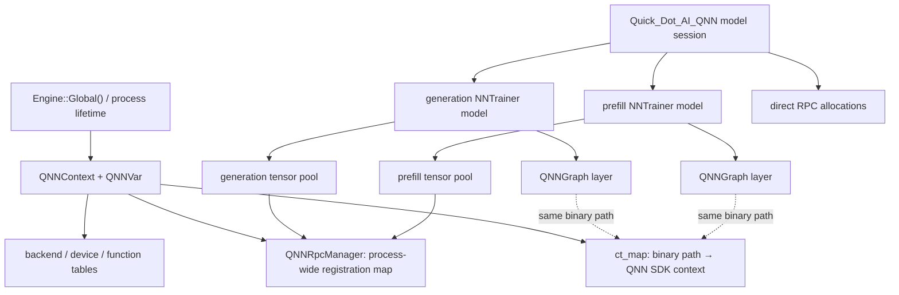
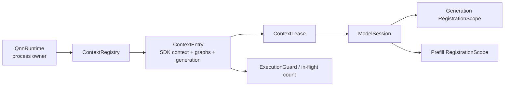

# QNN `load → run → unload → load → run` 정적 분석

- 최종 갱신: 2026-07-23
- 1차 범위: 단일 Gemma QNN serialized binary의 반복 load/run/unload
- 2차 범위: 같은 binary의 여러 graph, 여러 handle 및 여러 QNN binary로의 확장 안전성
- 제외 범위: CPU 통합형 멀티모달 구현
- 검증 수단: 제공된 두 logcat, 현재 소스와 Git 이력의 정적 분석
- SDK 호환 기준: Qualcomm AI Runtime(QAIRT/QNN) 2.47 — 특정 버전 우회보다 lifecycle/ownership 계약에 집중
- 관련 문서:
  - `qnn_reload_implementation_plan.ko.md`
  - `qnn_reload_implementation_status.ko.md`

이 문서는 이번 세션의 지속 체크포인트다. 새 증거가 나오거나 결론이 바뀌면 이전 결론을 조용히 덮지 않고, 근거와 변경 이유를 갱신 기록에 남긴다.

## 1. 결론부터

원래 실패의 직접 원인은 **QNN context의 개수**나 멀티모달 구성이 아니라, 같은 QNN context를 공유하는 여러 graph의 **소유권과 teardown 순서가 잘못된 것**이다.

수정 전에는 먼저 파괴되는 `QNNGraph`가 공유 context에 `contextFree()`를 호출하고, 실제 SDK rc를 보존하지 않은 채 host handle/metadata/`ct_map` entry를 폐기했다. 그 다음 NNTrainer model의 tensor pool은 host가 이미 폐기해 유효성을 추적할 수 없는 이전 context handle에 속한 memHandle 31개를 deregister하려 했고 모두 실패했다. 그럼에도 host 쪽 등록 정보를 지우고 RPC backing memory까지 해제했다. 두 번째 load는 API 상 성공했지만 두 번째 run에서 `graphExecute`가 36회 실패했다. 상위 inference 경로는 그 실패를 반환하지 않아 깨진 token과 허위 성능 수치를 정상 결과처럼 내보냈다.

문제를 처음 완화한 commit `8cdc4dd3`은 다음 두 동작을 동시에 바꿨다.

1. context가 살아 있을 때 모든 QNN memHandle을 먼저 deregister한다.
2. SDK context와 graph를 `ct_map`에 남겨 다음 load에서 재사용한다.

이후 로그에서는 deregistration 실패와 두 번째 run의 graph 실행 실패가 모두 사라졌다. 따라서 이 변경은 제공된 한 사이클에서 유효한 **keep-warm workaround**다. 현재 branch에는 그 위로 PR 1~11의 21개 source commit을 구현해 global graph-destructor sweep을 pointer/context별 lossless allocator cleanup과 explicit shutdown으로 교체했다. 현재 HEAD는 Android NDK 부분 compile과 Kotlin offline compile을 통과했지만 실제 QNN device cycle로 검증되지 않았다.

다만 다음 결론은 아직 성립하지 않는다.

> QNN context는 절대로 free/recreate하면 안 된다.

제공된 실험은 “잘못된 순서로 context를 먼저 free한 경로”와 “올바른 순서로 deregister하고 context를 유지한 경로”를 비교했다. 아직 **모든 실행 종료 → 모든 memHandle deregister 성공 → backing memory 해제 → contextFree 성공 확인 → recreate** 순서를 시험하지 않았다. 즉, 확정된 것은 context 재생성의 불가능성이 아니라 기존 teardown 순서의 오류다.

권장 방향은 다음과 같다.

- 구조: 명시적인 `ContextRegistry + ContextLease + RegistrationScope + ExecutionGuard`
- 초기 정책: 검증된 keep-warm 재사용
- 진단 정책: 올바른 strict free/recreate를 feature flag로 별도 시험
- 비상 정책: backend/device 전체 reset은 일상 unload가 아니라 모든 QNN client가 멈춘 recovery 전용

## 2. 증거의 확실성 구분

다음 표의 entry/backing 제거와 execute 실패 미전파는 **수정 전 코드와 제공 로그에 대해 확정된 사실**이다. 현재 HEAD의 동작은 8절에서 별도로 갱신한다.

| 등급 | 판단 | 근거 |
|---|---|---|
| 확정 | 수정 전 `contextFree()` 호출과 host-side context 폐기가 memHandle 정리보다 먼저였다 | before log의 `Freed QNN context` 뒤 31회 `memDeRegister failed`; 소멸 코드 순서와 일치 |
| 확정 | deregistration 실패 후에도 등록 entry와 backing memory를 제거한다 | `QNNRpcManager::free()`가 rc와 무관하게 erase 후 `RpcMem::free()` 수행 |
| 확정 | 두 번째 run에서 graph 실행이 36회 실패했다 | before log count |
| 확정 | graph 실행 실패가 상위 inference 실패로 전달되지 않는다 | `QNNGraph::forwarding()`은 로그만 남기고 정상 반환 |
| 확정 | `8cdc4dd3` workaround 후 한 번의 reload는 정상 동작했다 | after log에서 lazy-create 경고/진입 1회, dereg/execute 실패 0회, 정상 문장 생성 |
| 강한 추론 | 첫 graph가 공유 context를 host registry에서 제거한 뒤 다음 model이 이전 handle로 접근해 31개 pool registration 정리에 실패했다 | `std::map` 순차 reset, `NeuralNetwork::~NeuralNetwork()`의 pool deallocate 선행, 그 뒤 layer 파괴 순서와 로그가 정확히 맞음 |
| 미확정 | 두 번째 context의 내부 SDK/driver 상태가 정확히 어떤 방식으로 깨졌는가 | 실제 numeric rc, context ID, memHandle ID, SDK version이 로그에 없음 |
| 미확정 | 올바른 순서의 contextFree/recreate도 실패하는가 | 해당 대조 실험이 없음 |
| 미확정 | keep-warm context가 장기 반복에서도 메모리와 graph 상태를 안정적으로 유지하는가 | 한 사이클 로그뿐이며 DSP/HTP 메모리 계측이 없음 |

## 3. 실제 소유 구조

현재 코드에서 이름이 비슷한 객체들을 구분해야 한다.



핵심은 다음과 같다.

- `Engine::Global()`이 process-wide QNN runtime 상태를 사실상 소유한다.
- `QNNVar::ct_map`의 entry가 `Qnn_ContextHandle_t`, graph metadata와 retrieved graph handle을 가진다.
- 현재 key는 binary path 문자열이다.
- Gemma prefill과 generation은 NNTrainer model과 `QNNGraph`가 각각 따로지만 같은 serialized binary path를 사용하므로 SDK context 하나를 공유한다.
- 초기 코드와 `8cdc4dd3` workaround에서는 비소유 `QNNGraph` destructor가 context 또는 process-wide registration을 정리했다. 현재 HEAD의 destructor에는 이 side effect가 없고, model `MemoryPool`/direct allocation owner와 explicit `Quick_Dot_AI_QNN::shutdown()`이 model-local 정리를 담당한다.
- `Quick_Dot_AI_QNN`은 graph model들 외에도 `allocated_ptrs_`의 direct RPC allocation 155개를 별도로 관리한다.

## 4. 수정 전 실패의 정확한 순서

`Quick_Dot_AI_QNN::~Quick_Dot_AI_QNN()`은 `models`의 각 `model_handle`을 순서대로 reset한 뒤 direct allocation 155개를 해제한다. 각 `NeuralNetwork` destructor는 먼저 `deallocate()`로 tensor pool을 해제하고, 그 다음 멤버와 layer가 파괴되면서 `QNNGraph` destructor가 실행된다.

따라서 수정 전 실제 흐름은 다음과 같다.

```text
unloadModelHandle()
  └─ handle->models.clear()
      └─ Quick_Dot_AI_QNN destructor
          ├─ 먼저 reset되는 NNTrainer model
          │   ├─ 자기 tensor pool free
          │   │   └─ context가 아직 살아 있으므로 해당 memDeRegister 성공
          │   └─ QNNGraph destructor
          │       └─ freeContext(binary)
          │           └─ contextFree 호출 후 host handle/metadata/ct_map entry 폐기
          ├─ 다음 NNTrainer model
          │   ├─ tensor pool free
          │   │   ├─ host가 폐기한 이전 context handle로 memDeRegister 31회 실패
          │   │   ├─ 실패해도 registration entry 제거
          │   │   └─ 실패해도 RPC backing memory 해제
          │   └─ QNNGraph destructor
          │       └─ context가 이미 없어 no-op
          └─ direct RPC allocation 155개 해제
```

before log의 사건 순서가 이 코드 흐름과 일치한다.

1. 첫 run에서 context를 lazy create한다.
2. 첫 unload에서 `Freed QNN context`가 먼저 기록된다.
3. 곧바로 `memDeRegister failed`가 31회 기록된다.
4. 두 번째 graph destructor는 context를 찾지 못한다.
5. 이후 `deallocate_all: freeing 155 tracked pointers`가 기록된다.
6. 두 번째 load는 외형상 성공한다.
7. 두 번째 run에서 새 context create 경로로 들어간다.
8. `Execution of Graph: 0 failed!`가 36회 발생한다.
9. 실패가 전파되지 않아 특수 token 위주의 깨진 출력과 비현실적인 1178 token/s가 보고된다.
10. 마지막 unload에서도 같은 deregistration 실패 31회가 반복된다.

## 5. 제공 after 로그를 만든 `8cdc4dd3` workaround의 순서

제공된 after 로그의 `8cdc4dd3`에서는 `QNNGraph::~QNNGraph()`이 `freeContext(bin_path)` 대신 process-wide `QNNRpcManager::deRegisterQnnTensor()`를 호출했다.

```text
첫 번째 NNTrainer model reset
  ├─ 자기 tensor pool free 및 개별 deregister
  └─ 첫 QNNGraph destructor
      ├─ 공유 QNN context는 아직 live
      ├─ manager에 남은 모든 memHandle deregister
      └─ registration map clear, context는 ct_map에 유지

두 번째 NNTrainer model reset
  ├─ map이 이미 비어 있어 backing만 free
  └─ 두 번째 QNNGraph destructor의 전역 deregister는 no-op

direct allocation free

다음 load/run
  ├─ per-load buffer를 다시 allocate
  ├─ 기존 SDK context/graph 재사용
  ├─ 새 buffer를 기존 context에 register
  └─ graphExecute 성공
```

이 workaround가 과거의 “`freeContext()` 호출만 제거” 실험과 다른 점은 매우 중요하다. 과거 실험은 live registration을 정리하지 않은 채 backing memory를 해제해 kernel panic까지 관찰됐다. `8cdc4dd3`은 **context가 살아 있을 때 먼저 deregister한 후 backing을 해제**하기 때문에 성공했다. 현재 HEAD는 process-wide sweep을 제거하고 각 pointer owner가 live context의 `(pointer, context)` registration만 checked deregister/free한다. 이후 구현에서도 이 순서는 절대로 퇴행시키면 안 된다.

## 6. before/after log 정량 비교

| 항목 | 수정 전 | 수정 후 | 해석 |
|---|---:|---:|---|
| `Context is not created` | 2 | 1 | 수정 후 두 번째 run은 cached context 재사용 |
| `memDeRegister failed` | 62 | 0 | 수정 전 각 unload마다 31회, 수정 후 live context에서 성공 |
| `Execution of Graph: 0 failed!` | 36 | 0 | 두 번째 run의 반복 실행 실패 제거 |
| 첫 run 생성 token | 172 | 172 | 둘 다 의미 있는 결과 |
| 두 번째 run 생성 token | 33 | 165 | 수정 전 33은 실행 실패 뒤의 깨진 결과라 성능 비교에서 제외해야 함 |

관찰된 timing은 다음과 같다.

- 수정 전 첫 run: prefill 약 459 ms, generation 약 4993 ms
- 수정 전 두 번째 run: prefill 약 415 ms, generation 약 28 ms
- 수정 후 첫 run: prefill 약 876 ms, generation 약 5268 ms
- 수정 후 두 번째 run: prefill 약 76 ms, generation 약 4796 ms

수정 전 두 번째 generation 28 ms와 1178 token/s는 성공적인 실행 결과가 아니므로 성능 개선 증거가 아니다. 수정 후 두 번째 prefill 76 ms는 warm context 이점일 수 있지만, prompt/token 수, thermal 상태와 반복 횟수가 통제되지 않아 참고값으로만 본다. 제공된 peak-memory 로그도 `getrusage(...).ru_maxrss` 기반의 한 사이클 process peak RSS라 context leak 부재를 증명하지 못한다.

## 7. 현재 변경을 요소별로 쉽게 설명

| 요소 | 이전 | 현재 HEAD | 올바른 최종 방향 | 차이와 리스크 |
|---|---|---|---|---|
| SDK context 수명 | 첫 graph destructor에서 `contextFree` 호출 후 host entry 폐기 | normal unload에서 binary path별 keep-warm | 마지막 lease 뒤 정책적으로 cache 또는 strict destroy | reload는 빨라질 수 있지만 idle HTP/context 메모리가 남고 path별 누적 가능 |
| memHandle 정리 시점 | `contextFree`와 host entry 폐기 뒤에도 deregister 시도 | pointer owner가 live context에서 `(pointer, context)` registration을 checked release하고 실패 entry/backing 보존 | 실행 drain 뒤 session/context scope별 batch release | UAF 위험은 줄었지만 pointer별 lock과 quarantine 비용이 남음 |
| 정리 주체 | 개별 `QNNGraph` destructor | explicit QNN shutdown → model deallocate → direct buffer release; graph destructor side effect 없음 | model/session의 scoped transaction | 공유 자원의 owner는 명확해졌고 all-or-nothing batch는 후속 |
| context identity | raw binary path | raw path + transactional state | artifact identity + effective config + runtime generation | same-path 교체와 alias의 stale/duplicate reuse는 아직 가능 |
| 등록 identity | raw `void *` | pointer + context + datatype/dimension fingerprint | context generation + allocation ID + range + session scope | cross-context 충돌은 줄었지만 generation/address reuse 경계가 남음 |
| 오류 처리 | dereg/execute/free 실패를 로그만 남김 | graph execute와 release error 7을 C/JNI/Kotlin까지 전파하고 sticky terminal 상태 보존 | device failure injection으로 계약 확정 | 기존에 성공처럼 보이던 unload가 실패할 수 있으나 데이터 오염을 막음 |
| 동시성 | lifecycle guard 없음 | manager-wide shared/exclusive guard | `ContextLease`와 per-context execution/registration guard | correctness 1차 방어 대신 unrelated context까지 직렬화 가능 |
| graph/tensor 임시 객체 | 매 forward 재조회/할당 | tensor descriptor RAII/direct binding 완료, graph retrieve는 매 forward 유지 | generation별 graph handle cache와 same-context 실행 정책 | host 누수는 줄었고 cache/thread-safety 검증은 후속 |

## 8. 정적 코드 감사 결과와 현재 상태

이 절은 최초 감사에서 발견한 결함을 현재 source HEAD `32f6575d` 기준으로 다시 분류한다. “해결”은 source와 정적 compile 수준이며 실제 QNN device 검증은 별도다.

### 8.1 P0: reload correctness와 안전에 직접 관련

| 최초 결함 | 현재 상태 | 근거 |
|---|---|---|
| `graphExecute` 실패를 로그만 남기고 상위에서 계속 실행 | 해결 — 첫 실패에서 inference 중단 및 C API 실패 전파 | `467eeadd`, `6cc4f924` |
| global deregistration이 실패 entry까지 map에서 제거 | 해결 — public global sweep 제거, pointer/context별 성공 entry만 제거 | `15873b03` |
| deregistration 실패 후에도 RPC backing 해제 | 해결 — 실패 entry/backing retention과 checked release status | `15873b03`, `7aa3527d` |
| `freeContext()`가 SDK 실패 뒤 host metadata/map을 먼저 제거 | 해결 — SDK 성공 전 ownership 보존, 실패 entry quarantine | `24e184c6` |
| `makeContext()`가 부분 entry와 초기화되지 않은 output을 남김 | 해결 — 사전조건 검증, create/rollback transaction, 성공 entry만 publish | `9c1c717f`, `24e184c6` |
| 비소유 `QNNGraph` destructor가 process 전체 registration 정리 | 해결 — destructor global cleanup 제거, 정상 allocator owner로 일원화 | `15873b03` |
| execute와 load/cleanup 사이 process-wide 동기화 부재 | 1차 해결 — manager-wide shared/exclusive guard; per-context lease는 후속 | `15873b03` |
| non-stream C ABI에서 catch-all 부재 | 해결 — 모든 backend 예외를 C 오류로 봉쇄 | `6cc4f924` |
| 실패한 재실행 뒤 이전 성공 metric 잔존 | 해결 — run 시작 시 `has_run_`와 metric 초기화 | `6cc4f924` |

현재 남은 P0 성격의 검증 공백은 deregistration/context free/execute 실패를 실제 SDK에서 주입하고, 상위 API의 terminal status와 backing retention을 확인하는 일이다. 정적 코드에서 최초의 위험 경로는 닫혔지만 device 동작을 완료로 간주하지 않는다.

### 8.2 P1: 장기 반복과 유지보수 문제

| 항목 | 현재 상태 |
|---|---|
| raw path 기반 `ct_map`, same-path 교체와 alias | 미해결 — artifact identity를 포함한 `ContextKey` 필요 |
| keep-warm cache budget/eviction/explicit purge | 미해결 |
| 매 forwarding `graphRetrieve()`와 same-context 병렬 실행 정책 | 미해결 — generation cache와 SDK thread-safety 검증 필요 |
| per-forward tensor descriptor와 누적 input/output vector | 해결 — RAII와 call-local direct binding (`facd1111`) |
| raw pointer 하나만 사용한 registration 충돌/orphan | 1차 해결 — `(pointer, context)` key; session/descriptor scope는 후속 (`15873b03`) |
| context config와 copied metadata ownership 불명확 | 해결 — persistent/borrowed ownership 분리와 rollback (`24e184c6`) |
| duplicate QNN plugin/runtime 초기화 | 해결 — process once 초기화와 fake-plugin test (`5163e606`, `82a05282`) |
| allocator destructor의 erase/retention/오류 은폐 | 해결 — lossless ledger와 checked release (`15873b03`, `d06e0c5f`, `7aa3527d`) |
| Android unload/destroy handle과 실패 상태 불일치 | 해결 — C/JNI/Kotlin terminal teardown 계약 (`d6a4c818`, `10bee850`) |

현재 장기 리스크는 context cache가 무제한이라는 점, manager-wide guard와 pointer별 free가 병렬 run/unload를 과도하게 직렬화할 수 있다는 점, concrete QNN failure-injection test seam이 없다는 점으로 압축된다.

## 9. 가능한 해결 정책 비교

아래 A/B/C는 teardown 정책이고 D는 이를 안전하게 구현하는 공통 구조다.

### A. context keep-warm

현재 성공 경로를 명시적인 정책으로 다듬는다.

- 장점: 제공 로그에서 검증됨, reload/첫 run latency가 가장 낮을 가능성, vendor teardown 취약 경로 회피
- 단점: context/graph/HTP 메모리 상주, stale state 가능성, cache가 무제한이면 장기 누적
- 필수 조건: global destructor hack이 아니라 scope별 deregistration, 실행 drain, bounded cache/explicit purge, artifact identity

### B. clean free/recreate

정상적인 logical unload 의미와 idle memory 회수에는 가장 깔끔하다.

안전한 순서는 다음과 같아야 한다.

1. 새 execute/register를 차단한다.
2. active `graphExecute`가 0이 될 때까지 기다린다.
3. 해당 session/context의 모든 memHandle을 backing이 살아 있을 때 deregister한다.
4. 모든 rc가 성공이고 registration count가 0인지 확인한다.
5. tensor pool과 direct backing memory, host graph wrapper를 해제한다.
6. 마지막 context lease를 놓는다.
7. `contextFree`를 정확히 한 번 호출한다.
8. 성공한 경우에만 metadata/config와 registry entry를 지운다.
9. 다음 load에서 context를 transactionally recreate한다.

deregister가 하나라도 실패하면 5단계 이후로 가면 안 된다. backing과 owner를 보존하고 unload 실패 또는 quarantine으로 남긴다. `contextFree`가 실패하면 context entry와 metadata를 보존하고 quarantine한다.

- 장점: 실제 메모리 회수, fresh-state 의미가 명확, unbounded cache 방지
- 단점: reload latency 증가, driver fragmentation/teardown 문제 노출, 현재 기기에서 미검증

### C. backend/device 전체 reset

- 장점: context보다 넓은 poisoned runtime을 복구할 수 있음
- 단점: 모든 QNN client에 영향, 최고 latency, process singleton/등록 구조와 충돌, teardown 위험 최대
- 판단: 일상 unload에 사용하지 않고 DSP SSR 또는 quarantine 복구, 명시적 runtime shutdown에만 제한

### D. explicit lifecycle registry/lease

A와 B 어느 정책을 선택해도 필요한 구조다.



`ContextEntry`는 `Ready`, `Idle`, `Closing`, `Quarantined` 상태와 lease 수, in-flight 수, registration 수를 가진다. `QNNGraph`는 context의 최종 owner가 아니라 lease와 자기 graph/registration scope만 가진다. registry lock은 state mutation에만 쓰고 vendor API와 임의 destructor를 전역 lock을 잡은 채 호출하지 않는다.

## 10. context 개수에 대한 최종 판단

“QNN graph binary 하나당 SDK context 하나”는 하드웨어의 절대 법칙이 아니라 현재 serialized-artifact load 방식에 가장 자연스러운 **기본 registry 정책**이다.

- 같은 Gemma binary 안의 prefill/generation graph는 context 하나를 공유하는 것이 맞다.
- 별도 serialized binary는 기본적으로 별도 context entry를 가진다.
- 정확한 key는 path 하나가 아니라 `runtime identity + binary artifact identity + effective context config`여야 한다.
- 명시적인 격리, 서로 다른 config, 동시 실행 제약, replica 요구가 있으면 같은 artifact에 여러 context generation/instance를 만들 수 있다.

CPU/GPU의 “context”와 이름만 비교해 process-global이어야 한다고 결론 내리면 안 된다. QNN의 backend/device/function table은 CPU/GPU의 공통 runtime/device 쪽에 가깝고, `Qnn_ContextHandle_t`는 특정 serialized model bundle과 그 graph들을 담는 executable namespace 쪽에 가깝다.

참고 사례로 NPU vision encoder binary와 NPU LLM binary를 함께 쓰는 멀티모달 구성이라면 기본적으로 runtime/backend/device는 공유하고 SDK context는 2개다. LLM prefill/generation은 LLM context 하나를 공유한다. 이 사례는 registry 확장성을 확인하는 보조 테스트일 뿐 이번 reload 원인의 설명은 아니다.

## 11. 성능 및 구조 리스크

### 성능

- keep-warm은 contextCreateFromBinary와 graph 준비 비용을 피하므로 reload latency를 줄일 가능성이 높다.
- 그 대가로 idle context와 graph의 host/RPC/DSP/HTP 메모리가 남는다. process RSS만 보면 DSP 측 누적을 놓칠 수 있다.
- strict free는 idle memory를 줄이지만 recreate latency, allocator/driver fragmentation, vendor teardown 위험이 커진다.
- QNN manager-wide lifecycle mutex를 단기 안전장치로 두면 현재 단일 active QNN session에는 영향이 작지만 여러 handle의 병렬성을 제한한다.
- 최종 per-context `ExecutionGuard`는 execute hot path에 atomic/lock 비용을 더한다. vendor call 시간에 비하면 작을 가능성이 크지만 계측해야 한다.
- composite registration key의 hash 비용은 매 token마다 register하지 않고 stable allocation 시 한 번 등록해 scope에서 재사용하도록 상쇄해야 한다.
- descriptor RAII와 graph handle cache는 오히려 매-token allocation/조회 비용과 누수를 줄일 가능성이 높다.

### 구조

- explicit shutdown은 destructor-only cleanup보다 API와 상태 수가 늘어난다. 대신 실패를 caller에게 반환하고 정확한 순서를 강제할 수 있다.
- lease/refcount는 누락 시 context가 영구 pin될 수 있다. debug counter, state dump, shutdown assertion이 필요하다.
- quarantine은 안전한 leak을 선택하는 정책이다. 실패한 backing을 무리하게 free하는 것보다 안전하지만 반복 실패 시 메모리를 소모하므로 recovery/telemetry가 필요하다.
- cache identity가 너무 약하면 stale binary를 실행하고, 너무 강한 full hash를 매 load 계산하면 cold-load 비용이 늘어난다. manifest digest 또는 size/mtime+배포 ID를 우선 고려한다.
- lock ordering을 잘못 설계하면 unload와 execute가 deadlock될 수 있다. registry → context → registration 순서와 vendor call 중 lock 보유 규칙을 문서화해야 한다.

## 12. 외부 SDK 단서와 한계

대상 환경의 SDK는 사용자 확인 기준 QAIRT/QNN 2.47이다. Qualcomm의 QAIRT 2.33 release notes에는 ION memory deregistration 실패와 HTP graph 실행 오류가 연관될 수 있는 known issue가 기재돼 있다. 이번 로그의 `memDeRegister` 실패 뒤 `graphExecute` 실패라는 순서와 문제 종류는 부합하지만, 2.47에서도 같은 issue가 유지되는지와 실제 numeric rc는 별도로 확인해야 하므로 동일 issue라고 단정하지 않는다.

- 공식 자료: [QAIRT 2.33 Partner Release Notes](https://docs.qualcomm.com/doc/KBA-250421151446/KBA-250421151446_REV_1_QAIRT_2_33_0_Partner_Release_Notes.pdf)
- system-context metadata 수명 참고: [QnnSystemContext_getBinaryInfo API](https://docs.qualcomm.com/bundle/publicresource/topics/80-63442-10/function_QnnSystemContext_8h_1ac3ac16e68a41c7d8c141402c2ef9bd4e.html)

다음 기기 로그에는 최소한 SDK version, context pointer/generation, graph handle/name, allocation ID, memHandle, numeric API rc, registration count, state transition을 넣어야 한다.

## 13. 과거 실험과 해석

- 같은 load 안에서 run을 반복하면 정상: context와 buffer lifetime이 유지되므로 현재 원인과 일치한다.
- `load → no run → unload → load → run`은 정상: lazy context와 mem registration이 생기지 않아 잘못된 teardown 경로가 활성화되지 않는다.
- duplicate registration 제거만으로 해결되지 않음: 근본 문제가 teardown ordering/ownership이므로 예상과 일치한다.
- model deallocate/reset 순서만 두 단계로 바꿔도 해결되지 않음: 개별 graph destructor가 공유 context를 소유하는 구조가 남기 때문이다.
- `freeContext()`만 제거한 실험에서 kernel panic 관찰: live registration과 backing lifetime 규칙을 깨면 더 위험해짐을 보여준다.
- `8cdc4dd3` workaround 성공: live context에서 deregistration을 선행하는 것이 핵심 안전 조건임을 뒷받침한다.

## 14. checked deallocation 계약과 one-phase shutdown 경계

기존 안전 수정은 `memDeRegister` 실패 시 registration과 RPC backing을 manager에 보존했지만, `MemAllocator::free(void *)`가 정상 반환했기 때문에 `MemoryPool`, `NeuralNetwork`, CausalLM unload는 실패를 구분할 수 없었다. 반환형 변경이나 새 virtual 함수 추가는 설치되는 C++ class의 vtable ABI를 바꾸므로 채택하지 않았다.

채택한 계약은 다음과 같다.

```text
allocator free(ptr)
  정상 반환 → backing release 확정, caller는 pointer를 잊어도 됨
  예외       → release 미확정, caller는 ownership record를 유지해야 함

MemAllocator::tryFree(ptr)  // non-virtual adapter
  정상 반환을 true, 모든 예외를 false로 변환

MemoryPool::deallocate()
  모든 unique pointer를 시도
  성공 pointer만 owner list에서 erase
  실패 pointer는 보존
  tensor bindings는 전부 무효화
  aggregate failure를 상위로 전달
```

QNN manager는 cleanup closed, unknown pointer, deregistration failure/quarantine에서 backing을 보존한 뒤 예외를 낸다. 따라서 core는 QNN concrete type이나 SDK header를 알지 않고도 정확한 ownership 결정을 할 수 있다. virtual signature와 object layout은 그대로지만, core와 QNN plugin이 같은 예외/runtime 계약으로 함께 배포되어야 하는 semantic ABI 전제는 생긴다.

이 단계의 shutdown은 transactional하지 않다. 예를 들어 pointer 1은 deregister/free에 성공하고 pointer 2가 실패하면 pointer 1을 되돌릴 수 없다. 실패 모델은 다시 실행 가능한 상태가 아니라 terminal `QUARANTINED`다. 안전한 결과는 다음과 같다.

- 성공한 자원은 해제한다.
- 실패 registration/backing은 manager가 영구 보존한다.
- tensor/model은 runnable 상태로 되돌리지 않는다.
- public unload는 실패를 반환하고, 반복 unload도 그 sticky 실패를 유지한다.
- SDK context는 keep-warm cache에 그대로 둔다.

모든 deregistration 성공 뒤에만 backing을 일괄 free하려면 session별 `RegistrationScope`, `prepareDeregister`, `commitBackingFree`가 필요하다. 이는 여러 model pool과 앱 직접 allocation의 owner를 같은 scope로 태깅해야 하므로 별도 구조 PR이다.

성능상 현재 pointer별 `free()`는 각 buffer마다 manager-wide exclusive lifecycle lock을 다시 얻는다. 단일 handle reload에서는 vendor deregistration 비용이 지배적이지만, 여러 handle에서는 unload writer starvation이나 inference jitter가 생길 수 있다. 정확성 확인 뒤 scope-aware batch release와 per-context gate로 줄여야 한다.

또한 같은 binary를 쓰는 두 handle의 병렬 run은 shared lifecycle lock 아래 같은 cached `GraphInfo::graph` write와 backend extension hook을 겹쳐 실행할 수 있다. 이는 unload 문제와 별개의 공존성 위험이며, graph handle의 exclusive one-time publish와 same-context execute 직렬화 필요성을 별도 검증해야 한다.

## 15. 명시적 model shutdown 구현 결과

PR 8은 “QNN graph binary 하나당 SDK context를 새로 만들거나 없애는” 변경이 아니다. 현재 binary-path registry의 context와 cached graph는 계속 keep-warm이다. 새 경계는 CausalLM handle이 소유한 NNTrainer model pool과 앱의 direct RPC allocation을 destructor의 암묵적 순서에 맡기지 않고 먼저 명시적으로 정리하는 것이다.

요소별 차이는 다음과 같다.

| 요소 | 이전 | PR 8 이후 | 남은 위험 |
|---|---|---|---|
| NNTrainer model pool | destructor 중 간접 deallocate | `deallocateModel()`을 명시 호출하고 결과를 확인 | 한 번 일부 해제된 모델은 rollback할 수 없어 terminal 상태 |
| direct RPC allocation | destructor의 void free, 실패 관찰 불가 | 성공 pointer만 set에서 제거하고 실패 pointer는 보존 | allocation과 set insert 사이의 예외 창 |
| partial load | model map 등록 전 예외 시 cleanup 누락 가능 | model 생성 직후 map에 넣고 이후 compile/init 수행 | 외부 subclass destructor 호환성 |
| C API unload/destroy | 성공/일반 오류만 표현 | resource-release 전용 오류와 sticky failure | 이전 binary와 header를 섞는 배포 금지 필요 |
| Android JNI/Kotlin | unload 결과를 사실상 폐기하고 새 handle로 덮을 수 있음 | status-bearing load/unload/destroy, terminal reload 차단 | device에서 실제 lifecycle 검증 필요 |
| SDK context | destructor/global side effect에 기대던 구조 | 이번 PR에서는 free하지 않고 keep-warm 유지 | cache budget, strict purge, lease는 후속 작업 |

성능상 정상 run hot path에는 새 비용이 없다. unload에서는 기존에도 수행하던 buffer 해제를 명시적으로 호출하고 결과를 집계하므로, 주된 비용은 vendor deregistration 자체이며 오류 검사 비용은 작다. 다만 pointer마다 manager-wide exclusive lock을 다시 얻는 현재 구현은 allocation 수가 많거나 다른 handle이 동시에 run할 때 unload latency와 jitter를 키울 수 있다.

구조상 장점은 model-local lifetime과 process-wide SDK context lifetime을 분리한 것이다. 실패가 상위 앱까지 보이고, 실패한 backing은 manager에 남아 UAF를 피한다. 반면 public error enum 추가와 core/plugin exception 계약은 관련 artifact를 lockstep으로 배포해야 한다. 또한 explicit base shutdown이 derived destructor보다 먼저 실행되므로 외부 subclass가 derived destructor에서 base tensor/RPC buffer를 읽는다면 호환성 문제가 된다. in-tree Gemma/VJEPA destructor에서는 그런 접근이 발견되지 않았다.

PR 8 직후 독립 감사에서는 다음 두 누락이 확인됐다. 현재 HEAD에서는 각각 후속 PR로 해결했다.

1. `get_qnn_input_data`, `tracked_allocate`, `get_cos_sin`의 raw allocation 뒤 owner set 삽입 전 예외 창 — PR 9 (`3f8ea209`, `20e8355b`)에서 ownership-first로 해결.
2. multimodal loader가 두 임시 handle을 조립하는 중 stack 임시 객체의 explicit teardown status를 잃는 문제 — PR 11 (`32f6575d`)에서 해결.

두 수정 모두 정상 run hot path를 바꾸지 않으며 실제 device failure injection은 남아 있다.

## 16. direct RPC allocation의 예외 창과 PR 9 결과

명시적 shutdown이 정확하려면 “모든 live model-local RPC pointer가 `allocated_ptrs_`에 있다”는 불변식이 필요하다. 기존 코드는 다음 순서였다.

```text
rpcmem allocate 성공
  → std::set node allocation/insert
     → 여기서 bad_alloc이면 live pointer를 owner가 잃음
```

PR 9는 이를 다음 순서로 바꿨다.

```text
임시 key로 std::set node 선확보
  → node extract
  → rpcmem allocate
  → node key를 실제 pointer로 변경
  → 같은 node를 set에 재삽입
  → caller에 pointer 반환
```

따라서 set-node OOM은 RPC resource 획득 전에 끝난다. RPC allocation 자체가 실패하면 추출한 node handle만 파괴되고 owner set은 원래 상태다. 성공 pointer는 caller가 관찰하기 전에 set에 들어간다. class field나 virtual 함수를 추가하지 않아 object ABI도 유지된다.

RoPE는 두 buffer를 한 utility가 raw tuple로 반환하던 구조를 compatibility wrapper로만 남겼다. in-tree Gemma는 cos를 tracked allocation하고, sin을 tracked allocation하고, 마지막에 두 caller-owned buffer를 채운다. sin allocation이나 fill 계산이 실패해도 cos는 이미 shutdown 대상이다. 이 변화는 초기 load 경로에만 tree 연산 몇 회를 더하며 token 생성/run 비용에는 영향을 주지 않는다.

남은 경계는 세 가지다.

1. compatibility `get_cos_sin`의 rollback 자체가 실패하면 global QNN allocator는 backing을 quarantine하지만 어느 model의 sticky teardown인지 연결하지 못한다. in-tree 호출은 없지만 외부 사용자는 새 tracked+fill 경로로 이행해야 한다.
2. 호출자가 없는 `get_zero_memory`는 caller-owned raw API다. 삭제는 symbol ABI를 바꾸므로 이번 PR에서는 계약만 명시했다.
3. 더 아래의 `QNNRpcManager::alloc()`도 먼저 rpcmem을 얻고 나중에 `allocations_` map node를 만들었다. map OOM catch에서 raw free가 실패하면 lossless ledger에 진입하지 못하는 문제는 다음 절의 PR 10 (`f7f64236`)에서 allocator ledger node를 먼저 확보하도록 해결했다.

## 17. process-wide RPC backing ledger의 PR 10 결과

PR 9만으로는 app/model owner가 pointer를 잃는 창은 닫혔지만, 그 아래 `QNNRpcManager`가 rpcmem backing을 얻은 후 `allocations_` map node를 할당했다. map allocation이 실패하면 catch에서 raw `rpcmem_free`를 호출할 수는 있어도, 그 void API의 결과를 확인하거나 실패 backing을 manager ledger에 남길 방법이 없었다.

PR 10은 manager 내부도 다음 순서로 통일했다.

```text
lifecycle shared guard
  → registration mutex
  → allocations_ map node 선확보/extract
  → rpcmem_alloc
  → node key = 실제 pointer
  → allocations_에 동일 node publish
  → caller의 *ptr publish
```

이 순서에서는 manager metadata OOM, cleanup admission closed, mutex 획득 실패가 모두 backing acquisition 전에 발생한다. rpcmem이 실패하면 local node handle만 정리된다. 성공 pointer는 process-wide ledger와 model-local tracker 양쪽에 순서대로 공개되므로 정상 load failure에서 explicit shutdown이 끝까지 ownership을 추적할 수 있다.

구조적 대가는 vendor call을 `registration_mutex_` 아래 수행한다는 점이다. 이는 여러 model이 동시에 load될 때 RPC allocation을 직렬화하고, 이미 run 중인 다른 graph가 매 forward에서 기존 registration을 조회할 때도 짧은 대기를 만들 수 있다. steady-state 단독 inference에는 추가 lock이 없고, sequential reload에서는 원래 있던 allocation 비용에 tree node 순서만 바뀐다. 실제 제품 판단에는 concurrent load 중 `rpcmem_alloc` duration과 inference p95/p99 latency 계측이 필요하다.

남는 비정상 경계는 rpcmem allocator가 아직 live인 주소를 중복 반환하는 경우다. pointer 하나만 받는 free API와 pointer-key map은 두 논리 allocation을 구분할 수 없으므로, 해당 주소를 섣불리 free하면 기존 live owner를 깨뜨린다. 현재는 log+throw하고 ambiguous backing을 보수적으로 유지한다. 이를 자동 복구하려면 allocator generation/token 또는 manager poison 정책이 필요하며 일반 reload 경로와 분리한다.

## 18. 두 QNN model 조립 실패의 PR 11 보완

멀티모달은 이번 분석의 중심이 아니지만, vision encoder와 LLM이라는 두 QNN model을 임시 handle에 load한 뒤 하나로 옮기는 경로는 multi-handle cleanup 계약의 실제 참고 사례다. 기존에는 LLM load 실패, compatibility 실패, combined handle allocation 실패 시 stack temporary destructor가 QNN `shutdown()`을 호출하더라도 bool 결과가 버려졌다. backing은 global manager가 보존해도 caller는 terminal cleanup 실패를 모르고 reload할 수 있었다.

PR 11은 공개되기 전의 combined/LLM/vision owner를 모두 explicit unload한다. 원래 실패가 unsupported나 allocation failure여도 teardown 실패가 하나라도 있으면 resource-release failure 7이 우선한다. 부분 move 중 예외가 발생해도 `unique_ptr` 이동 때문에 각 model owner는 하나뿐이고, 모든 owner를 끝까지 방문하므로 double free 없이 failure status를 보존한다.

성공 경로의 inference 성능에는 영향이 없다. 실패 경로에서만 최대 세 handle의 checked cleanup을 수행한다. 구조적 이점은 단일-model load와 두-model 조립이 같은 terminal teardown 의미를 갖는다는 점이다. 자동 failure injection이 없고 experimental macro가 기본 build에서 꺼져 있다는 검증 한계는 남는다. 따라서 이는 주 reload 해결의 보조 안전망이며, 단일 QNN model의 반복 device cycle보다 우선순위가 높지 않다.

## 19. 현재 남은 핵심 질문

1. 올바른 순서로 clean shutdown한 뒤 `contextFree/recreate`를 50~100회 반복해도 성공하는가?
2. keep-warm context에서 100회 reload 후 host/RPC/DSP/HTP 메모리가 plateau를 이루는가?
3. unload 후 KV/cache 및 extension의 논리 상태가 fresh session과 동일한가?
4. 같은 binary를 쓰는 두 CausalLm handle 중 A를 unload해도 B run이 계속 성공하는가?
5. 서로 다른 QNN binary A/B 중 A unload가 B registration에 영향을 주지 않는가?
6. same path의 binary를 교체했을 때 stale context를 절대로 재사용하지 않는가?
7. deregister/contextFree 실패를 주입했을 때 backing을 보존하고 unload 오류를 반환하는가?

## 20. 갱신 기록

### 2026-07-23 — reload 중심 재정리

- 멀티모달 중심 설명을 제거하고 단일 Gemma reload 실패를 문서의 주제로 복원했다.
- 세 서브에이전트의 로그 포렌식, lifecycle 감사, 정책 비교 결과를 통합했다.
- 수정 전 정확한 model/pool/graph/context 소멸 순서와 31회 deregistration 실패의 원인을 명시했다.
- `8cdc4dd3` workaround가 ordering 수정과 keep-warm을 동시에 적용했음을 분리해 설명했다.
- “context recreate가 본질적으로 불가능”하다는 기존 과도한 결론을 철회하고 미검증 대조 실험으로 표시했다.
- P0/P1 정적 결함, A/B/C 정책과 D registry 구조, 성능·구조 리스크를 갱신했다.
- 멀티모달은 여러 binary context의 보조 확장성 사례로 축소했다.
- 교차검토 후 SDK 내부 context 해제 성공 여부는 미확정으로 낮추고, host-side 폐기 이후의 실패로 표현을 교정했다.
- memory metric을 PSS가 아닌 `ru_maxrss` 기반 peak RSS로 바로잡았다.

### 2026-07-23 — 구현 시작 체크포인트

- 사용자 확인 SDK version을 QAIRT/QNN 2.47로 기록했다.
- 첫 PR 후보를 R0 `graphExecute` 실패 전파와 lifecycle 진단 로그로 제한했다.
- transactional context create/free와 registration ownership 변경은 후속 PR 후보로 분리한다.
- R0 call-stack 감사에서 QNNGraph 예외가 기존 streaming API의 `CAUSAL_LM_ERROR_INFERENCE_FAILED`로 전달됨을 확인했다.
- non-stream C ABI의 catch-all 부재와 실패 후 stale `has_run_`/metric 가능성을 R0 범위에 추가했다.
- QAIRT 2.47 헤더는 오류/opaque handle 타입 호환성 확인에만 사용했다. 이후 설계는 특정 SDK 버전 우회가 아니라 lifecycle·소유권·실패 복구 계약을 중심으로 진행한다.
- `QnnGraph_execute()` 비정상 반환 뒤 output 유효성 보장이 없으므로 실패 output을 token/KV/metric 계산에 사용하지 않는 fail-fast가 필요하다.
- 진단에는 raw 64-bit error와 `QNN_GET_ERROR_CODE()` 공개 오류를 함께 남기되, 버전별 오류 번호에 구조를 종속시키지 않는다.

### 2026-07-23 — per-forward 및 context transaction 감사

- `setupInputAndOutputTensors()`는 매 forward마다 input/output `Qnn_Tensor_t` 배열과 deep-copy metadata를 할당하지만 성공 경로에서 해제하지 않아 token 수에 비례한 host leak이 발생한다.
- 기존 private teardown은 metadata 일부를 누락하고, `clientBuf`와 `memHandle`이 union인 descriptor에서 opaque memHandle을 `free()`할 수 있다. 수동 해제 대신 SDK `deepCopyQnnTensorInfo()`의 짝인 `qnn_wrapper_api::freeQnnTensors()`를 사용해야 한다.
- 기존 `populateInputTensor()`는 MEMHANDLE zero-copy descriptor의 null client buffer로 복사를 시도하는 no-op이며, output에도 같은 불필요한 계산을 한다. NNTrainer RPC backing pointer를 직접 `registerQnnTensor()`에 bind하는 것이 현재 NATIVE 경로의 실제 의미와 맞다.
- `currentInputBuffers/currentOutputBuffers`는 매 token 증가하면서 항상 초기 원소를 재사용해 stale pointer 가능성이 있다. call-local 현재 Tensor pointer를 직접 bind하면 누적 상태와 variant가 모두 사라진다.
- context create는 zero-init, function pointer 검증, mmap/SystemContext/metadata RAII, 성공 후 publish가 필요하다. 현재 config 배열은 stack pointer와 extension-owned pointer를 저장한 뒤 모두 `free()`하는 잘못된 ownership이다.
- binary-created context의 extension free hook은 무조건 호출하면 안 된다. Qualcomm의 인접 공식 구현에는 HTP extension crash를 피하기 위해 해당 hook을 건너뛰는 근거가 있어 strict-free 정책에서 별도 검증한다.

### 2026-07-23 — transactional context lifecycle 구현 완료

- `9c1c717f`에서 context creation의 function pointer, binary/mmap, caller status 사전조건을 먼저 닫았다.
- `24e184c6`에서 context entry를 `CREATING/ACTIVE/QUARANTINED`로 분리하고 최종 성공한 `ACTIVE` entry만 조회·재사용하게 했다.
- core create error가 non-null handle을 남기거나 rollback/contextFree가 실패하면 handle, copied metadata, registry entry, binary mmap을 보존한다.
- quarantine이 하나라도 생기면 다른 binary의 신규 create는 차단하지만, 이미 정상인 동일-path `ACTIVE` cache hit은 먼저 허용해 기존 reload keep-warm 경로를 유지한다.
- normal `freeContext()`는 `ACTIVE`만, create rollback은 `CREATING`만 다루도록 상태별 책임을 분리했다.
- extension config는 borrowed, 구성 pointer vector와 IO estimation config는 call-local로 취급해 기존 invalid free와 dangling stack pointer를 제거했다.
- QNN runtime destructor에서 free 실패나 cleanup 예외가 나면 backend/device/library를 계속 해제하지 않는다. 생성 시 미리 확보한 holder에 runtime을 옮기고 holder 자체를 의도적으로 남겨, 실패 자원이 process/DSO teardown에서 다시 파괴되는 것을 막는다.
- cached context가 binary mapping을 계속 보유하므로 address-space/file-backed page cache 부담이 늘 수 있다. 이는 persistent-binary config를 보수적으로 지원하기 위한 현재 정책이며, 기기에서 config/lifetime을 확인하면 축소 가능하다.
- 당시에는 `ct_map` mutex/lease가 없어 thread-safe registry가 아니었고 `QNNGraph` destructor의 process-wide deregistration도 남아 있었다. 후속 PR 4에서 registration failure preservation과 cleanup ownership을 처리했다.

### 2026-07-23 — RPC registration ownership 재감사

- 실제 registration backing owner는 `QNNGraph`가 아니라 `MemoryPool::owned_buffers_`와 그 allocator다. `NeuralNetwork::~NeuralNetwork()`의 pool deallocate가 GraphCore/`QNNGraph` destructor보다 먼저 실행된다.
- PR 4 전 `QNNGraph` destructor global sweep은 첫 graph가 아직 파괴되지 않은 다른 NN/model/context의 memHandle까지 지웠다. after-fix 로그의 첫 sweep이 약 133ms이고 다음 sweep이 즉시 끝나는 현상도 이 전역 정리로 설명된다.
- 당시 global sweep을 제거하면 각 NN pool의 `QNNRpcManager::free(ptr)`가 cached live context에서 자기 allocation의 registration을 해제한 뒤 backing을 free하므로 정상 reload의 keep-warm 조건을 유지할 수 있다고 판단했다.
- 단, 당시 `free(ptr)`는 deregister 실패에도 entry를 erase하고 backing을 free했으므로 global sweep 제거보다 먼저 lossless failure 처리가 필요했고, PR 4에서 둘을 함께 완료했다.
- raw pointer 단일 key는 같은 allocation을 다른 context에 등록할 때 두 번째 SDK memHandle을 map에 넣지 못해 orphan시킨다. `pointer → context → registration` 복합 소유 구조가 필요하다.
- active graphExecute와 allocator/context cleanup을 막기 위해 과도기 QNN manager-wide shared/exclusive lifecycle guard를 도입한다. Engine에 등록된 한 runtime의 모든 context cleanup이 서로 상호배제되고 forwarding hot path에 lock 비용을 더한다. 중복 임시 QNNContext까지 포괄하는 진정한 process-wide gate는 아니므로 다음 plugin 초기화 수정도 필요하다.
- QNN context를 free하기 전 해당 context에 속한 registration 수가 0이어야 한다. 실패/quarantine entry가 하나라도 남으면 context와 backing을 함께 보존해야 한다.
- 직접 manager 단위 테스트는 QNN SDK generated header와 Android module에 결합돼 있다. SDK-free generic ledger로 상태/erase 정책을 분리해야 host failure-injection test가 가능하다.

### 2026-07-23 — lossless registration teardown 구현

- 정상 deregistration owner를 `QNNGraph`가 아니라 backing allocation을 가진 `MemoryPool`/`QNNRpcManager`로 코드에 반영했다. `QNNGraph` destructor는 더 이상 다른 graph/model/context의 registration을 process-wide로 지우지 않는다.
- registry는 `pointer → context → Registration`이고 각 entry는 fd, memHandle, datatype, dimensions, state, 마지막 오류를 보존한다. 같은 pointer를 여러 QNN context가 사용해도 memHandle이 섞이지 않는다.
- 동일 pointer/context cache hit은 descriptor까지 같을 때만 허용한다. shape/type가 달라졌는데 예전 memHandle을 조용히 재사용하는 대신 명시적으로 실패한다. 이는 correctness 우선 정책이며 dynamic-shape workload에서는 재등록 정책이 후속으로 필요할 수 있다.
- `memRegister` 실패가 null handle을 남기면 SDK 계약상 등록되지 않은 것으로 보고 placeholder를 제거할 수 있다. 반대로 오류와 함께 non-null handle이 나오거나 성공과 함께 null handle이 나오면 상태가 불확실하므로 quarantine한다.
- `memDeRegister` 오류는 SDK 계약상 일부 valid handle이 이미 해제됐을 수도 있어 자동 재시도가 안전하지 않다. entry와 backing을 terminal quarantine으로 보존한다. 메모리 누수 가능성은 있지만 driver-visible use-after-free보다 안전하다.
- shared execution guard가 context lookup, graph retrieve, tensor register, graph execute 전체를 보호하고 exclusive cleanup guard가 context load/create, pointer free, context/runtime free를 보호한다. 현재는 process-wide라 다른 QNN context끼리도 cleanup 동안 직렬화되는 성능/병렬성 비용이 있다.
- 기존 registration cache hit에서 매 token마다 dimensions vector를 할당하던 중간 구현은 저장된 fingerprint와 직접 비교하도록 고쳐 hot-path 추가 allocation을 제거했다.
- `QNNRpcManager`가 `libQnnHtp.so`를 별도로 열어 provider를 다시 선택하던 중복 경로를 제거하고, `QNNContext`가 실제 backend 초기화에 사용한 function table을 주입한다. provider 불일치와 불필요한 DSO lifetime을 줄인다.
- public process-wide deregistration API는 호출처가 사라진 뒤 제거했다. runtime destructor의 best-effort 전체 cleanup만 private으로 남고, 실패한 entry가 있으면 해당 backing을 해제하지 않는다.
- runtime shutdown은 context map을 비운 뒤 lock을 풀지 않는다. execution admission을 영구 폐쇄한 exclusive guard를 `context cleanup → backend/device release → backend DSO close` 전체에 유지해, 기다리던 forwarding이 teardown 뒤 stale function table로 재진입하는 경합을 막는다.
- 이 구조는 reload의 핵심 UAF/blast-radius를 막지만 unload 실패를 API로 반환하지는 못한다. `MemAllocator::free(void)` 계약상 manager 내부 안전한 보존까지만 가능하므로 explicit session shutdown/status 경로가 다음 단계다.

### 2026-07-23 — CausalLM RPC allocator 통합

- CausalLM은 기존에 `android_memory_allocator.cpp`가 `libcdsprpc.so`를 별도로 열어 앱 input/KV/RoPE buffer를 할당하고, NNTrainer tensor pool은 QNN plugin의 `QNNRpcManager`를 사용했다. 같은 RPC heap을 쓰지만 host ownership ledger가 둘로 갈라져 있었다.
- `4577a696`은 Engine allocator registry에 이름 기반 mutex-protected 단일 조회를 추가했다. 반환된 `shared_ptr<MemAllocator>`는 조회 lock 밖에서도 allocator lifetime을 유지한다.
- `5e2580b8`은 앱 adapter가 별도 dlsym allocator 대신 Engine의 `qnn` allocator를 사용하게 했다. 앱 buffer도 manager의 allocation ledger에 들어가므로 어느 QNN context에 등록되더라도 동일 manager가 deregistration 후 backing을 해제한다.
- 함수 정적 legacy model이 Engine보다 늦게 파괴될 수 있어, allocator holder는 첫 성공 조회 후 의도적으로 process-lifetime으로 유지한다. 이는 현재 Engine/QNN plugin 자체가 process-lifetime이라는 정책과 맞지만 향후 실제 plugin unload를 구현하면 함께 재설계해야 한다.
- `deallocate()`는 `noexcept`이며 teardown 중 예외를 C++ destructor 밖으로 내보내지 않는다. deregistration 실패는 PR 4 정책에 따라 backing을 manager 내부에 보존한다.
- 이 변경은 inference hot path에 lookup/copy를 추가하지 않는다. Engine 조회는 첫 allocation 한 번뿐이고 이후 allocate/free는 cached manager를 직접 호출한다.

### 2026-07-23 — Engine의 QNN context plugin 중복 초기화 원인

- 첫 process load에서는 Engine 기본 등록이 QNN plugin을 한 번 초기화한다. 이후 CausalLM의 명시 `registerContext()`가 이름 중복 여부를 검사하기 전에 다시 `createfunc()`를 호출하고, reload에서도 같은 임시 QNNContext를 한 번 더 만든다. 제공 로그의 QNN 초기화 3회는 `정상 1회 + 불필요한 임시 2회`와 일치한다.
- 명시 등록 호출 자체를 삭제하면 안 된다. 기본 자동 탐색이 plugin 경로나 시점 문제로 실패한 경우 명시 호출이 복구 경로다. 필요한 동작은 성공한 동일 plugin 경로만 `createfunc()` 전에 fast no-op하고, 실패한 초기화는 재시도를 허용하는 것이다.
- 기존 name check는 plugin context 생성 뒤에 있고 `engines.find()`가 mutex 밖에서 실행되어 data race/TOCTOU가 있다. 동시 호출 loser는 context/DSO가 새거나, registry helper의 부분 publish 예외가 dangling context를 만들 수 있다.
- 이름은 plugin 코드를 실행해야만 알 수 있어 ABI를 깨지 않고 사전 조회할 수 없다. 따라서 1차 identity는 `getFullPath()` 결과를 lexical normalize한 경로로 잡고, path별 `std::once_flag`가 plugin 외부 코드를 한 번만 수행하도록 하는 것이 가장 작은 호환 설계다.
- `call_once` callback이 예외를 내면 once flag는 완료로 기록되지 않으므로 다음 호출이 재시도할 수 있다. 성공한 다른 경로가 같은 context 이름을 내면 후보 context와 DSO를 정리하고 그 경로 record는 성공한 no-op으로 마감한다.

### 2026-07-23 — explicit QNN model shutdown과 앱 오류 전파

- PR 8의 네 commit과 검증 결과를 기록했다.
- SDK context keep-warm과 model/session-local buffer shutdown을 명확히 분리했다.
- one-phase terminal shutdown의 성능·구조·배포 리스크를 요소별로 정리했다.
- raw allocation tracking 예외 창과 multimodal temporary-handle status 누락을 다음 독립 PR 후보로 추가했다.

### 2026-07-23 — direct RPC allocation ownership-first 구현

- PR 9의 두 commit과 Android NDK 정적 검증 결과를 기록했다.
- set-node 선확보 방식의 실패 순서와 run/load 성능 차이를 정리했다.
- 기존 global/utility 심볼과 class ABI를 보존한 이유를 기록했다.
- compatibility raw helper와 allocator 내부 allocation ledger의 잔여 예외 창을 후속 항목으로 분리했다.

### 2026-07-23 — process-wide RPC allocation ledger 선확보

- PR 10 단일 commit과 fake-header 기반 NDK/host 정적 compile 결과를 기록했다.
- model-local ownership과 process-wide backing ledger의 publication 순서를 연결했다.
- vendor allocation-under-lock이 concurrent load/run latency에 미치는 구조적 tradeoff를 명시했다.
- duplicate allocator address와 deterministic fault-injection seam 부재를 잔여 리스크로 분리했다.

### 2026-07-23 — 두 QNN model 조립 실패 cleanup 보완

- PR 11 단일 commit과 experimental macro OFF/ON 정적 compile 결과를 기록했다.
- 멀티모달을 주제로 확대하지 않고 multi-handle cleanup 계약의 보조 사례로 제한했다.
- 모든 unpublished owner cleanup, error 7 우선순위, partial-move single ownership을 문서화했다.
- 동적 loader 선행 수정에서는 공개 `getLastError()` 반환형을 바꾸지 않았다. 설치되는 public header이므로 `const char * → std::string` 변경은 외부 source/ODR 호환 위험이 있기 때문이다. 대신 owning snapshot API와 Windows `thread_local` backing을 추가했다.
- 경로 cache는 load/reload cold path에만 mutex와 `call_once` 비용을 더하고 graph execution hot path에는 영향을 주지 않는다. 성공한 DSO/context는 기존 Engine 정책처럼 process lifetime으로 유지하므로 반복 초기화 비용은 줄지만 idle QNN backend memory는 그대로 남는다.
- 구현 과정에서 단순 `lexically_normal()`만으로는 POSIX의 `libx.so`와 `./libx.so`를 잘못 같은 key로 합친다는 점을 확인했다. 전자는 loader search name이고 후자는 현재 디렉터리의 명시 파일이므로 identity domain을 분리했다. 명시 파일은 absolute lexical path로 load하고 canonical path는 key에만 사용해 symlink alias를 합치면서 loader 경로 의미는 보존한다.
- process-wide record가 특정 Engine의 기존 name winner를 저장하면 여러 Engine에서 같은 path가 서로 다른 Context를 뜻할 수 있다. 최종 구현은 record 자체가 factory가 만든 Context/DSO를 소유하고, Engine attach 결과 포인터가 다르면 collision으로 실패시킨다.
- name/allocator registry는 외부 `getMemAllocator()`를 global mutex 밖에서 호출한 뒤 double-check한다. name 삽입 후 allocator 삽입이 실패하면 name을 rollback하며, 두 map이 모두 publish된 뒤에는 예외 가능 작업을 하지 않는다.
- 동일 path의 두 번째 load부터는 map lookup, shared record 획득, completed `call_once`, name registry 확인만 발생한다. 기존처럼 QNN backend/device/context를 만들었다가 즉시 파괴하는 비용과 driver lifecycle 간섭은 사라진다.
- 구조적 대가는 path별 record와 성공 DSO가 process lifetime이라는 점이다. 실패한 서로 다른 path record도 작은 metadata로 남고, 다른 path가 같은 context name을 내 collision이 나면 그 record의 runtime도 다른 Engine 사용 가능성을 위해 남는다. 향후 실제 Engine release/plugin unload 정책을 도입할 때 함께 정리해야 한다.
- SDK-free fake context DSO 테스트는 실제 `loadLibrary → symbol lookup → createfunc → call_once → Engine attach` 경로를 사용한다. 따라서 QNN SDK 없이도 동일 path 중복 create와 host registry race는 회귀 검증할 수 있지만, QNN backend/device/RPC teardown 자체는 검증하지 못한다.
- retry test는 첫 factory 호출이 null을 반환하도록 한 뒤 같은 record에서 두 번째 호출이 성공하는지 검사한다. 실패 상태 counter를 유지하려고 probe DSO handle을 잡고 있으므로 Engine 쪽 실패 handle의 실제 OS unload 여부까지 증명하는 테스트는 아니다. RAII refcount 감소는 정적 경로로만 확인된다.
- Windows에서는 `context.h`가 이미 무attribute로 선언한 `ml_train_context_pluggable`에 뒤늦게 `__declspec(dllexport)`를 붙이면 clang-cl/MSVC 경고가 Werror가 된다. test plugin은 `.def`로 entry와 probe symbol을 export해 generic plugin ABI 선언을 바꾸지 않는다.
