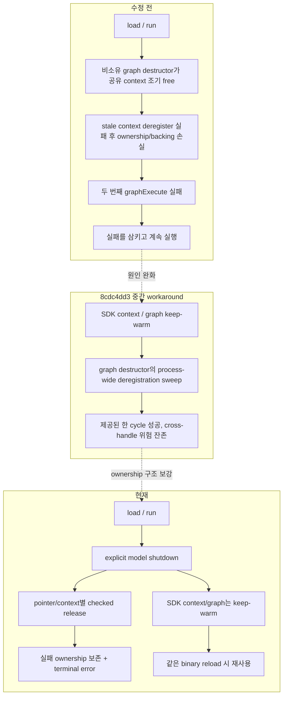
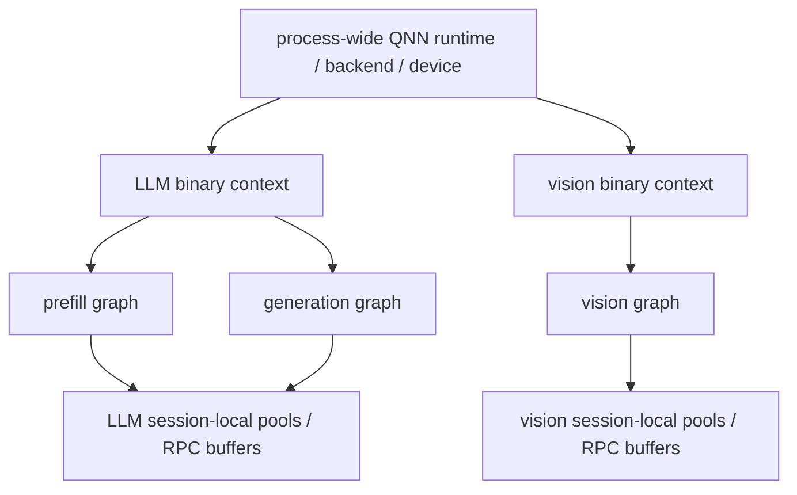

# QNN reload 개선 작업 요약

- 기준 source HEAD: `473e8255 [qnn] include required QNN SDK interfaces`
- 변경 범위: 기준 commit `8cdc4dd3` 이후 22개 source commit
- 대상 문제: QNN model의 `load → run → unload → load → run` 반복 시 두 번째 실행 실패
- 검증 수준: 강한 정적 분석과 부분 cross-compile 완료, 실제 QNN device 반복 시험은 남음

이 문서는 이번 세션의 결과를 빠르게 읽기 위한 안내서다. 세부 근거와 앞으로의 설계는 다음 문서에 있다.

- [상세 정적 분석](qnn_reload_analysis.ko.md)
- [향후 구현 계획](qnn_reload_implementation_plan.ko.md)
- [커밋별 구현 현황](qnn_reload_implementation_status.ko.md)

## 1. 한눈에 보는 결론

원래 before-log의 문제는 단순히 “QNN context를 free해서” 생긴 것이 아니었다. 더 정확히는 다음 문제가 겹쳤다.

1. 먼저 파괴된 비소유 `QNNGraph` destructor가 아직 다른 graph도 쓰는 공유 context를 조기에 free하고 host entry를 폐기했다.
2. 그 뒤 다른 model pool이 stale context로 deregister를 시도했고, 실패해도 bookkeeping과 RPC backing을 버리는 경로가 있었다.
3. 다음 load/run에서 `graphExecute`가 실패해도 상위 API가 실패를 삼키고 token 생성을 계속했다.
4. model-local resource, process-wide allocator, SDK context의 수명 경계가 명확하지 않았다.

`8cdc4dd3`은 context/graph를 keep-warm하고 live context에서 먼저 deregister해 제공된 한 cycle을 성공시켰다. 다만 이 중간 workaround는 `QNNGraph` destructor에서 process-wide registration sweep을 실행했으므로 다른 handle/binary까지 건드릴 수 있는 새 구조적 위험이 있었다. 이후 21개 lifecycle source commit은 이 global sweep도 pointer/context별 owner cleanup으로 교체했고, 22번째 source commit은 Issue #49 build 회귀를 보완했다.

이번 변경은 이 문제를 다음 원칙으로 정리했다.

> 해제에 성공하기 전에는 ownership을 버리지 않고, 실패는 C++ → C API → JNI/Kotlin까지 숨기지 않는다.

QNN SDK context와 graph는 아직 binary path별로 keep-warm한다. 반면 CausalLM handle 내부의 model/session이 소유한 tensor와 RPC allocation은 명시적으로 정리해 handle을 non-runnable 상태로 만든다. 즉 “모든 것을 process 종료까지 보존”하는 방식이 아니라, SDK context cache와 model-local resource의 수명을 분리한 상태다.

## 2. 전과 후의 차이

| 요소 | 수정 전 | 현재 변경 | 사용자에게 보이는 효과 |
|---|---|---|---|
| QNN graph 실행 실패 | 로그만 남기고 계속 진행 가능 | 첫 실패에서 예외/오류로 전파 | 깨진 output으로 token을 계속 만들지 않음 |
| 실행 metric | 이전 성공 상태가 남을 수 있음 | run 시작 시 상태와 metric 초기화 | 실패한 run을 성공처럼 보고하지 않음 |
| tensor binding | forwarding마다 만든 descriptor/누적 vector의 정리가 취약 | call-local binding과 RAII cleanup | 반복 token에서 host-side 누수 위험 감소 |
| context 생성 | 중간 실패가 부분 entry/metadata를 남길 수 있음 | create를 transactional하게 만들고 성공 entry만 공개 | 실패한 context를 정상 cache로 재사용하지 않음 |
| context free | SDK free 실패 뒤 host 상태를 먼저 지울 수 있음 | SDK 성공 전에는 handle/metadata/mmap 보존 | host와 SDK 상태가 갈라지는 split-brain 방지 |
| RPC registration | 초기에는 context 조기 free 뒤 stale deregister; `8cdc4dd3`에서는 global sweep/map clear | `(pointer, context)`별 관리, 성공한 entry만 제거 | 다른 graph/handle의 registration 파괴 범위 축소 |
| RPC backing | deregister 실패 뒤에도 free 가능 | 실패 entry와 backing을 quarantine/retention | DSP가 참조할 수 있는 메모리의 조기 해제 방지 |
| allocator 소유권 | Engine과 CausalLM이 별도 rpcmem manager를 가질 수 있음 | QNN plugin의 process-wide allocator를 공유 | allocation/registration ledger가 하나로 모임 |
| QNN SDK header 의존성 | sample-app utility의 전이 include에 의존 | `QnnInterface.h`와 `QnnMem.h`를 사용 위치에서 직접 include | Linux/Android QNN translation unit의 unknown-type 빌드 오류 제거 |
| plugin 초기화 | 중복 여부 확인 전에 임시 runtime을 만들 수 있음 | process당 once 초기화 | reload 때 불필요한 backend/device 초기화 위험 감소 |
| model unload | destructor 중심이라 해제 실패를 반환하기 어려움 | terminal·idempotent explicit shutdown | unload/destroy 실패를 호출자가 알 수 있음 |
| Android 상태 | native 오류와 Kotlin 상태가 어긋날 수 있음 | C API → JNI → Kotlin sticky teardown status | 실패 뒤 안전하지 않은 reload를 차단 |
| allocation 예외 안전성 | backing 획득과 ownership 기록 사이 예외 창 | ledger/model set을 먼저 예약한 뒤 backing 획득 | OOM 중 추적되지 않은 RPC allocation 위험 감소 |
| 두 QNN model 조립 | vision/LLM 부분 load 실패 시 cleanup 오류 손실 가능 | 모든 임시 owner를 checked cleanup | 멀티모달 조립 실패에서도 실제 teardown 오류 보존 |

## 3. context는 어떻게 유지되는가

현재 구조에서 서로 다른 수명은 다음처럼 구분한다.

| 계층 | 대표 자원 | 현재 수명 |
|---|---|---|
| model/session-local | tensor pool, direct RPC buffer, CausalLM handle 내부 model/session state | unload의 explicit shutdown에서 정리 |
| binary별 SDK cache | QNN context, 그 context에서 복원된 graph | 동일 binary reload를 위해 keep-warm |
| process-wide runtime | QNN backend/device interface, RPC allocator/plugin | process 범위에서 공유 |

논리 구조를 펼치면 다음과 같다.

여기서 context는 SDK의 논리적인 graph/resource container다. context가 두 개라는 말은 물리 NPU가 두 개라는 뜻이 아니다. 두 context도 같은 process-wide backend/device와 같은 물리 NPU를 시간 분할 또는 SDK scheduling으로 사용할 수 있다.

normal unload에서 사라지는 것과 남는 것도 구분해야 한다.

| unload에서 정리 | unload 뒤 유지 |
|---|---|
| model tensor/weight/activation pool | binary path별 SDK context와 cached graph |
| 성공적으로 deregister/free한 direct RPC buffer | process-wide QNN runtime/plugin/RPC allocator |
| CausalLM handle 내부 model/session 자원 | deregistration 실패로 quarantine된 registration/backing |

마지막 행의 backing 보존은 정상 동작의 cache가 아니라 fail-safe다. use-after-free를 피하기 위해 메모리를 의도적으로 남기고 unload를 오류 7로 실패시킨다.

따라서 “QNN graph binary 하나마다 매 load 때 새 SDK context 하나를 만든다”가 현재 설계는 아니다. 동일한 binary path는 기존 warm context를 재사용하고, 서로 다른 binary는 일반적으로 별도 cache entry/context를 가진다. vision encoder와 LLM이 서로 다른 두 QNN binary라면 보통 두 context가 존재하지만, 이번 작업의 주 목적은 멀티모달 최적화가 아니라 단일 QNN model의 reload 안정성이다.

중요한 한계도 있다. 현재 key는 완전한 artifact identity가 아니라 binary path 중심이다. 같은 path의 파일이 교체되거나 alias path로 같은 파일을 열면 stale reuse 또는 중복 context 문제가 생길 수 있다. 이 때문에 향후 `ContextKey`, generation, lease, bounded cache가 필요하다.

## 4. 성능과 구조 리스크

### 좋아질 수 있는 부분

- 같은 binary를 다시 load할 때 context/graph 복원 비용을 피할 수 있다.
- 중복 plugin/runtime 초기화가 줄어 reload latency와 teardown surface가 줄어든다.
- steady-state 단일 model inference에는 allocation ownership 선확보 변경의 추가 비용이 거의 없다.

### 새로 생기거나 아직 남아 있는 비용

- binary 종류가 늘면 warm context와 HTP memory가 process 종료까지 누적될 수 있다.
- manager-wide shared/exclusive lifecycle guard는 서로 다른 context의 run과 cleanup도 필요 이상으로 직렬화할 수 있다.
- `QNNRpcManager::alloc()`은 vendor `rpcmem_alloc` 동안 registration mutex를 보유한다. 병렬 model load나 같은 순간의 registration은 잠시 대기할 수 있다.
- pointer별 release가 manager lock을 반복 획득하므로 큰 model unload latency와 jitter가 커질 수 있다.
- same-context graph retrieve/execute가 SDK에서 thread-safe인지 확정하지 못했다. 여러 handle 병렬 실행 전 별도 검증 또는 직렬화가 필요하다.
- deregistration 실패 시 안전을 위해 backing을 의도적으로 보존하므로, 실패 상황에서는 메모리 누수가 발생할 수 있다. 이는 use-after-free보다 안전한 쪽을 택한 결과이며 로그와 unload 오류로 관찰된다.

### 구조적 한계

- context cache에는 아직 lease, generation, eviction budget, explicit purge가 없다.
- 여러 buffer를 한 transaction으로 release하는 `RegistrationScope + prepare/commit`이 없다.
- 자동 failure-injection seam이 부족해 map OOM, rpcmem 실패, SDK deregister 실패를 host test로 재현하기 어렵다.
- 외부 proprietary `Quick_Dot_AI_QNN` 파생 클래스가 base resource를 derived destructor에서 참조한다면 explicit base shutdown과 호환성 확인이 필요하다. repository 안의 Gemma/VJEPA 경로에서는 정적 검토상 문제가 없었다.

## 5. 수행한 검증과 남은 검증

### 수행함

- before/after log의 lazy context 진입, deregistration 실패, graph 실행 실패 패턴 비교
- 21개 commit의 ownership, rollback, lock, ABI, exception 경계 정적 검토
- 변경 C/C++의 clang-format 14 및 diff consistency 검사
- core/ccapi의 Windows host object/syntax compile과 symbol 확인
- Android NDK r27 arm64 기준 QNN/CausalLM 부분 syntax/object compile
- 실제 Quick JNI object build와 Kotlin offline compile
- experimental multimodal macro OFF/ON compile
- 임시 최소 QNN type stub을 사용한 `ENABLE_QNN` manager compile 및 non-QNN host compile
- Issue #49의 실제 과거 QNN API 2.36/QAIRT 2.47 호환 header로 6개 오류 재현 후 수정본 syntax compile
- 분리된 fake `QnnInterface.h`/`QnnMem.h`로 clang++/g++ QNN-enabled compile과 header-alone self-containment 검사

### 수행하지 못함

- 실제 QAIRT/QNN device에서 `load → run → unload → load → run` 반복 실행
- 동일 binary 50~100회 reload와 DSP/HTP/RSS memory plateau 측정
- handle A가 run 중일 때 handle B unload/reload
- 서로 다른 두 binary와 같은 binary의 여러 handle 동시성 시험
- context free/deregister/rpcmem allocation 단계별 failure injection
- thermal, power, 장시간 unload latency profiling

QAIRT/QNN 2.47은 호환 기준일 뿐이다. 이번 변경은 특정 버전의 return code를 우회하는 patch가 아니라 lifecycle과 ownership 계약을 고친 것이다.

## 6. 앞으로 남은 작업

우선순위는 멀티모달보다 원래 문제인 단일 QNN model/serialized binary reload 검증에 둔다.

1. 실제 기기에서 동일 binary 50~100회 반복하고 매 cycle의 QNN rc, unload status, DSP/HTP/RSS를 기록한다.
2. deregistration/context free/rpcmem 실패를 주입할 test seam을 만든다.
3. `ContextKey + ContextEntry + ContextLease`를 도입해 path alias, same-path replacement, active-user 수명을 명시한다.
4. `RegistrationScope`와 batch `prepare/commit` release로 unload를 진짜 transaction으로 만든다.
5. context cache budget, idle eviction, explicit strict purge를 추가한다.
6. 같은 context의 graph retrieve/execute 및 여러 handle 동시성 정책을 기기에서 확정한다.
7. 그 뒤 vision encoder + LLM 두 QNN binary stress test를 수행한다.

## 7. 권장 PR 분할

21개 lifecycle source commit의 순서를 유지한 stacked PR을 권장한다. 각 PR base는 바로 앞 PR이다. 리뷰 주제와 revert 경계를 엄격히 유지하면 다음 14개가 가장 안전하며, 22번째 Issue #49 build repair는 아래 설명처럼 PR 4에 포함한다.

| PR | commit (범위는 양 끝 포함) | 주제 |
|---|---|---|
| 1 | `467eeadd`–`6cc4f924` | graph execution 실패를 CausalLM까지 전파 |
| 2 | `facd1111` | per-forward tensor binding 예외 안전성 |
| 3 | `9c1c717f`–`24e184c6` | transactional context create/free |
| 4 | `15873b03` | lossless RPC registration/backing cleanup |
| 5 | `4577a696`–`5e2580b8` | Engine/CausalLM allocator 단일화 |
| 6 | `fc14f16d` | dynamic library error lifetime 안전성 |
| 7 | `5163e606`–`82a05282` | context plugin once 초기화와 test source |
| 8 | `d06e0c5f`–`7aa3527d` | release 실패 시 buffer/ledger retention |
| 9 | `9d84c730`–`38227432` | explicit QNN model shutdown 기반 |
| 10 | `d6a4c818` | C API teardown failure 계약 |
| 11 | `10bee850` | JNI/Kotlin teardown failure 전파 |
| 12 | `3f8ea209`–`20e8355b` | CausalLM direct RPC allocation ownership-first |
| 13 | `f7f64236` | QNN manager allocation ledger 선확보 |
| 14 | `32f6575d` | 두 QNN model 조립 실패 cleanup |

분할 경계는 각 표의 마지막 commit 직후다. 더 적은 PR이 필요하면 PR 6+7과 PR 9+10+11을 각각 합쳐 기존 문서의 11개 구분으로 축약할 수 있다. 반대로 PR 4와 PR 8은 각각 하나의 ownership 계약을 여러 계층에서 함께 완성하므로 더 쪼개지 않는 편이 안전하다.

Issue #49 build repair `473e8255`는 독립 동작 변경이 아니라 `15873b03`에서 누락된 직접 header 의존성을 복구한다. 최종 stacked PR에서는 PR 4에 함께 넣거나 squash하는 것이 맞다.

문서 commit은 source 변경과 별개이므로 마지막에 독립 `[docs]` commit으로 둔다.

## 8. Issue #49 Linux/Android QNN 빌드 보완

`build_android.sh --enable-qnn`에서 보고된 여섯 오류는 QNN SDK version workaround가 아니라 C++ header self-containment 문제였다.

- `QNN_INTERFACE_VER_TYPE`의 정의 위치: `QnnInterface.h`
- `Qnn_MemDescriptor_t`, `QNN_MEM_DESCRIPTOR_INIT`, `QNN_MEM_TYPE_ION`의 정의 위치: `QnnMem.h`
- 회귀 원인: `15873b03`에서 `DynamicLoadUtil.hpp → QNN.hpp → QnnInterface.h → QnnMem.h`라는 우연한 전이 include를 제거하면서 실제 직접 의존성을 추가하지 않음
- 수정: manager header는 `QnnInterface.h`, implementation은 `QnnMem.h`를 직접 include

Meson의 source 목록, `ENABLE_QNN`, vendor/QNN include directory는 정상이라 build 설정 변경은 필요하지 않았다. 이 수정은 runtime object layout, ABI, 실행 성능을 바꾸지 않고 compile-time include graph만 명확히 한다.

## 9. 현재 판단

정적 코드 관점에서는 원래 실패의 가장 위험한 조합인 “공유 context 조기 free + deregister 실패 후 ownership 손실 + execute 실패 은폐”를 제거했고, `8cdc4dd3`의 process-wide global sweep도 owner별 cleanup으로 바꿨다. 따라서 이전보다 reload 실패를 일으킬 가능성과, 실패했는데 성공처럼 보일 가능성이 모두 크게 낮아졌다.

다만 실제 QNN device의 장기 반복과 multi-handle 시험이 없으므로 이 상태를 완전 해결로 선언하면 안 된다. 현재 코드는 **기기 검증에 올릴 수 있는 안전한 중간 상태**이며, 다음 승인 기준은 50~100회 반복 후 memory plateau와 정확한 failure propagation을 확인하는 것이다.
