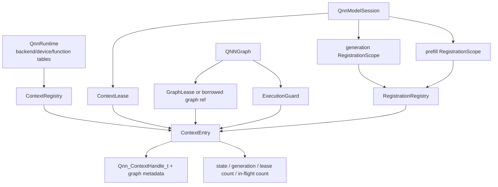

# QNN reload 구현 계획

- 최종 갱신: 2026-07-23
- 최우선 목표: 단일 Gemma QNN binary의 `load → run → unload → load → run`을 안전하고 반복 가능하게 만들기
- 초기 운영 정책: clean deregistration 뒤 SDK context keep-warm
- 별도 검증 정책: strict context free/recreate
- 보조 검증: 같은 binary의 여러 graph/handle, 서로 다른 두 QNN binary
- 제외: CPU 통합형 멀티모달 구현, 초기 단계의 embedding zero-copy 최적화
- SDK 호환 기준: QAIRT/QNN 2.47. 설계는 특정 버전 workaround가 아니라 lifecycle/ownership 불변식에 둔다.

현재 위치: source PR 1~11의 21개 commit까지 완료했다. 다음 구현 중심은 `ContextLease`, `RegistrationScope`, bounded cache이며 실제 QNN device gate는 아직 통과하지 못했다.

이 계획은 `qnn_reload_analysis.ko.md`의 확정된 근거를 구현 순서로 옮긴 문서다. 소스가 변경될 때마다 완료 항목, 변경 파일, 검증 결과와 남은 위험을 `qnn_reload_implementation_status.ko.md`에도 반영한다.

## 1. 채택할 방향

최종 구조는 `ContextRegistry + ContextLease + RegistrationScope + ExecutionGuard`다. 그러나 context 정책은 구조와 분리한다.

- A 정책, 기본값: 마지막 model session이 내려가도 clean-idle context를 cache한다.
- B 정책, 실험/선택값: 모든 lease와 registration이 사라지면 context를 free하고 다음 load에서 recreate한다.
- C 정책, 복구 전용: 모든 QNN client가 정지한 상태에서 backend/device/runtime 전체를 reset한다.

즉, 현재 HEAD의 keep-warm 동작은 폐기하지 않는다. 먼저 destructor의 우연한 side effect를 명시적인 lifecycle 정책으로 바꾸고, 그 뒤 strict recreate가 실제로 가능한지 기기에서 독립적으로 검증한다.

## 2. 반드시 지킬 불변식

구현 및 리뷰에서 아래 항목 중 하나라도 깨지면 merge하면 안 된다.

1. live QNN memHandle이 있는 동안 해당 backing allocation을 free하지 않는다.
2. memHandle을 deregister할 때 해당 SDK context와 backing allocation이 모두 살아 있어야 한다.
3. active `graphExecute`가 있는 context를 deregister/free하지 않는다.
4. deregistration 실패 시 registration entry와 backing allocation을 잊거나 free하지 않는다.
5. `contextFree` 실패 시 context handle, metadata, registry entry를 지우지 않는다.
6. 부분적으로 실패한 create 결과를 registry에 publish하지 않는다.
7. 개별 `QNNGraph` destructor는 공유 context 또는 다른 graph의 registration을 정리하지 않는다.
8. 같은 context를 공유하는 prefill/generation graph는 마지막 사용자까지 context를 pin한다.
9. 다른 handle 또는 다른 QNN binary의 registration은 unload 대상이 아니다.
10. 첫 `graphExecute` 실패에서 inference를 중단하고 호출자에게 오류를 반환한다.
11. vendor API call의 numeric rc와 대상 identity를 로그에 남긴다.
12. unload 성공은 “정리가 요청됨”이 아니라 선택한 정책의 post-condition을 모두 만족했음을 뜻한다.

## 3. 목표 소유 구조



### 3.1 `QnnRuntime`

Process 단위 owner다.

- QNN backend, device, interface/function table, profiling, extension, RPC allocator service 소유
- thread-safe one-time initialization
- context보다 오래 살아야 함
- 정상 종료 순서와 recovery reset 제공
- model load마다 임시 runtime을 만들었다 없애는 duplicate initialization 제거

### 3.2 `ContextKey`

raw path만 사용하지 않는다.

```text
ContextKey = {
  runtime_generation,
  canonical_artifact_identity,
  effective_context_config_identity
}
```

초기 artifact identity 후보는 canonical path + file size + mtime + 배포 manifest ID다. 신뢰 가능한 manifest digest가 있으면 이를 우선한다. 매 load의 full binary hash는 정확하지만 cold-load 비용을 측정한 뒤 선택한다.

### 3.3 `ContextEntry`

- SDK context handle
- binary에서 복사한 graph metadata와 graph handle cache
- monotonically increasing generation ID
- `Creating`, `Ready`, `Idle`, `Closing`, `Quarantined` 상태
- model/graph lease 수
- active execution 수와 condition variable
- context에 속한 registration 수
- 마지막 사용 시각, 추정 메모리, cache policy metadata

### 3.4 `RegistrationKey`와 allocation lifetime

raw address만으로 동일성을 판단하지 않는다.

```text
RegistrationKey = {
  context_generation,
  allocation_id,
  byte_offset,
  byte_length,
  tensor_descriptor_fingerprint
}
```

registration entry는 memHandle뿐 아니라 backing allocation lease와 소유 `RegistrationScope`를 가진다. 이 구조로 deregistration 실패 시 backing free를 구조적으로 막는다. 같은 backing을 서로 다른 context에 등록하면 별도 memHandle entry가 생긴다.

### 3.5 `QNNGraph`

- SDK context의 최종 owner가 아님
- 자기 `ContextLease`/graph reference/registration scope만 보유
- forwarding마다 `ExecutionGuard` 획득
- destructor는 no-throw local lease release만 수행
- 실패를 반환해야 하는 정리는 명시적 `shutdown()`에서 수행

## 4. 정상 lifecycle 알고리즘

### 4.1 최초 load/run

1. runtime을 한 번만 initialize한다.
2. model session이 `ContextKey`를 계산한다.
3. registry에서 existing `Ready/Idle` entry를 acquire하거나 새 entry를 transactionally 만든다.
4. 같은 Gemma binary의 prefill/generation은 같은 `ContextLease`를 공유한다.
5. tensor pool/direct buffers를 allocation handle로 만든다.
6. 첫 사용 시 context generation이 포함된 key로 memRegister한다.
7. graph handle은 context generation마다 한 번 retrieve/cache한다.
8. forwarding은 `ExecutionGuard` 안에서 execute한다.
9. execute 실패 시 즉시 status/exception을 상위 API로 전달한다.

### 4.2 keep-warm unload

```text
block new run/register
  → wait until in_flight == 0
  → deregister this session's scopes while context/backing are live
  → require all deregistration success and this session's scope count == 0
  → deallocate tensor pools and direct backing allocations
  → destroy host NN model/QNNGraph wrappers
  → release ContextLease
  → mark ContextEntry Idle and keep it in cache
  → return unload success
```

deregister 하나라도 실패하면 backing/model owner를 유지하고 unload failure를 반환한다. 즉시 재사용 가능한 상태가 아니면 entry를 `Quarantined`로 둔다. destructor fallback은 경고와 안전한 leak을 선택하며 backing을 강제 free하지 않는다.

### 4.3 strict free/recreate

keep-warm의 clean shutdown이 성공한 뒤에만 진행한다.

```text
require lease_count == 0
  → require in_flight == 0
  → require registration_count == 0
  → transition Idle → Closing
  → contextFree exactly once
  → on success: free metadata/config and erase entry
  → on failure: preserve entry/metadata, mark Quarantined
```

다음 load는 새 generation으로 create한다. 50~100회 device cycle에서 성공하기 전에는 strict free를 기본값으로 바꾸지 않는다.

### 4.4 runtime recovery/shutdown

모든 QNN model session이 정지했을 때만 허용한다.

1. 새 acquire/execute 차단
2. 모든 execution drain
3. 남은 registration을 context별로 정리 또는 quarantine 확인
4. 모든 context free
5. profiling/extension/device/backend/logging을 SDK dependency 순서에 맞춰 정리
6. runtime generation 증가

SDK별 정확한 device/backend 해제 순서는 사용 중인 QNN SDK 문서와 기기 검증으로 확정한다. 추측만으로 현재 destructor 순서를 바꾸지 않는다.

## 5. 구현 단계

각 단계는 별도 commit으로 만들고, 가능한 범위의 host test를 함께 넣는다.

### R0. 관측성과 실패 전파

목표: 다음 기기 실행이 원인을 숨기지 않게 하고, 실패한 inference를 성공으로 보고하지 않게 한다.

- [ ] QNN API wrapper에 operation, numeric rc, context generation/pointer, graph name/handle 로그 추가
- [ ] mem register/deregister 로그에 allocation ID, pointer, fd, memHandle, context ID 추가
- [ ] context/registration state와 count dump 추가
- [x] `graphExecute` 실패를 `QNNGraph::forwarding()` 밖으로 전파
- [x] CausalLM run이 첫 execute 실패에서 token 생성을 중단하고 non-zero 오류 반환 — 정적 call-chain 검증, device 미검증
- [x] 실패한 run의 token/s와 latency를 성공 metric으로 publish하지 않음 — 정적 검증, device 미검증
- [x] QNN model run 시작에서 `has_run_`와 performance metric을 초기화
- [x] streaming/non-stream C ABI 모두 `catch (...)`로 예외 유출 차단
- [ ] SDK version/backend build 정보를 최초 initialize 시 한 번 기록

완료 조건:

- fake `graphExecute` failure가 C/C++ API와 JNI/Kotlin까지 오류로 관찰된다.
- 로그만으로 어느 context generation의 어느 graph/memHandle이 실패했는지 식별 가능하다.

### R1. create/free와 per-forward 자원 정합성

목표: lifecycle API 자체를 transactional하게 만들고 장기 run의 별도 누수를 제거한다.

- [x] `Qnn_Context_Graph_t`와 output handle/metadata/count zero-init — device 미검증
- [x] 필수 function pointer null이면 즉시 실패 — `9c1c717f`, device 미검증
- [x] `makeContext()` 각 단계에 mmap/SystemContext/metadata/core rollback 적용 — `24e184c6`, device 미검증
- [x] 최종 성공한 entry만 `ACTIVE`로 publish/reuse — `24e184c6`, device 미검증
- [x] caller가 `makeContext()` status를 검사한 뒤에만 context 참조 — `9c1c717f`
- [x] `freeContext()`는 SDK success 때만 metadata/map/mmap 제거 — `24e184c6`, device 미검증
- [x] config pointer array와 extension-owned config의 ownership 분리 — `24e184c6`, device 미검증
- [x] input/output tensor descriptor를 RAII로 teardown — `facd1111`, device/ASan 미검증
- [x] `currentInputBuffers/currentOutputBuffers` 제거 후 call-local direct binding — `facd1111`, device 미검증
- [ ] graph handle은 context generation마다 한 번 retrieve/cache
- [x] `QNNRpcManager` destructor iterator invalidation과 allocation/registration bookkeeping 수정 — `15873b03`, device 미검증

완료 조건:

- create 단계별 failure injection에서 invalid entry가 남지 않는다.
- N회 forwarding 뒤 live descriptor/vector 크기가 증가하지 않는다.
- contextFree failure 뒤 entry와 metadata가 보존된다.

### R2. 최소 안전 keep-warm shutdown

목표: 현재 한-cycle 성공을 유지하면서 destructor의 전역 side effect를 제거한다. 현 correctness claim과 device test 우선 범위는 **동시에 active인 QNN model session 1개**지만, 현재 코드는 두 번째 handle을 명시적으로 거부하지 않으므로 multi-handle 안전을 아직 주장하지 않는다.

- [x] registered QNN runtime의 manager-wide shared/exclusive lifecycle gate로 context load, graph run, pointer/context cleanup 상호배제 — `15873b03`
- [x] shared/exclusive guard로 in-flight execution drain — 명시적 count/timeout은 후속 scope API에서 추가
- [x] status를 반환하는 explicit QNN model shutdown/deallocation API 추가 — `9d84c730`, `38227432`
- [x] shutdown이 모든 QNN graph model reset보다 먼저 실행되도록 CausalLM unload 연결 — `38227432`, `d6a4c818`
- [x] 호출처 없는 process-wide `deRegisterQnnTensor()` API 제거; runtime destructor의 private cleanup report만 유지
- [x] 실패 entry는 map에 남기고 backing free 금지 — `15873b03`
- [ ] 여러 allocation을 all-or-nothing으로 prepare한 뒤 모든 dereg 성공 시 commit 정리 — 현재는 실패 backing을 보존하는 one-phase successful-only release이며 R3 `RegistrationScope`가 필요
- [x] `QNNGraph::~QNNGraph()`에서 global deregistration 제거 — 정상 owner인 `MemoryPool`의 pointer별 free로 일원화
- [x] normal unload에서 SDK context/graph keep-warm 동작 유지 — 명시적 `Idle` state/lease는 미구현
- [x] unload 실패를 C API/JNI/Kotlin에 전파 — `d6a4c818`, `10bee850`
- [x] Kotlin은 unload 뒤 model을 non-runnable로 만들고, 성공한 stale handle은 새 load 전에 destroy/0 처리하며, 실패는 terminal flag와 handle에 보존해 reload 차단 — `10bee850`

현재 unload는 process-wide `deregisterAll()`을 사용하지 않고 각 pointer owner의 context별 checked cleanup과 manager-wide lifecycle gate를 사용한다. 그래도 병렬 handle을 안전하다고 주장하려면 R3의 scope 분리와 실제 device 동시성 시험이 필요하다.

PR 4 완료 상태:

- [x] RPC allocation/registration map mutex와 manager-wide shared/exclusive lifecycle guard 구현 — `15873b03`
- [x] `(pointer, context)`별 distinct memHandle entry 구현 — `15873b03`
- [x] deregistration 성공 entry만 erase하고 실패 entry/backing을 quarantine — `15873b03`
- [x] `contextFree` 전 context registration count 0 precondition — `15873b03`
- [x] `QNNGraph` destructor global sweep과 죽은 context-owner 필드 제거
- [x] cache hit descriptor를 datatype/dimensions로 검증하고 반복 forward에서는 추가 vector allocation 없이 비교
- [x] manager의 중복 `libQnnHtp.so` provider 탐색 제거; 이미 초기화된 interface table 주입
- [x] runtime shutdown admission을 닫고 context/backend/device/DSO teardown 전체를 하나의 exclusive guard로 보호
- [x] explicit shutdown 및 unload status 전파 — checked `tryFree`/model deallocation과 C/JNI/Kotlin 계약으로 후속 완료 (`d06e0c5f`~`10bee850`)

manager-wide lifecycle guard는 현재 안전한 과도기다. graph forwarding마다 shared-lock 1회와 registration lookup mutex 비용이 추가되고, 등록된 한 QNN runtime 안에서는 어느 context의 cleanup이든 모든 graph execution과 상호배제된다. R3에서 per-context execution/registration scope로 축소한다. Engine이 중복 임시 context를 생성하는 문제는 별도 core PR에서 제거한다.

완료 조건:

- same binary prefill/generation cleanup이 정확히 한 번 일어난다.
- graph destructor 순서가 바뀌어도 결과가 같다.
- deregister 실패 주입 시 tensor/direct backing이 free되지 않고 unload가 실패한다.
- 현재 after-fix reload 동작을 보존한다.

### R3. ContextRegistry와 scoped registration

목표: 같은 binary의 여러 graph와 여러 handle/binary를 안전하게 지원한다.

- [ ] artifact/config identity와 generation을 포함한 강한 `ContextKey` 도입 — transactional `ContextEntry` state는 `24e184c6`에서 완료
- [ ] `ContextLease`와 per-context `ExecutionGuard` 도입 — manager-wide guard는 `15873b03`에서 완료
- [ ] 최종 registry/lease lock order 문서화 — `CREATING/ACTIVE/QUARANTINED` state machine은 완료
- [ ] session `RegistrationScope`와 allocation lease 도입 — `(pointer, context)` key와 descriptor fingerprint는 `15873b03`에서 완료
- [ ] RPC manager API를 session scope-filtered batch register/deregister로 확장 — pointer/context별 API는 완료
- [ ] address reuse/generation collision을 명시적 오류로 처리 — incompatible descriptor 재등록 검사는 완료
- [x] 같은 Gemma binary의 prefill/generation이 binary-path context entry를 공유
- [x] pointer/context별 cleanup으로 다른 handle/binary registration을 제거하지 않는 partial shutdown 구현 — device 동시성 미검증
- [ ] global process gate를 per-context gate로 축소
- [x] CausalLM direct Android allocator와 NN tensor allocator를 공통 `QNNRpcManager` lifetime 경로로 통합 — `4577a696`, `5e2580b8`; 범용 external lease는 후속

완료 조건:

- A/B 두 handle이 같은 binary를 공유할 때 A unload 뒤 B run 성공
- binary A unload 중 binary B run 성공
- execute 중 같은 context unload는 기다리며, 다른 context는 불필요하게 정지하지 않음
- pointer 주소가 재사용돼도 이전 generation memHandle을 재사용하지 않음

### R4. strict purge/free/recreate 실험 경로

목표: context 영구 cache가 필수인지 기기에서 분리 검증한다.

- [ ] `process_lifetime`과 `strict_on_unload` feature flag
- [ ] 명시적 `purgeContext(ContextKey)`/`purgeIdleContexts()` API
- [ ] precondition 검사: no lease, no execution, no registration
- [ ] contextFree success/failure post-condition 검증
- [ ] recreate 시 새 generation과 graph handle 획득
- [ ] strict mode 50회, 이후 100회 cycle test
- [ ] contextFree 실패 및 vendor rc별 quarantine/recovery 정책

판정:

- strict mode가 안정적이면 제품 요구에 따라 memory-first 또는 latency-first 정책을 선택한다.
- 올바른 순서에서도 실패한다면 keep-warm을 vendor/device 정책으로 명시하고 증거와 SDK version을 기록한다.

### R5. cache budget, runtime 정리와 중복 초기화 제거

- [x] 현재 normal unload의 기본 동작은 process-lifetime keep-warm — 명시적 cache policy 객체는 후속
- [ ] 이후 `keep_last`, idle timeout, byte budget 또는 explicit purge 중 제품 요구에 맞춰 선택
- [ ] cache hit/miss/create/free/quarantine metric
- [ ] 같은 path binary 교체가 cache miss가 되는 artifact identity 검증
- [x] duplicate QNN context plugin initialization 제거와 fake-plugin lifecycle test — `5163e606`, `82a05282`
- [ ] runtime shutdown/recovery API와 모든-client-idle precondition
- [ ] DSP SSR/recovery test

### R6. 보조 확장성 검증

reload 구조가 안정된 뒤 수행한다.

- [ ] 같은 binary의 graph 1개/2개/여러 개
- [ ] 서로 다른 두 QNN binary A/B/A 반복
- [ ] NPU vision encoder + NPU LLM 두 context 반복 load/run/unload
- [ ] partial unload와 handle 병렬성
- [ ] host-copy bridge를 유지한 상태에서 correctness 확인

멀티모달은 이 단계의 stress case다. reload fix를 기다리게 하거나 초기 구조를 멀티모달 전용으로 만들지 않는다.

## 6. 테스트 설계

현재 환경에서는 전체 vendor QNN link와 device run이 불가능하다. Android NDK arm64 부분 syntax/object compile, Quick JNI object, Kotlin offline compile은 수행했지만 concrete QNN failure-injection seam은 여전히 필요하다.

### 6.1 Host fake 단위 테스트

가짜 QNN function table과 `IRpcMem`을 주입해 호출 순서와 failure handling을 검사한다.

1. load 후 run하지 않으면 context/mem API 호출 0회
2. keep-warm: 첫 run create 1회, unload deregister N회/contextFree 0회, reload 후 create 총 1회
3. strict: 첫 run create 1회, unload deregister N회/contextFree 1회, reload 후 create 총 2회
4. deregister 실패: backing free 0회, contextFree 0회, entry/map 보존, unload 실패
5. contextFree 실패: metadata/map 보존, `Quarantined`
6. create 각 단계 실패: registry publish 0회, execute 0회
7. 같은 binary graph 2개: context create 1회, session cleanup 1회
8. 두 handle 같은 binary: A unload가 B registration/execute에 영향 없음
9. 두 binary: A shutdown이 B scope를 건드리지 않음
10. execute 중 unload: unload가 drain까지 기다림
11. graphExecute 실패: 상위 run 실패, output/token/성능 publish 중단
12. address reuse: 새 allocation/generation이 old memHandle을 cache hit하지 않음
13. same path artifact replacement: old context reuse 없음
14. N번 forwarding: tensor descriptor live count와 buffer vector size가 일정
15. runtime parallel ensure: backend/device initialize 1회

### 6.2 정적/동시성 검증

- clang-format 14 및 changed-line format check
- ASan/UBSan 가능한 host tests
- TSan 또는 deterministic race test 가능한 범위
- lock-order assertion와 debug state dump
- vendor API를 registry/global mutex를 잡은 채 호출하지 않는지 review
- destructor가 오류를 삼키는 주요 정리 경로가 아닌지 review

### 6.3 Android/QNN 기기 테스트

우선순위 순서:

1. Gemma `load → run → unload → load → run`
2. 같은 load에서 run 두 번
3. `load → no run → unload → load → run`
4. 20 cycle soak, 이후 100 cycle soak
5. deregister/contextFree 실패를 재현 또는 mock 가능한 device harness
6. cancel/run 중 unload
7. 두 handle 같은 binary: A unload 후 B run
8. 두 binary: A unload 중/후 B run
9. A binary → B binary → A binary
10. same path binary 교체
11. strict purge/free/recreate 50/100회
12. NPU vision + NPU LLM 두 binary stress test
13. background/foreground, thermal, memory pressure

필수 pass 조건:

- `memDeRegister`, `graphExecute`, `contextFree` 실패 0회
- 생성 token이 baseline과 의미상/결정적 설정에서 일치
- 실패 주입 시 즉시 오류 반환, 깨진 token 없음
- kernel panic, DSP SSR, app/native crash 없음
- context create/cache hit/free 횟수가 정책과 일치
- unload 뒤 session/KV state가 fresh session 의미와 일치
- host RSS, RPC/ION allocation, DSP/HTP memory와 registration count가 정책에 맞게 plateau

## 7. 계측할 성능 지표

- cold/warm load latency
- context create/free/purge latency
- graph retrieve latency 및 호출 횟수
- 첫/두 번째 prefill latency
- generation tokens/s와 실제 성공 token 수
- memRegister/memDeregister 횟수와 시간
- context/registration lock wait와 execution drain wait
- context별 host/RPC/DSP/HTP memory
- cache hit/miss/eviction/quarantine 횟수
- N cycle 뒤 allocation/descriptor/handle live count

before log의 실패한 두 번째 run은 성능 baseline으로 쓰지 않는다.

## 8. 위험과 대응

| 위험 | 영향 | 대응 및 rollback |
|---|---|---|
| execute 실패 전파로 기존 앱이 더 자주 실패를 보임 | 외형상 regression | 깨진 성공을 금지하는 의도된 변경; 오류 code 문서화 |
| 명시적 shutdown 추가로 unload 경로 복잡도 증가 | 순서/부분 실패 bug | state machine, failure injection, destructor는 fallback만 담당 |
| manager-wide lifecycle gate | 서로 다른 context도 run/cleanup 중 대기 | R3에서 per-context guard와 lease로 축소 |
| scope/refcount leak | context 영구 pin | debug counter, owner token, shutdown assertion, leak test |
| dereg 실패 시 quarantine | 안전한 메모리 누적 | telemetry와 recovery API; backing 강제 free 금지 |
| keep-warm cache | idle HTP 메모리 및 stale state | artifact identity, explicit purge, R4 strict 시험, R5 budget |
| strict free | reload 재발/driver 문제 | feature flag 기본 off, 즉시 keep-warm으로 rollback |
| lock ordering 오류 | deadlock | 고정 lock order, vendor call 전 unlock, concurrency tests |
| composite key 비용 | load/register latency | manifest identity, stable allocation one-time registration |
| direct/NN allocator 통합 | 넓은 변경 범위 | adapter를 먼저 두고 호출부를 단계적으로 이관 |
| duplicate runtime init 변경 | plugin 등록 회귀 | singleton/registry test와 별도 commit, 쉽게 revert 가능 |

## 9. 권장 commit 단위

1. QNN execution failure propagation — 완료 `467eeadd [qnn] propagate graph execution failures`, `6cc4f924 [CausalLM] preserve QNN inference failure state`
2. `[qnn] make tensor bindings exception safe` — 완료 `facd1111`
3. `[qnn] validate context creation prerequisites` — 완료 `9c1c717f`
4. `[qnn] make context lifecycle transactional` — 완료 `24e184c6`
5. `[qnn] preserve RPC registrations on cleanup failure` — 완료 `15873b03`
6. `[core] add synchronized allocator lookup` — 완료 `4577a696`
7. `[CausalLM] share the QNN RPC allocator` — 완료 `5e2580b8`
8. `[core] make dynamic library errors value safe` — 완료 `fc14f16d`
9. `[engine] avoid duplicate context plugin initialization` — 완료 `5163e606`
10. `[test] cover context plugin initialization lifecycle` — 완료 `82a05282`
11. `[core] preserve buffers after release failures` — 완료 `d06e0c5f`
12. `[qnn] report retained RPC allocations` — 완료 `7aa3527d`
13. `[core] expose explicit model deallocation` — 완료 `9d84c730`
14. `[CausalLM] make QNN model shutdown explicit` — 완료 `38227432`
15. `[CausalLM] report model teardown failures` — 완료 `d6a4c818`
16. `[CausalLM] propagate teardown errors to Android` — 완료 `10bee850`
17. `[CausalLM] track QNN allocations before acquisition` — 완료 `3f8ea209`
18. `[CausalLM] make QNN RoPE allocation exception safe` — 완료 `20e8355b`
19. `[qnn] reserve allocation ledger before RPC acquisition` — 완료 `f7f64236`
20. `[CausalLM] preserve multimodal load cleanup failures` — 완료 `32f6575d`
21. `[qnn] add context leases and scoped memory registrations`
22. `[qnn] add batch release under one cleanup guard`
23. `[qnn] serialize same-context graph retrieval/execution as required`
24. `[qnn] add strict context purge and recreate policy`
25. `[qnn] bound idle context caching and add runtime shutdown`

한 commit에 전체 registry와 앱 변경을 몰아넣지 않는다. 각 commit은 host fake test 또는 최소한 독립적인 failure-injection 검증을 동반한다.

## 10. 구현 시작 전 체크리스트

- [x] 실제 target의 QNN/QAIRT SDK version 확인 — 2.47, 호환성 기준으로만 사용
- [ ] `contextFree`, `memDeRegister`, `graphExecute` numeric rc 확보
- [ ] CausalLM unload와 destroy의 public semantics 확정
- [ ] 제품이 동시에 여러 QNN handle을 허용해야 하는지 확정
- [ ] unload의 메모리 회수 요구와 reload latency 요구 우선순위 확인
- [ ] DSP/HTP memory 측정 방법 확보
- [ ] fake function-table/allocator test seam 위치 결정
- [ ] QNN SDK context config/customConfigs ownership 계약 확인

## 11. 계획 변경 기록

### 2026-07-23 — reload 중심 재작성

- 멀티모달 bundle 중심 계획을 폐기하고 단일 QNN reload를 R0~R5의 중심으로 재배치했다.
- 구조 D와 정책 A/B/C를 분리했다.
- 현재 keep-warm을 초기 기본 정책으로 유지하되 destructor 전역 정리를 explicit shutdown으로 교체하도록 했다.
- strict free/recreate는 결론이 아니라 R4의 대조 실험으로 이동했다.
- deregistration 실패 시 backing 보존, execute failure 전파, transactional make/free를 선행 단계로 올렸다.
- 최종 scoped registry 전의 R2는 single-active-QNN-session을 correctness claim과 우선 test 범위로 제한했다. 코드는 두 번째 handle을 거부하지 않으므로 multi-handle은 안전하다고 주장하지 않는다.
- 멀티모달은 R6의 두-binary 확장성 시험으로 축소했다.
- multi-handle 확장 시 session unload는 해당 session scope만 0을 요구하고, context 전체 registration 0은 마지막 lease의 strict free에서만 요구하도록 교정했다.

### 2026-07-23 — 구현 착수 및 PR 분할

- PR 1 후보: R0 실행 실패 전파, numeric rc/resource identity 진단, 실패 metric/token 중단.
- PR 2 후보: R1 transactional context create/free와 per-forward RAII.
- PR 3 후보: failed-deregister 자원 보존과 explicit keep-warm session shutdown.
- 이후 ContextRegistry/RegistrationScope는 변경량을 재평가해 하나 이상의 별도 PR로 분할한다.
- 각 PR 후보가 독립 review 가능한 상태가 되면 사용자에게 경계를 알리고 다음 묶음으로 진행한다.
- PR 1에는 graph execute의 fail-fast, DSO-safe C ABI catch-all, QNN run metric reset을 함께 묶는다.
- PR 1의 host fake seam은 보류한다. 현재 QNN code가 SDK/concrete runtime에 강결합되어 있으므로 PR 2의 SDK-header-free lifecycle core와 failure-injection test 기반으로 분리한다.
- SDK 2.47은 compile/API 호환성 확인 기준으로만 사용한다. 구현 정책은 특정 버전의 오류 코드나 workaround에 종속시키지 않는다.
- 기존 PR 2 후보를 둘로 분리한다: PR 2는 per-forward tensor descriptor RAII/direct binding, PR 3은 transactional context creation이다.
- context destruction, deregistration ownership, explicit shutdown은 create transaction에 섞지 않고 이후 lossless teardown PR로 유지한다.
- PR 2는 `facd1111`에서 완료했다. 다음 구현 묶음은 transactional context creation으로 진행한다.
- PR 3은 prerequisite 검증 commit `9c1c717f`와 context transaction 본체 commit으로 분리했다.
- transaction 본체는 `CREATING/ACTIVE/QUARANTINED`, failure-preserving free, call-local config ownership, context-lifetime binary mmap을 도입한다.
- quarantine이 생긴 runtime은 기존 `ACTIVE` reuse는 허용하고 신규 create는 차단한다. 동시성/lease는 후속 registry PR 범위다.
- PR 3 다음에는 failed-deregister의 registration/backing 보존을 먼저 구현하고, explicit shutdown/global destructor cleanup 제거를 이어서 분리한다.
- PR 3은 세 독립 리뷰와 수정 후 재검토를 거쳐 `24e184c6`에서 완료했다.
- PR 4는 두 commit으로 계획한다: (1) RPC registration 상태/실패 보존/execution guard, (2) `QNNGraph` process-wide destructor cleanup과 죽은 context-owner 필드 제거.
- `MemAllocator::free()`가 `void`이므로 PR 4는 실패 자원의 안전한 보존까지 담당하고 unload 오류 전파는 explicit shutdown API 후속 commit으로 남긴다.
- exact-diff 검토 결과 두 부분은 “pointer별 free가 유일한 정상 teardown owner”라는 하나의 불변식을 함께 완성해야 하므로 PR 4의 한 source commit으로 묶는다. 중간 상태에서 global API만 남기거나 제거하면 오용 또는 compile 불일치가 생긴다.
- PR 4 다음에는 로그에서 확인된 중복 QNN plugin/backend 초기화를 별도 core PR로 제거한다. registration scope와 explicit unload status 전파는 그 뒤에도 독립 PR로 유지한다.
- PR 5는 앱과 QNN plugin의 중복 RPC allocator ownership을 먼저 합쳤다. Engine의 synchronized allocator getter와 CausalLM adapter를 두 commit으로 분리했고 각각 `4577a696`, `5e2580b8`에서 완료했다.
- 다음 PR은 Engine의 동일 context plugin 중복 create-before-check를 제거한다. 외부 plugin code를 Engine mutex 아래 실행하지 않으면서 동일 normalized path의 최초 initialization만 허용해야 한다.
- PR 6의 선행 loader commit `fc14f16d`를 완료했다. 기존 public `const char *` 오류 API는 유지하고 owning snapshot을 별도 추가해 ABI 위험을 피했으며, 실제 중복 초기화 변경은 다음 Engine commit으로 분리한다.
- Engine commit은 `normalized full_path → shared PluginRecord(std::once_flag)`를 사용한다. 같은 경로의 성공은 process lifetime 동안 fast no-op이고, 예외로 끝난 `call_once`는 다음 호출이 재시도할 수 있어 기본 자동 등록 실패 뒤 CausalLM의 명시 등록 복구 동작을 보존한다.
- Engine 본체는 `5163e606`에서 완료했다. 검토 중 bare soname과 `./file`을 같은 lexical key로 합치면 loader 의미가 달라지는 문제가 발견되어 `loader-name:`/`file-path:` domain으로 분리했다.
- path record는 최초 호출 Engine의 name winner를 빌려 쓰지 않고 자기 Context/DSO를 소유한다. 여러 Engine은 같은 포인터만 attach할 수 있고, 다른 포인터의 같은 이름은 명시적 collision으로 처리한다.
- PR 6은 generic fake context DSO 테스트 commit까지 포함해 닫는다. sequential same-path, concurrent same-path, explicit-path alias, create 실패 후 재시도, DSO retained lifetime을 최소 검증 대상으로 삼는다.
- fake DSO test는 `82a05282`에서 완료했다. name collision과 secondary Engine 동일-pointer attach까지 포함했고, Meson 0.55 및 Windows `.def` export 정적 호환성 검토를 통과했다.
- PR 6 경계는 `fc14f16d` + `5163e606` + `82a05282`이다. 다음 PR은 explicit QNN session shutdown/status 전파를 바로 구현하기 전에 현재 `MemAllocator::free(void)`와 `MemoryPool::deallocate(void)`의 실패 계약을 분리 설계하는 단계부터 시작한다.
- PR 7 경계는 `d06e0c5f` + `7aa3527d`이다. virtual ABI를 바꾸지 않는 `tryFree()` adapter, successful-only owner erase, destructor containment, QNN retention 예외 신호까지 구현했다.
- 다음 CausalLM PR은 true transaction이 아니라 one-phase fail-safe teardown으로 명시한다. 일부 pointer 해제 뒤 다른 pointer가 quarantine되면 rollback할 수 없으므로 모델 상태는 terminal `QUARANTINED`, `initialized=false`이며 반복 unload도 최초 실패를 성공으로 덮지 않는다.
- “모든 deregistration 성공 뒤 backing 일괄 free”는 `RegistrationScope + prepareDeregister + commitBackingFree`가 필요한 별도 PR이다. context free, bulk dereg, runtime shutdown도 session scope/lease 전에는 넣지 않는다.
- 현재 pointer별 free는 buffer마다 process-wide exclusive lifecycle lock을 얻으므로 multi-handle 환경에서 unload latency/jitter 또는 writer starvation 가능성이 있다. batch release와 per-context gate는 correctness PR 뒤 성능/공존성 PR로 분리한다.
- 동일 binary/graph의 여러 handle이 shared lifecycle lock 아래 `GraphInfo::graph` 갱신과 backend extension hook을 동시에 실행할 수 있는 별도 data-race/thread-safety 위험을 발견했다. reload 최소 수정과 분리해 graph retrieve 1회 publish 및 same-context execution 직렬화 여부를 후속 검증한다.
- PR 8 경계는 `9d84c730` + `38227432` + `d6a4c818` + `10bee850`이다. ABI-safe ccapi deallocation bridge, concrete QNN shutdown, sticky C error, Android status 전달을 각각 독립 commit으로 닫았다.
- PR 8은 model/session-local tensor pool과 direct RPC allocation만 정리한다. SDK context와 cached graph는 keep-warm이며, strict context free/recreate를 암묵적으로 수행하지 않는다.
- 다음 PR은 allocation 직후 tracking 이전의 예외 창을 닫는다. common path인 두 번째 allocation 실패는 각 allocation을 즉시 owner set에 등록하도록 바꾸고, set insertion 예외는 즉시 checked rollback한다.
- set insertion과 rollback이 동시에 실패하면 process-wide QNN manager가 backing을 보존해 UAF는 막지만 session-local set만으로는 실패를 완전히 표현할 수 없다. 이를 숨기지 않고 scoped registration/lease PR의 남은 계약으로 기록한다.
- 그 다음 작은 PR에서 multimodal 조립 중 stack temporary handle들의 teardown status 집계를 보완한다. 멀티모달 전체 구조 변경은 하지 않는다.
- PR 9 경계는 `3f8ea209` + `20e8355b`이다. model-local set node를 RPC acquisition 전에 확보하고, Gemma RoPE의 두 buffer도 각각 즉시 tracked ownership으로 전환했다.
- 기존 전역 `get_qnn_input_data`와 `get_cos_sin` 심볼, Quick class layout/vtable은 유지한다. compatibility `get_cos_sin` rollback 실패와 호출자가 없는 `get_zero_memory`는 legacy ownership P1로 문서화한다.
- 다음 PR은 동일 원칙을 allocator 내부의 `QNNRpcManager::allocations_` ledger에 적용한다. map node를 먼저 확보하고 rpcmem을 얻은 뒤 node key를 publish해, metadata OOM 뒤 untracked backing이 생기지 않게 한다.
- 이 allocator PR은 context lease/scoped registration보다 작고 독립적이다. allocation ledger가 lossless해야 이후 registration scope도 신뢰할 수 있으므로 먼저 수행한다.
- PR 10 경계는 `f7f64236` 한 commit이다. process-wide allocator의 `allocations_` node를 rpcmem backing 전에 확보하고 caller publication을 ledger insert 뒤로 옮겼다.
- 강한 ownership 순서를 위해 registration mutex를 vendor allocation 동안 유지한다. 이는 concurrent load와 active handle registration 사이의 latency tradeoff이며, device에서 rpcmem allocation 시간과 inference tail latency를 함께 계측해야 한다.
- mutex 구간을 다시 줄이는 최적화는 allocation node를 선확보한 채 unlock/relock하고, 재-lock 실패 시 안전한 process-lifetime retention을 제공할 별도 pending ledger가 생긴 뒤에만 고려한다.
- PR 11 경계는 `32f6575d` 한 commit이다. 두 임시 QNN handle 조립의 모든 실패 경로를 explicit checked cleanup으로 통합하고 cleanup error 7을 우선한다.
- 멀티모달 구조 자체를 재설계하지 않았고, 주 reload 로드맵의 context lease/scoped registration 순서는 그대로다.
- 다음 중심 단계는 `RegistrationScope`를 바로 크게 도입하기 전에 현재 pointer/context registration 생성·해제의 prepare/commit 경계를 더 작게 분리할 수 있는지 감사한다. 큰 registry PR은 fake failure seam과 함께만 시작한다.
