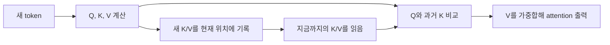
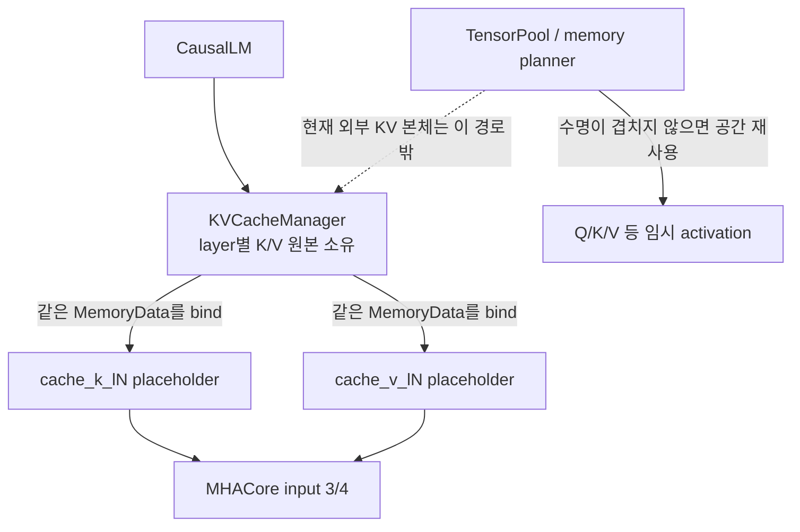
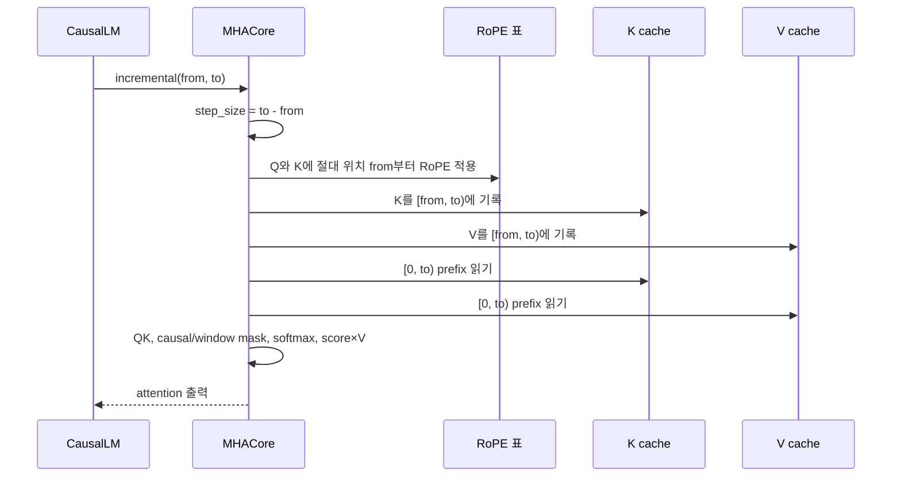
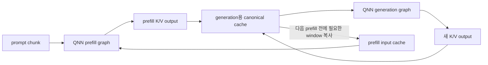
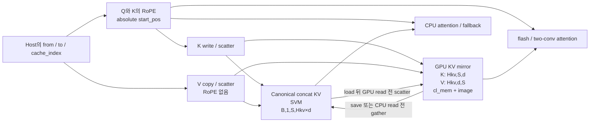
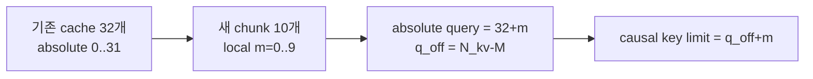
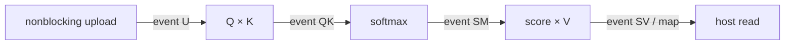
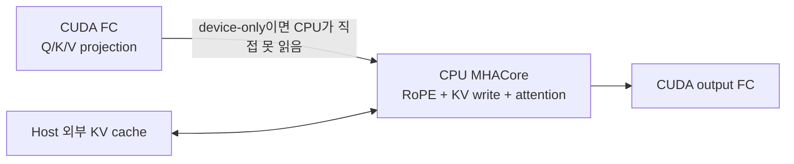
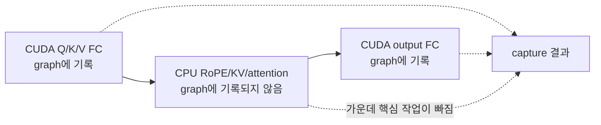
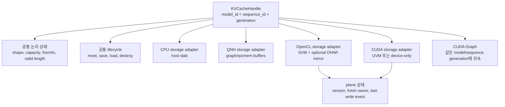

# KV 캐시 관리: 기존 CPU 방식부터 GPU 도입 이후까지

이 문서는 NNTrainer CausalLM의 기존 KV cache가 실제로 누구에게 소유되고,
prefill·decode·reset·save/load 때 어떻게 움직이는지부터 설명한다. 그다음
리뷰한 GPU PR들이 어떤 저장 방식과 실행 부품을 추가하는지, 무엇이 아직
연결되지 않았는지, 안전한 최종 구조는 어떠해야 하는지를 쉬운 비유와 함께
정리한다.

관련 전체 변화는 [37개 PR 통합 영향 안내서](./pr-stack-impact-guide-ko.md),
각 PR의 정확성 문제는 같은 디렉터리의 상세 리뷰 문서에서 볼 수 있다.

## 먼저 구분할 세 가지 상태

이 문서에서 다음 세 표현은 서로 다른 뜻이다.

| 표현 | 뜻 |
|---|---|
| **기존 CPU 경로** | 공통 기준 commit `b3a5face`의 CausalLM 외부 KV cache와 CPU `mha_core` 동작 |
| **현재 GPU PR 부품** | 2026-07-29에 검토한 각 OpenCL/CUDA PR head에 실제로 들어 있는 코드 |
| **목표 GPU 구조** | GPU PR의 의도를 살리되, 리뷰에서 발견한 정확성·동기화 문제까지 고친 최종 형태 |

관련 PR들은 하나의 직선형 branch가 아니다. 여기서 “현재 GPU PR 부품”은
서로 다른 관련 head에서 기능과 호출 가능성을 확인했다는 뜻이며, 모든 head를
기계적으로 합치면 하나의 완성된 tree가 된다는 뜻은 아니다.

가장 중요한 결론은 다음과 같다.

> 리뷰한 PR들을 그대로 모아도 CausalLM의 KV cache와 attention이
> end-to-end GPU로 전환되지는 않는다. OpenCL에는 KV/RoPE/attention kernel과
> GPU용 KV mirror 부품이 생기지만 기존 `MHACoreLayer` 호출 경로에는 아직
> 연결되지 않았다. CUDA에는 그 KV/RoPE/attention kernel 자체가 아직 없다.

따라서 이 문서는 **현재 구현**과 **연결이 완료된 목표 구조**를 계속 나누어
표시한다.

## 1. 30초 요약

| 질문 | 기존 CPU | GPU 도입 후 목표 | 리뷰한 head의 현재 상태 |
|---|---|---|---|
| KV의 의미가 바뀌나? | layer별 K/V와 token 위치를 저장 | 바뀌지 않음 | 의미는 유지됨 |
| 누가 원본을 소유하나? | `KVCacheManager` | model·sequence별 KV manager | 기존 manager는 여전히 host `Tensor`를 소유 |
| 저장 모양은? | token 순서의 연속 배열 | 원본 + GPU 친화적 mirror 가능 | OpenCL mirror API는 있음, CUDA mirror는 없음 |
| prefill은? | 여러 token을 `[from,to)`에 기록 | 여러 token GPU kernel | OpenCL primitive는 있으나 CausalLM caller 없음 |
| decode는? | 보통 token 한 개를 뒤에 기록 | 한 token GPU kernel/graph replay | CUDA Graph 기반은 있으나 KV kernel과 위치 연결이 없음 |
| reset은? | manager의 내부 책갈피만 0으로 옮기는 함수가 있음 | MHA 위치와 모든 plane·graph 세대도 함께 초기화 | 완전한 session reset을 묶는 lifecycle 계약이 없음 |
| save/load는? | host 원본의 유효 prefix를 파일로 저장·복원 | device와 host 사이 동기화가 추가 | OpenCL scatter/gather API만 있고 실제 연결은 없음 |
| 새로 어려워지는 점은? | 위치와 범위 관리 | 복사 방향, 최신 사본, event, 장치 주소, graph 수명 | 이 부분에 blocker가 많이 남아 있음 |

한 문장으로 줄이면 다음과 같다.

> **공책의 내용과 페이지 번호는 그대로지만, GPU가 빨리 읽도록 별도의
> 색인 카드와 비동기 작업 순서를 관리해야 한다.**

## 2. KV cache는 무엇인가

Transformer의 attention은 새 token을 만들 때 과거 token의 Key와 Value를
다시 사용한다. 매번 과거 전체의 K와 V를 재계산하면 비싸므로, 한 번 계산한
결과를 저장해 두는 것이 KV cache다.

도서관에 비유하면 다음과 같다.

- K는 “어떤 내용을 찾을지” 비교하는 색인이다.
- V는 그 색인에 연결된 실제 내용이다.
- Q는 지금 들어온 질문이다.
- attention은 Q와 과거 K를 비교한 뒤, 관련 있는 V를 섞어 답을 만든다.
- KV cache는 이미 읽은 책의 색인과 내용을 적어 둔 장기 공책이다.



### KV cache가 커지는 이유

기본 메모리 크기는 대략 다음 식으로 계산할 수 있다.

```text
KV bytes
= 2 × layer 수 × batch
  × 최대 token 수
  × KV head 수 × head dimension
  × 원소당 byte

앞의 2 = Key 한 벌 + Value 한 벌
```

예를 들어 layer 32개, batch 1, KV head 8개, head dimension 128, FP16이면
다음과 같다.

| 최대 token 수 | 대략적인 KV 크기 |
|---:|---:|
| 4,096 | 512 MiB |
| 8,192 | 1 GiB |
| 32,768 | 4 GiB |

같은 조건에서 KV head가 32개인 일반 MHA라면 4,096 token만으로 약 2 GiB가
필요하다. GQA/MQA가 KV head 수를 줄이는 것은 계산량뿐 아니라 이 장기
저장소의 크기도 줄인다.

## 3. 이름에 `cache`가 붙어도 모두 KV cache는 아니다

GPU PR에는 여러 종류의 cache가 등장한다. 이들을 하나로 묶어 생각하면
수명과 무효화 문제를 잘못 이해하기 쉽다.

| 종류 | 저장하는 것 | 보통의 수명 | 핵심 식별 정보 |
|---|---|---|---|
| **KV cache** | 한 대화의 과거 K/V | sequence 또는 대화 | model, sequence, layer, token 위치 |
| RoPE LUT cache | 위치별 sin/cos 표 | model 또는 context | RoPE 설정과 최대 위치 |
| weight/repack cache | GPU용으로 바꾼 weight | model/checkpoint | 원본 weight와 model 세대 |
| activation quant cache | 한 연산의 임시 양자화 결과 | 한 forward 또는 storage 세대 | tensor 값의 세대와 범위 |
| CUDA Graph cache | 반복할 GPU 실행 순서 | model·shape·sequence 세대 | 모든 captured 주소와 동적 상태 |

특히 [PR #4110 리뷰](./pr-4110.md)와
[PR #4111 리뷰](./pr-4111.md)의 pointer-only cache 문제는
**일반 activation의 GPU 파생 결과**에 관한 문제다. 기존 외부 KV 본체는
`KVCacheManager`가 직접 소유하므로 memory planner가 token마다 다른 tensor에
그 공간을 빌려주는 구조가 아니다.

다만 GPU KV mirror, image view, CUDA Graph 같은 **KV에서 파생된 사본이나
실행 cache**도 model/context/storage 세대를 구분해야 한다는 교훈은 같다.

## 4. 기존 CPU KV cache: 모델이 가진 긴 공책

### 4.1 소유권

현재 일반 CausalLM의 canonical KV 저장소는 graph의 임시 activation pool이
아니다.

1. `KVCacheManager`가 model layer slot마다 K와 V `Tensor`를 직접 한 번 할당한다.
2. `Transformer`가 graph에 `cache_k_l<N>`, `cache_v_l<N>` 입력 자리를 만든다.
3. `CausalLM::allocateAndBindKVCache()`가 manager의 실제 메모리를 그 입력에
   연결한다.
4. `MHACoreLayer`가 연결된 전체 buffer에서 필요한 구간을 view로 잘라 쓴다.



쉽게 말하면 다음과 같다.

- Q/K/V 같은 중간 tensor는 계산할 때 잠깐 빌리는 **공용 사물함**이다.
- 외부 KV cache는 대화가 끝날 때까지 모델이 보관하는 **전용 공책**이다.
- 공용 사물함은 시간차로 다른 tensor가 재사용할 수 있지만, 현재 외부 KV
  공책은 그 방식으로 돌려 쓰지 않는다.

일반 Transformer에서는 이 두 buffer를 attention layer마다 사용한다. LFM2
같은 hybrid model의 conv-only block은 manager allocation slot이 있어도
cache placeholder가 없으므로 bind와 실제 사용을 건너뛸 수 있다.

과거의 legacy 3/4-input MHA에는 layer 내부 cache를 graph pool에
`MAX_LIFESPAN`으로 요청하는 경로도 남아 있다. 그러나 현재 일반 CausalLM이
만드는 5-input external-cache graph의 기준 동작은 위의 manager 소유 방식이다.

### 4.2 저장 모양

일반 layer의 K와 V는 각각 다음 모양이다.

```text
[batch, 1, max_seq_len, kv_width]

kv_width = num_heads_kv × head_dim
```

예를 들어 `batch=1`, `max_seq_len=8`, `kv_width=4`이면 한 cache는 다음처럼
생각할 수 있다.

```text
token position
0  [k0 k1 k2 k3]
1  [k0 k1 k2 k3]
2  [k0 k1 k2 k3]
...
7  [아직 비어 있는 자리]
```

K와 V가 각각 한 권씩 있고, 일반 Transformer에서는 이런 두 권을 attention
layer마다 사용한다. 앞서 설명한 hybrid conv-only layer는 예외가 될 수 있다.
Gemma4처럼 layer마다 KV 폭이 다른 모델은 manager가 layer별 `kv_width`를 따로
받아 각 공책의 가로 길이를 다르게 만든다.

일반 build에서는 16-bit cache를 사용한다. FP16 지원 build는 FP16이고,
비-FP16 build의 `UINT16`은 half 계열 데이터를 담는 16-bit 저장 용기 역할을
한다.

### 4.3 실제 쓰기 위치

batch 하나의 현재 token 위치에 쓰는 element offset은 다음과 같다.

```text
batch 시작
  = batch × cache.getFeatureLen()

현재 쓰기 시작
  = batch 시작 + cache_index × kv_width
```

쓰기 범위는 `[cache_index, cache_index + step_size)`이고, 읽기 범위는 batch
시작부터 현재 끝인 `[0, cache_index + step_size)`다.

`KVCacheManager`에도 같은 공식을 쓰는 write/read view API가 있다. 다만 현재
CausalLM의 hot path에서는 manager가 매 token마다 작은 view를 넘기는 것이
아니다. manager는 전체 공책을 한 번 bind하고, `MHACoreLayer`가 그 안에서
직접 view를 만든다.

### 4.4 한 번의 attention step



중요한 순서는 다음과 같다.

1. 새 K에는 현재 **절대 token 위치**를 사용해 RoPE를 적용한다.
2. RoPE가 적용된 K를 현재 cache 위치에 쓴다.
3. V도 같은 token 위치에 쓴다.
4. Q에도 같은 절대 위치 기준의 RoPE를 적용한다.
5. 지금까지 유효한 K/V 범위만 읽어 attention을 계산한다.

GPU 구현이 저장 모양을 바꾸더라도 이 논리 순서는 바뀌면 안 된다.

### 4.5 첫 prefill, 이어서 하는 prefill, decode

prefill을 단순히 “`from==0`인 실행”이라고 정의하면 안 된다.

| 상황 | 예시 범위 | 뜻 |
|---|---|---|
| 첫 prefill | `[0,128)` | 첫 prompt 128개를 한꺼번에 기록 |
| resumed/chunked prefill | `[128,160)` | 저장된 prefix 뒤에 새 prompt 32개를 기록 |
| decode | `[160,161)` | 새 token 한 개를 slot 160에 기록 |

저장된 system prompt가 있거나 이전 대화를 이어 가면 정상적인 prefill도
0이 아닌 위치에서 시작한다.

```text
[저장된 system prompt][이전 대화][새 prompt chunk][생성 token...]
 0                  SYS_LEN       prefill_from

prefill_from = SYS_PROMP_LEN + global_token_len
```

현재 CPU `MHACoreLayer`의 판정은 다음과 같다.

```text
prefill = (from == 0) 또는 (step_size > 1)
decode  = 보통 (from > 0) 그리고 (step_size == 1)

따라서 첫 실행 [0,1)도 prefill로 분류됨
```

즉 `from` 하나만 보거나 token 수 하나만 보고 분류하면 안 된다. 특히
`from>0, step_size>1`인 resumed prefill을 decode로 오해하지 않아야 한다.

### 4.6 sliding window는 공책을 지우는 기능이 아니다

기존 CPU 외부 KV 경로의 sliding attention은 보통 과거 KV를 물리적으로
삭제하거나 ring 형태로 덮어쓰지 않는다.

```text
전체 물리 cache
[t0][t1][t2][t3][t4][t5][t6][빈칸]

window = 4일 때 attention이 실제로 보는 부분
            [t3][t4][t5][t6]
```

즉 공책은 앞에서부터 계속 보관하되, 계산할 때 최근 `W`페이지만 펼쳐 본다.
일반 CPU 경로에는 최대 capacity를 넘으면 자동으로 앞부분을 버리고 계속 쓰는
보편적인 ring/shift 기능이 없다. legacy 경로도 cache shift가 필요해지는
범위에서는 NYI 오류를 낸다.

이 구분이 중요한 이유는 다음과 같다.

| 용어 | 실제 뜻 |
|---|---|
| sliding attention | attention 계산이 최근 window만 참고 |
| ring KV cache | 오래된 물리 slot을 새 token이 다시 사용 |
| cache eviction | 오래된 내용을 명시적으로 제거 |

세 가지는 같은 말이 아니다.

### 4.7 reset, save, load, 대화 이어가기

`KVCacheManager::reset()`은 byte 전체를 0으로 덮지 않는다. manager 내부
책갈피인 `cache_pos_`만 0으로 되돌린다.

```text
reset 전
[유효 t0][유효 t1][유효 t2][과거 byte...]
                            ▲ 다음 위치

reset 후
[과거 byte가 남아 있음................]
 ▲ manager 책갈피 0
```

읽기 범위를 항상 `[0,to)`로 제한하면 새 sequence 범위 밖의 과거 byte는
보이지 않으므로 이 방식 자체는 합리적이다. 공책을 모두 지우기보다 책갈피를
첫 페이지로 옮기는 셈이다.

단, 이 함수 하나가 완전한 CausalLM session reset은 아니다. 각 MHA의
`cache_index`, `global_token_len`, system-prefix 상태는 바꾸지 않는다.
새 sequence를 시작하려면 `setKVCachePosition(0)` 또는 다음 inference의
`from=0` 등 상위 경로가 관련 상태를 함께 맞춰야 한다.

save/load 동작은 다음과 같다.

| 동작 | CPU에서 하는 일 |
|---|---|
| save | layer 순서대로 K `[0,seq_len)`, V `[0,seq_len)`을 binary로 저장 |
| load | 같은 범위에 byte를 복원하고 manager 위치를 `seq_len`으로 설정 |
| position sync | 모든 `MHACoreLayer::cache_index`도 같은 위치로 맞춤 |
| 다음 prefill | 복원한 prefix 뒤의 절대 위치부터 기록 |

일반 manager 파일에는 model architecture나 format version 같은 강한
자기설명 metadata가 없다. 다른 model이나 shape의 파일을 잘못 사용하는 것을
상위 계층이 막아야 한다.

### 4.8 현재 위치가 한 곳에만 있지는 않다

현재 CPU/CUDA 관련 코드에는 “다음 token 위치”를 나타내는 상태가 여러 곳에
있다.

| 상태 | 소유자 | 역할 |
|---|---|---|
| `SYS_PROMP_LEN + global_token_len` | `CausalLM` | system prefix와 이전 대화 길이 |
| `KVCacheManager::cache_pos_` | 외부 manager | 저장·복원 및 논리 위치 |
| `MHACoreLayer::cache_index` | 각 attention layer | 실제 write slot |
| `cuda_pos_buffer` | CUDA 전역 buffer | Graph replay에서 위치를 바꾸려는 장치 입력 |

CPU eager 경로는 시작·resume 때 `setKVCachePosition()`으로 manager와 각
MHA를 맞춘다. 그 뒤 각 incremental inference의 `from/to`가 MHA의 실제
write 위치를 다시 정한다. 다만 일반 CausalLM이 매 step마다 manager의
`cache_pos_`까지 항상 `advance()`하는 것은 아니다. 즉 현재도 위치의 권위가
완전히 한 객체에 모여 있지 않으며, 실제 계산에서는 호출의 `from/to`가 더
직접적인 기준이다. GPU Graph처럼 C++ layer 순회를 생략하려면 하나의 권위 있는
위치 설명을 device kernel까지 전달하는 별도 계약이 필요하다.

## 5. 별도 QNN/NPU 구현과 비교

이 절은 출처를 분리해서 읽어야 한다.

- 리뷰 대상 GPU PR들의 공통 기준 `b3a5face`에는 QNN core, `QNNGraph`,
  `rpcmem` allocator 같은 공용 기반이 있다.
- 아래의 상세 CausalLM KV 비교에 참고한 Gemma4 E2B QNN app과
  `QnnKvCacheManager` 계열은 [별도 QNN 통합 commit](https://github.com/nntrainer/nntrainer/commit/245dae4425a6c2fd83cac20cfadecb772443b46c)에
  있는 구현이다.
- 따라서 이것을 “37개 GPU PR이 변경한 기존 QNN KV 경로”라고 해석하면 안
  된다. NPU의 다른 구현 방식을 이해하기 위한 참고 비교다.

여기서 비교한 `Gemma4_E2B_QNN` app은 일반 CPU `MHACoreLayer`를 연산
하나씩 실행하기보다, 미리 컴파일된 prefill/generation graph를 큰 단위로
실행한다. 그래서 KV 관리도 graph 입출력 buffer에 맞춰진다.



대표적인 차이는 다음과 같다.

| 항목 | 기존 CPU CausalLM | 별도 QNN app 예시 |
|---|---|---|
| 계산 단위 | C++ layer와 `MHACore` | 사전 컴파일된 QNN graph |
| canonical 저장소 | model 소유 K/V `Tensor` | generation graph용 buffer |
| prefill 저장소 | 같은 원본 cache | 별도 prefill input/output buffer 가능 |
| K/V 배치 | token-major concat | K `[head_dim][sequence]`, V `[sequence][head_dim]` 등 graph 계약에 맞춤 |
| sliding | 전체를 두고 최근 W개만 읽음 | 일부 작은 buffer는 오래된 행을 실제로 밀어냄 |
| reset | manager의 `cache_pos_`만 0, 나머지 상태는 상위 경로가 맞춤 | quant zero-point 등으로 실제 buffer를 초기화할 수 있음 |
| save/load | 단순 K/V prefix | 이 Gemma4 E2B app은 persistence를 노출하지 않고 `run()`마다 reset |

QNN core의 `QNNRpcManager`가 pointer를 memhandle로 등록하는 것은 “이 물리
방을 NPU가 사용할 수 있다”는 출입증에 가깝다. 이는 위 Gemma app의 KV
관리 객체와는 다른 core 계층이다. 반면 GPU activation 결과 cache는 “지금
그 방에 어느 tensor의 어떤 값이 들어 있는가”까지 구분해야 한다. 따라서 QNN
등록 cache에서 주소가 중요하다고 해서 GPU의 값 cache도 주소만으로 안전하다는
뜻은 아니다.

또한 현재 별도 tree의 `QnnKvCacheManager` class 자체는 저장소 안에서 실제
owner/call site가 확인되지 않았다. 이 미사용 class에는
magic/version/architecture metadata를 가진 save/load 구현이 있지만, 그것을
현재 Gemma4 E2B app의 실제 persistence 동작으로 설명하면 안 된다. 위 동작도
모든 QNN model의 공통 동작으로 일반화하면 안 된다.

## 6. GPU로 옮겨도 반드시 유지해야 하는 계약

물리 저장소가 host, SVM, `cl_mem`, image, UVM, `cudaMalloc` 중 무엇이든
다음 의미는 같아야 한다.

| 불변 조건 | 이유 |
|---|---|
| layer마다 K와 V가 정확히 대응 | 다른 layer나 K/V가 섞이면 attention 전체가 틀림 |
| `kv_width = Hkv × head_dim` | GQA head 배치와 offset의 기준 |
| write 범위는 `[from,to)` | prefill과 decode가 같은 규칙으로 이어짐 |
| Q와 K는 같은 절대 위치의 RoPE 사용 | 위치가 다르면 attention 의미가 바뀜 |
| 읽기 끝은 `to` | 방금 추가한 K/V까지 포함해야 함 |
| causal query 위치는 절대 위치 | prefix 뒤의 query가 과거 전체를 볼 수 있어야 함 |
| batch stride와 view offset 보존 | batch 1 이상과 nonzero slot에서 필수 |
| capacity를 넘기 전에 거부 | host/device OOB 방지 |
| reset/load 후 모든 위치 상태 일치 | 과거 대화나 잘못된 slot 재사용 방지 |

CPU와 GPU가 공유해야 하는 step 설명은 단순한 pointer 하나가 아니라 다음 묶음에
가깝다.

```text
KVStep
- batch
- from                  절대 쓰기 시작 위치
- step_size = to-from   이번에 쓰는 token 수
- to                    읽을 총 prefix 길이
- kv_width
- max_seq_len
- sliding window
- model/sequence generation
```

## 7. GPU가 들어오면 왜 저장 관리가 복잡해지는가

CPU는 보통 한 주소 공간의 원본 하나를 함수 호출 순서대로 읽고 쓴다. GPU는
다음 이유로 사본과 실행 순서를 별도로 관리해야 한다.

1. GPU가 빠르게 읽는 memory layout이 CPU 원본과 다를 수 있다.
2. host와 device가 같은 pointer를 볼 수 있는지 장치마다 다르다.
3. GPU 명령은 제출 후 나중에 끝나는 비동기 작업이다.
4. 같은 tensor에 SVM plane과 `cl_mem` plane이 함께 있을 수 있다.
5. GPU Graph는 첫 실행의 주소와 작업 순서를 기억한다.
6. save/load와 CPU fallback에는 다시 host에서 읽을 수 있는 형태가 필요하다.

“어디에 저장돼 있는가”와 “어느 사본이 최신인가”는 서로 다른 질문이다.

| 질문 | 예 |
|---|---|
| residency | 이 tensor는 SVM을 쓸까, `cl_mem`을 쓸까? |
| freshness | SVM과 `cl_mem` 중 어느 쪽에 최신 token이 들어 있나? |
| ordering | 최신 사본을 만드는 copy/kernel이 실제로 끝났나? |
| identity | 이 사본이 현재 model·sequence·allocation의 것인가? |

static residency만 결정해 놓고 freshness와 event를 추적하지 않으면,
이름과 shape가 맞아도 오래된 값을 읽을 수 있다.

## 8. OpenCL KV 관리가 의도하는 구조

### 8.1 관련 PR이 추가하는 부품

| PR | KV 관리와 관련된 역할 |
|---|---|
| [#4109](./pr-4109.md) | SVM allocator/pool, queue, `ClBufferPool` 기반 |
| [#4112](./pr-4112.md) | OpenCL RoPE, K/V scatter·gather, attention kernel, OHWI mirror |
| [#4114](./pr-4114.md) | `HOST/SVM/GPU_CLMEM` static residency 분류와 device plane |
| [#4145](./pr-4145.md) | planner-managed SVM-only offset의 불필요한 일반 `cl_mem` plane 생략 |
| [#4148](./pr-4148.md) | Intel XMX/DPAS용 flash-attention prefill |
| [#4151](./pr-4151.md) | XMX reduction 방식 개선 |

### 8.2 원본 공책과 GPU용 진열대

OpenCL 쪽에서 의도한 핵심은 canonical concat cache를 SVM에 유지하면서,
필요하면 GPU가 읽기 좋은 OHWI 형태의 별도 `cl_mem`/image mirror를 두는
방식이다.



비유하면 다음과 같다.

- SVM concat cache는 token 순서대로 적은 **원본 장부**다.
- OHWI mirror는 GPU 직원이 head와 열별로 빨리 찾도록 재정렬한
  **진열대 또는 색인 카드**다.
- 장부만 수정하고 진열대를 갱신하지 않으면 GPU가 과거 값을 본다.
- 진열대만 수정하고 장부로 모으지 않으면 save나 CPU fallback이 과거 값을 본다.

이 그림은 **연결이 완료된 목표 구조**다. 현재 외부 `KVCacheManager`의
standalone `Tensor`는 `ClSVMAllocator`를 자동으로 거치지 않으므로, reviewed
head에서 host 원본이 저절로 SVM 원본으로 바뀌지는 않는다. device-aware
KV storage adapter나 명시적인 staging 연결이 추가로 필요하다.

### 8.3 두 layout

```text
Canonical K/V
[token][all KV heads × head dimension]

GPU K mirror
[KV head][sequence][head dimension]

GPU V mirror
[KV head][head dimension][sequence]
```

K는 query와 sequence 축을 따라 비교하기 좋게, V는 attention score와 곱하기
좋게 뒤집어 둘 수 있다. 이 물리 배치가 달라도 “token 37의 K/V”라는 논리적
정체성은 같아야 한다.

### 8.4 예상 lifecycle

#### 새 token 또는 chunk 추가

1. `from`, `to`, `step_size`를 정한다.
2. Q와 K에 절대 위치 기준 RoPE를 적용한다.
3. canonical SVM 또는 GPU mirror에 `[from,to)`를 기록한다.
4. 다른 plane도 필요하면 scatter/gather를 enqueue한다.
5. attention kernel이 최신 plane과 올바른 event를 기다린다.
6. 성공한 뒤에만 유효 길이를 `to`로 바꾼다.

#### save 또는 CPU fallback

1. GPU가 mirror에 쓴 마지막 event를 기다린다.
2. mirror가 최신이면 `[0,to)`를 canonical SVM으로 gather한다.
3. gather 완료 뒤 host가 읽거나 파일로 저장한다.

#### load 또는 prefix resume

1. host가 canonical SVM에 prefix를 읽는다.
2. manager와 layer 위치를 `seq_len`으로 맞춘다.
3. GPU mirror를 사용할 예정이면 `[0,seq_len)`을 scatter한다.
4. 기존 mirror/image/graph가 다른 storage 세대의 것이면 재생성한다.

### 8.5 residency와 #4145의 정확한 범위

#4114의 planner는 이름에 `cache_`가 들어간 tensor를 SVM으로 낮추어,
canonical KV를 SVM에 유지하려는 의도를 드러낸다. 즉 이 설계는 “모든 KV를
단일 `cl_mem`으로 바꾼다”가 아니다.

#4145가 생략하는 것은 `ClBufferPool`이 planner token/offset에 만들던
**일반적인 두 번째 `cl_mem` plane**이다.

- 같은 planner offset을 시간차로 쓰는 tensor가 모두 SVM이면 `cl_mem` 생략
- 하나라도 `GPU_CLMEM`이면 `cl_mem` 유지
- #4112 attention이 명시적으로 만드는 OHWI KV mirror는 별도 allocation이므로
  이 최적화로 없어지지 않음
- 현재 외부 `KVCacheManager`의 standalone `Tensor`도 그 planner token 자체가
  아님

따라서 “#4145가 모든 긴 KV의 메모리를 절반으로 줄인다”는 설명은 너무 강하다.
정확히는 **planner-managed SVM-only 장기 tensor의 불필요한 generic device
plane을 생략한다**고 보는 것이 맞다.

## 9. OpenCL 현재 head에서 아직 완성되지 않은 부분

### 9.1 CausalLM 연결이 없음

리뷰한 #4112, #4114, #4125, #4148, #4150, #4151 head에서 다음 symbol을
정의/header/kernel source 밖으로 검색했을 때 CausalLM 또는 `MHACoreLayer`
호출부가 없었다.

- `rope_inplace_f16_cl`
- `create_ohwi_kv_mirror`
- `k_scatter_ohwi_cl`, `v_scatter_ohwi_t_cl`
- `k_gather_ohwi_cl`, `v_gather_ohwi_t_cl`
- `two_conv_attention_prefill_f16*`
- `flash_decode_f16_cl`
- `flash_attention_prefill_f16_cl`

XMX kernel인 `flash_attention_prefill_f16_xmx`는 위 공개 wrapper 안에서
장치 조건에 따라 선택될 수 있다. caller가 없는 것은 그 상위 wrapper와
CausalLM/MHA 사이의 연결이다.

#4112 자체도 `Applications/CausalLM/layers/mha_core.cpp`를 변경하지 않는다.
따라서 현재 상태는 다음과 같이 표현해야 정확하다.

```text
현재:
CPU KV/MHA hot path + 별도로 존재하는 OpenCL primitive

목표:
기존 절대 위치와 원본 KV 계약
→ scatter/OHWI mirror/RoPE/attention kernel로 실제 연결
```

### 9.2 cached/chunked causal 위치 오류

prefix가 있는 query chunk의 local row `m`은 전체 sequence의 절대 위치가
아니다.

```text
N_kv = attention이 보는 전체 K/V 길이
M    = 이번 query chunk 길이
q_off = N_kv - M

absolute_query = q_off + m
causal key limit = q_off + m
```

예를 들어 기존 32 token 뒤에 새 10 token을 prefill하면 다음과 같다.

| 새 query의 local `m` | 올바른 절대 위치 | 올바르게 볼 K | 잘못된 `n <= m` |
|---:|---:|---|---|
| 0 | 32 | 0..32 | 0만 |
| 1 | 33 | 0..33 | 0..1 |
| 9 | 41 | 0..41 | 0..9 |



#4112의 여러 flash/two-conv variant가 local `m`만 사용한다. decode
`M=1, N_kv=128`에서도 잘못된 경로는 key 0만 보지만, 실제 마지막 query는
key 0..127을 모두 볼 수 있어야 한다.

일부 OHWI/block-Q variant와 #4148 XMX 경로는 `q_off`를 올바르게 사용한다.
모든 variant가 같은 절대 위치 계약을 따라야 한다.

### 9.3 비동기 queue의 순서

in-order queue는 같은 queue에 넣은 명령의 순서를 기본적으로 보존한다.
legacy out-of-order queue에서는 각 producer와 consumer를 event wait-list로
연결해야 한다.



마지막에 `clFinish`를 호출하는 것은 모든 일이 끝날 때까지 기다리는 동작이다.
그 전에 QK가 upload보다 먼저 실행되지 않도록 **작업 순서 자체를 만드는 것**은
아니다. #4112의 OOO 경로에는 이 중간 dependency chain이 빠져 있다.

### 9.4 두 plane의 최신성

#4114의 residency 분류는 producer와 consumer가 실제로 `cl_mem`을 읽고 쓰는지
확인하지 않고 `GPU producer + 모든 consumer GPU + FP16` 같은 조건으로
`GPU_CLMEM`을 선택한다.

예를 들어 `MHACoreLayer`는 실제로 host/SVM pointer에 결과를 쓰는데,
planner가 그 output을 `GPU_CLMEM` producer로 표시하면 다음 GPU FC가
zero 또는 과거 device plane을 읽을 수 있다.

```text
이름: 같은 tensor
host/SVM plane: 최신 attention 결과
cl_mem plane:   0 또는 이전 결과
다음 GPU FC:    cl_mem을 읽음 → 잘못된 출력
```

static residency는 어느 plane을 **사용하려는지** 정할 뿐, 어느 plane이
**최신인지**를 자동 추적하지 않는다.

### 9.5 view offset과 device handle

CPU/SVM view는 pointer에 offset이 반영된다. 반면 `Tensor::getClMem()`은 전체
allocation의 base device handle을 반환한다. kernel이 별도 byte/element
offset이나 sub-buffer를 받지 않으면 nonzero view도 0번부터 읽는다.

확인된 실제 사례는 [PR #4149](./pr-4149.md)와
[PR #4150](./pr-4150.md)의 `per_layer_slice_cl_fp16` 경로다. 반면 #4112의
KV API는 `position`, `src_off`, `write_off` 같은 offset 인자를 이미 받는다.
따라서 아래는 현재 KV wrapper의 확정 오류라기보다, 향후 CausalLM caller가
base `cl_mem`만 전달하고 그 offset 계약을 빠뜨릴 때 생길 위험이다.

KV에서 특히 위험한 경우는 다음과 같다.

- `position > 0`인 write view
- batch 1 이상의 두 번째 batch
- 하나의 큰 allocation 안에 여러 tensor가 배치된 경우
- cache load 뒤 일부 range만 scatter/gather하는 경우

### 9.6 allocation과 image 수명

현재 리뷰에서 함께 확인된 문제는 다음과 같다.

- SVM 할당 실패 뒤 ordinary host memory로 fallback하면서 계속 SVM이라고 표시
- 서로 다른 raw planner offset을 정렬한 값 하나로 합쳐 같은 `cl_mem` identity로
  취급할 수 있음
- scratch backing buffer가 커져 handle이 바뀌어도 cached image view를
  무효화하지 않음
- scatter/gather wrapper에 `position + M <= max_S` 검사가 없는 경로

주소나 handle이 같다는 사실만으로 “현재 storage의 최신 image”라고 판단하지
말고 allocation generation과 backing identity를 함께 관리해야 한다.

## 10. CUDA KV 관리: 목표와 현재의 간격

### 10.1 CUDA memory 종류

리뷰한 CUDA PR은 context, allocator, stream, 일부 layer/kernel과 Graph
기반을 추가한다.

| 저장 방식 | CPU 접근 | GPU 접근 | KV에 쓸 때의 특징 |
|---|---|---|---|
| 일반 host memory | 직접 가능 | 직접 불가 또는 별도 copy | 현재 외부 `KVCacheManager` 기본 |
| UVM/managed memory | 가능 | 가능 | 주소 공유는 쉽지만 migration·동기화 필요 |
| device-only `cudaMalloc` | 직접 불가 | 직접 가능 | CPU fallback 전에 D2H가 반드시 필요 |

UVM은 CPU와 GPU가 같은 창고 열쇠를 갖는 것과 같다. 하지만 다음 문제까지
자동으로 해결하지는 않는다.

- GPU write가 끝났는가
- CPU와 GPU 중 누가 지금 사용해도 되는가
- 어느 사본이 최신인가
- CPU 함수가 CUDA Graph에 기록되는가

### 10.2 현재 외부 KV는 CUDA allocator를 사용하지 않는다

그보다 먼저, reviewed head의 `NeuralNetwork::compile()`에는 CUDA node를
보고 graph allocator를 `cuda-uvm`으로 고르는 routing도 빠져 있다. 따라서
현재 정상 compile 경로에서는 CUDA activation allocator 자체에 도달하지 못할
수 있다.

이 routing을 고쳐 CUDA graph activation pool이 UVM 또는 device-only
allocator를 선택하더라도, `KVCacheManager::allocate()`는 graph manager
밖에서 `Tensor(cache_dim, true)`를 직접 만든다. 따라서 external KV 원본은
여전히 일반 host allocation이다.

#4127이 설정하는 `NNTR_CUDA_KV_UVM`은 현재 reviewed tree에서 reader가 없다.
환경변수 이름만으로 KV가 UVM으로 이동하지 않는다.

즉 allocator routing을 연결한 뒤에도 external KV storage를 별도로 고치지
않으면 다음과 같은 혼합이 생길 수 있다.



### 10.3 CUDA KV/RoPE/attention kernel이 없음

#4127 head의 CUDA context에는 FC, addition, RMSNorm, GeGLU/SwiGLU,
softcap/scalar, tied embedding 계열이 등록되지만 다음은 없다.

- CUDA `MHACoreLayer`
- CUDA RoPE
- CUDA K/V scatter 또는 append kernel
- CUDA cached attention
- position/KV length를 실제로 읽는 CUDA kernel

다음 자동 환경변수도 값을 넣을 뿐 실제 실행 경로를 제공하지 않는다.

```text
NNTR_CUDA_ROPE
NNTR_CUDA_ATTN
NNTR_CUDA_KV_UVM
NNTR_CUDA_QKNORM
NNTR_CUDA_FLASH_DECODE
NNTR_CUDA_BLOCKQ
```

OpenCL #4112의 kernel은 CUDA 구현이 아니다.

## 11. CUDA Graph와 KV cache

### 11.1 의도

decode는 매번 거의 같은 GPU kernel을 token 하나씩 실행한다. #4126은 첫
decode의 GPU 명령을 capture한 뒤, 다음 token부터 C++ layer 순회와 launch
비용을 줄여 cached graph를 replay하려 한다.

비유하면 첫날의 작업 순서를 영상으로 녹화해, 다음날부터 같은 작업을 자동
재생하는 방식이다.

### 11.2 KV 작업이 아직 녹화되지 않는다

CUDA stream capture는 CUDA API로 제출된 작업만 기록한다. 현재
`MHACoreLayer`의 다음 작업은 CPU 함수이므로 graph에 들어가지 않는다.

- Q/K RoPE
- K/V cache write
- cached K/V read
- QK
- causal mask와 softmax
- score×V
- `cache_index` 증가



capture 중에는 앞의 CUDA FC가 즉시 실행되지 않고 graph node로 기록될 수 있다.
그 직후 CPU MHA가 실행되면 아직 만들어지지 않은 Q/K/V의 과거 값을 읽을
위험도 있다.

### 11.3 position buffer를 쓰지만 아무도 읽지 않는다

#4126의 M2-B 경로는 각 decode token마다 `{position, n_kv}`를
`cuda_pos_buffer()`에 복사한다. 그러나 reviewed head에는 이 buffer를 kernel
인자로 받아 사용하는 consumer가 없다.

```text
첫 capture: position=160
다음 token: host가 position=161을 device buffer에 씀
후속 CUDA KV kernel이 그 buffer를 읽지 않는다고 가정
결과: position 갱신이 아무 효과가 없어 첫 위치를 계속 사용할 수 있음
```

현재는 CUDA KV kernel 자체가 없으므로 KV 위치가 graph에 기록되지도 않는다.
후속 KV kernel을 추가하더라도 이 buffer를 실제로 소비하지 않으면 위 문제가
생긴다. 장치 쪽 새 책갈피를 만들었지만 현재 작업자가 그 책갈피를 보지 않는
셈이다.

### 11.4 Graph의 소유 범위도 너무 넓다

현재 cached graph/output/position buffer에는 process-global 상태가 있다.
model, sequence, 실제 CUDA node가 참조한 allocation, shape, device generation이
graph key에 충분히 포함되지 않는다.

가능한 시나리오는 다음과 같다.

1. model A가 A의 weight·activation 등 실제 CUDA node가 참조한 주소로 graph를
   capture한다.
2. model B가 graph cache를 바꾸거나 같은 전역 위치 buffer를 사용한다.
3. model A의 다음 decode가 B의 graph/output 또는 잘못된 위치와 섞인다.
4. model reload로 같은 주소에 새 storage가 생겨도 과거 graph가 남는다.

현재 graph에는 CUDA KV node가 없으므로 KV 주소를 capture한다고 말할 수는
없다. 나중에 CUDA KV kernel이 추가되면 그 KV 주소도 같은 수명 문제에
포함된다.

CUDA Graph는 단순한 “함수 코드 cache”가 아니다. capture 당시의 pointer
값, stream 작업과 kernel 인자를 보존하는 **실행 상태 cache**다. 그 pointer가
가리키는 storage의 수명은 호출자가 graph보다 짧아지지 않도록 보장해야 한다.

## 12. reset, load, reload는 서로 다른 동작이다

GPU 도입 뒤에는 이 세 가지를 하나의 `invalidate()`로 뭉뚱그리지 않는 것이 좋다.

| 동작 | 그대로 유지할 것 | 반드시 바꿀 것 |
|---|---|---|
| sequence reset | model과 allocation을 재사용 가능 | valid length, position, sequence generation, Graph 상태 |
| prefix cache load | 같은 model의 prefix 의미 | host bytes, device mirror, position, freshness |
| model/context reload | 아무것도 신뢰하지 않는 편이 안전 | weight cache, RoPE LUT, image, Graph, allocator generation |

### sequence reset

같은 model과 같은 KV allocation을 계속 써도 된다. 과거 byte를 지우지 않는다면
모든 consumer가 새 valid length 밖을 절대 읽지 않아야 한다.

GPU에서는 다음도 함께 초기화해야 한다.

- manager position
- 모든 MHA/device position
- mirror valid length와 freshness
- sequence generation
- 해당 sequence를 capture한 CUDA Graph
- 진행 중인 GPU 작업은 완료를 기다려 retire하고, 낡은 generation의 결과는
  사용하지 않은 뒤 자원을 안전하게 회수

### prefix cache load

host 원본에 prefix를 복원한 뒤 GPU mirror를 쓴다면 load가 끝났다는 이유만으로
GPU가 최신 값을 보는 것이 아니다.

```text
파일 → canonical host/SVM
     → scatter/H2D
     → device mirror 최신
     → position = seq_len
     → resumed prefill
```

### model/context reload

pointer, tensor 이름, shape가 우연히 같아도 새로운 model의 값일 수 있다.
weight/repack cache, RoPE 표, gamma buffer, OpenCL image와 CUDA Graph는
owner/context/storage generation이 달라지면 모두 무효화해야 한다.

## 13. context 길이는 하나의 숫자가 아니다

실제 사용 가능한 최대 길이는 적어도 다음 최솟값이어야 한다.

```text
실제 capacity
= min(
    KV cache max_seq_len,
    model max_position_embeddings,
    실제 생성된 RoPE table 길이,
    backend kernel이 지원하는 길이
  )
```

현재 prompt를 모두 넣은 뒤 만들 수 있는 token 수는 다음처럼 계산해야 한다.

```text
최대 생성 가능 token 수
= 실제 capacity
  - system prompt 길이
  - 이전 대화 길이
  - 새 prompt 길이

admission check:
system prompt + 이전 대화 + 새 prompt + 요청한 generation
<= 실제 capacity
```

[PR #4144 리뷰](./pr-4144.md)에서 확인한 것처럼 설정의 `MAX_SEQ_LEN` 하나만
줄여서는 충분하지 않다.

- 일부 model은 실제 RoPE 표가 설정값보다 짧을 수 있음
- system prompt와 이전 대화가 이미 KV 공간을 사용함
- generation budget을 clamp 뒤 다시 검증해야 함
- scatter/gather와 device kernel도 `position + step_size <= capacity`를 검사해야 함

길이 검사는 host에서 한 번, device wrapper 또는 kernel 경계에서 한 번 더
하는 편이 안전하다.

## 14. 기존과 GPU 목표 구조 비교

| 항목 | 기존 CPU | 목표 OpenCL | 목표 CUDA |
|---|---|---|---|
| 논리 owner | model의 `KVCacheManager` | model·sequence KV handle | model·sequence KV handle |
| canonical layout | token-major concat | SVM concat | UVM 또는 명시적 host/device canonical |
| 빠른 device layout | 없음 | OHWI `cl_mem`/image mirror | CUDA attention에 맞는 device layout |
| 위치 전달 | C++ `from/to`, layer `cache_index` | host descriptor + kernel offset | device가 실제로 읽는 position descriptor |
| 쓰기 | CPU view에 K/V 기록 | Q/K RoPE + K/V scatter/append kernel | CUDA Q/K RoPE + K/V append kernel |
| 읽기 | `[0,to)` host view | 최신 GPU plane과 절대 query 위치 | 최신 device cache와 절대 query 위치 |
| 실행 순서 | 함수 호출 순서 | queue event chain | stream 순서와 event |
| save | host prefix 직접 저장 | 필요하면 먼저 gather | 필요하면 D2H/UVM sync |
| load | host prefix 직접 복원 | scatter 뒤 GPU 사용 | H2D/prefetch 뒤 GPU 사용 |
| reset | manager 책갈피만 0이며 MHA 등은 상위 경로가 맞춤 | 위치 + mirror generation/event | 위치 + Graph/stream generation |
| sliding | 최근 W만 논리적으로 읽음 | 명시한 kernel 정책 | 명시한 kernel 정책 |
| fallback | CPU 자체 | device→host 최신성 보장 후 CPU | device→host 최신성 보장 후 CPU |

## 15. 이해하기 쉬운 실패 시나리오

### 15.1 원본 장부와 진열대가 서로 다름

```text
1. CPU가 SVM 장부에 token 100을 기록
2. GPU mirror scatter를 하지 않음
3. GPU attention이 mirror를 읽음
4. token 100이 없는 과거 문맥으로 계산
```

tensor 이름과 shape는 모두 맞으므로 crash 없이 조용히 잘못된 답이 나올 수 있다.

### 15.2 이어서 하는 prefill을 첫 prefill처럼 계산

```text
기존 prefix: 0..31
새 chunk:    32..41

잘못된 kernel: 새 chunk의 local row 0..9만 사용
올바른 kernel: 절대 row 32..41 사용
```

첫 새 query가 과거 32개를 보지 못하면 prefix cache를 사용하는 목적 자체가
무너진다.

### 15.3 향후 caller가 device view offset을 빠뜨림

```text
원래 원하는 view: cache slot 160부터 1행
cl_mem kernel이 받은 것: base handle만
offset 인자: 없음
결과: slot 0을 다시 읽거나 덮어씀
```

CPU pointer view에서 잘 동작한 코드가 device handle 경로에서 자동으로 같은
offset을 갖는다고 가정하면 안 된다. #4112 KV wrapper에는 필요한 offset
인자가 있으므로, 이 시나리오는 실제 연결부가 그 인자를 올바르게 넘기는지
확인해야 할 테스트 항목이다. 현재 확인된 nonzero-view 오류는 KV가 아니라
#4149/#4150의 `per_layer_slice` 경로다.

### 15.4 UVM이 모든 문제를 해결한다고 생각함

```text
GPU가 UVM에 K/V를 쓰는 중
CPU가 완료 event를 기다리지 않고 save
결과: 일부는 새 값, 일부는 과거 값
```

공용 주소는 접근 가능성을 제공할 뿐 작업 순서를 제공하지 않는다.

### 15.5 다른 model의 CUDA Graph를 재생함

```text
model A graph가 A의 weight·activation 등 실제 CUDA 주소를 capture
model B 실행 또는 model reload
전역 graph cache가 owner 세대를 구분하지 못함
다음 decode에서 과거 주소와 작업을 replay
```

현재 graph에는 CUDA KV node가 없지만, 나중에 추가되면 KV 주소도 같은 문제를
겪는다. 공책, 책갈피, 녹화본을 같은 model·sequence 소유물로 묶어야 한다.

## 16. 권장하는 최종 관리 구조

가장 이해하기 쉬운 원칙은 **논리적인 KV owner는 하나, 물리 저장 방식은
backend별 adapter**로 나누는 것이다.



### 16.1 공통 owner가 가져야 할 정보

```text
KVCacheHandle
- model identity
- sequence identity
- storage generation
- layer별 K/V shape와 layout
- capacity
- valid length
- absolute next position
- backend storage adapter
- 각 plane의 version과 last-write event
- 이 KV를 capture한 Graph 목록
```

### 16.2 한 step을 하나의 descriptor로 전달

manager position, layer `cache_index`, CUDA position buffer를 각각 따로
수정하기보다 한 번 검증한 descriptor를 모든 layer/kernel이 소비하도록 한다.

```text
KVStepDescriptor
- from
- to
- step_size
- read_begin
- read_end
- causal/sliding policy
- batch stride
- layer layout
- expected storage generation
```

device kernel은 이 descriptor 또는 여기서 만든 device-side 값에 실제로
의존해야 한다. 값을 buffer에 써 놓고 kernel이 읽지 않는 상태는 허용하면 안 된다.

### 16.3 plane freshness를 version으로 관리

예를 들어 canonical SVM과 GPU mirror가 있다면 다음처럼 관리할 수 있다.

```text
append가 SVM에 기록됨
SVM version    = 8
mirror version = 7

GPU attention 요청
→ mirror version이 낮으므로 scatter
→ scatter event 완료
→ mirror version = 8
→ attention 실행
```

pointer나 이름만으로 최신성을 추정하지 않는다.

### 16.4 Graph key

CUDA Graph cache key에는 적어도 다음이 들어가야 한다.

- CUDA context/device
- model identity와 model generation
- sequence/KV generation
- weight, activation, KV base address
- shape와 dtype
- layout과 capacity
- 지원되는 모든 op가 device capture 가능한지 여부

reset/load/rebind/reallocate/model reload 중 하나라도 이 조건을 바꾸면 graph를
폐기하고 안전한 eager 경로부터 다시 시작해야 한다.

### 16.5 fallback 원칙

GPU에서 지원하지 않는 op가 하나라도 있으면 다음 중 하나를 명시적으로 택해야 한다.

1. 필요한 범위를 host 최신 상태로 만든 뒤 검증된 CPU eager 경로로 내려감
2. 전체 attention step을 GPU에서 실행할 수 있을 때만 GPU 경로를 사용
3. capture 중 CPU op가 나타나면 Graph capture를 실패시키고 eager로 재실행

device-only pointer를 CPU가 직접 읽거나, capture에서 CPU op를 조용히 빠뜨리는
상태는 fallback이 아니다.

## 17. 필요한 테스트

### 위치와 계산

- 첫 prefill: `from=0`, `M>1`
- decode: `M=1`, `N_kv>1`
- resumed prefill: `from>0`, `M>1`
- 여러 chunk를 연속으로 prefill
- system prefix load 뒤 prefill과 decode
- CPU 결과와 OpenCL/CUDA 결과 비교

### 저장과 범위

- 정확히 마지막 허용 slot에 쓰기
- `position + M == capacity`
- `position + M > capacity` 거부
- batch 2 이상에서 각 batch의 K/V가 섞이지 않음
- layer별 KV width가 다른 model
- GQA/MQA head 배치
- full attention layer와 sliding layer 혼합

### lifecycle

- reset 후 같은 allocation 재사용
- save → reset → load → 이어서 생성
- load 직후 GPU mirror scatter
- model reload가 같은 주소를 재사용하는 경우
- OpenCL backing resize 뒤 image 재생성
- 두 model을 번갈아 decode
- 두 sequence를 같은 process에서 동시에 실행

### memory와 동기화

- fine-grain SVM
- coarse-grain SVM의 map/unmap
- SVM 미지원 또는 강제 allocation 실패
- CUDA UVM
- CUDA device-only activation
- out-of-order OpenCL queue
- GPU event/stream 오류 강제 주입
- capture 중 host op가 있으면 명확한 fallback

가장 가치가 큰 회귀 테스트 하나를 고른다면 다음이다.

```text
prefix 32 token을 load
→ 새 prompt 10 token을 resumed prefill
→ decode 2 token
→ CPU와 GPU의 모든 layer KV 및 최종 logits 비교
```

이 테스트 하나가 절대 위치, scatter/gather, 여러 token prefill, 한 token decode,
Graph의 두 번째 위치 갱신을 동시에 확인한다.

## 18. 코드와 리뷰 근거 지도

### 기존 CPU

- [`KVCacheManager` allocation, view, reset, save/load](https://github.com/nntrainer/nntrainer/blob/b3a5face283c50d7afae6181e6e804e566f8074c/Applications/CausalLM/kv_cache_manager.cpp)
- [`CausalLM` KV binding과 position sync](https://github.com/nntrainer/nntrainer/blob/b3a5face283c50d7afae6181e6e804e566f8074c/Applications/CausalLM/models/causal_lm.cpp)
- [`MHACoreLayer` external cache write/read와 RoPE](https://github.com/nntrainer/nntrainer/blob/b3a5face283c50d7afae6181e6e804e566f8074c/Applications/CausalLM/layers/mha_core.cpp)
- [`Transformer` cache placeholder 생성](https://github.com/nntrainer/nntrainer/blob/b3a5face283c50d7afae6181e6e804e566f8074c/Applications/CausalLM/models/transformer.cpp)

### OpenCL

- [PR #4112의 attention/KV API](https://github.com/nntrainer/nntrainer/blob/08ff4cdd93cfb14ed28c6766bd5afad363c63fce/nntrainer/tensor/cl_operations/attention_kernels.h)
- [PR #4112의 OpenCL attention wrapper 구현](https://github.com/nntrainer/nntrainer/blob/08ff4cdd93cfb14ed28c6766bd5afad363c63fce/nntrainer/tensor/cl_operations/attention_kernels.cpp)
- [PR #4112의 flash-attention kernel](https://github.com/nntrainer/nntrainer/blob/08ff4cdd93cfb14ed28c6766bd5afad363c63fce/nntrainer/tensor/cl_operations/cl_kernels/flash_attention.cl)
- [PR #4114의 residency planner](https://github.com/nntrainer/nntrainer/blob/b96a24f633ba850d74f534f30ea189dc49e40e5a/nntrainer/tensor/residency_planner.h)
- [PR #4109 상세 리뷰](./pr-4109.md)
- [PR #4112 상세 리뷰](./pr-4112.md)
- [PR #4114 상세 리뷰](./pr-4114.md)
- [PR #4145 상세 리뷰](./pr-4145.md)
- [PR #4148 상세 리뷰](./pr-4148.md)
- [PR #4151 상세 리뷰](./pr-4151.md)

### CUDA와 길이

- [PR #4126의 CUDA Graph 구현](https://github.com/nntrainer/nntrainer/blob/c1fa0171ecad85a8ebac1a55c390ffa3717d9f83/nntrainer/cuda_context.cpp)
- [PR #4127의 CUDA 기본 설정](https://github.com/nntrainer/nntrainer/blob/a57c2210df40dae70848986c0947796182e8d0aa/nntrainer/cuda_context.cpp)
- [PR #4117 상세 리뷰](./pr-4117.md)
- [PR #4121 상세 리뷰](./pr-4121.md)
- [PR #4126 상세 리뷰](./pr-4126.md)
- [PR #4127 상세 리뷰](./pr-4127.md)
- [PR #4144 상세 리뷰](./pr-4144.md)

## 결론

기존 CPU KV cache의 본질은 단순하다.

> model이 layer별 K/V 공책을 소유하고, 절대 token 위치에 새 내용을 쓰며,
> 현재 유효한 prefix만 읽는다.

GPU 도입 뒤에도 이 의미는 바뀌지 않는다. 달라지는 것은 그 공책을 GPU가
빠르게 읽도록 다른 layout의 사본을 만들고, 여러 memory plane과 비동기
작업의 최신성·순서·수명을 관리해야 한다는 점이다.

리뷰한 OpenCL PR은 그 부품을 상당수 추가하지만 실제 CausalLM 연결과
freshness/event 계약이 아직 완성되지 않았다. CUDA PR은 backend와 Graph의
기반은 추가하지만 CUDA KV/RoPE/attention 구현 자체가 아직 없다.

따라서 안전한 최종 방향은 **KV 공책, 위치 책갈피, GPU용 사본, 실행 녹화본을
model·sequence별 하나의 owner 아래 묶는 것**이다. 이 소유권과 lifecycle이
분명해야 GPU가 빨라져도 다른 대화의 과거 값, 오래된 mirror, 첫 token의
Graph를 잘못 재사용하지 않는다.
