# 리뷰 대상 37개 PR(#4103~#4152) 반영 시 NNTrainer 변화 안내서

이 문서는 `jijoongmoon`이 작성한 PR 가운데 기존에 상세 리뷰한 37개를
한꺼번에 보았을 때, NNTrainer가 이전과 어떻게 달라지는지 설명한다.
특히 기존 CPU와 QNN NPU 경로에서 이미 사용하던 구조를 GPU가 어떻게
재사용하는지에 초점을 맞췄다.

## 먼저 알아둘 전제

- 문서 범위는 이 디렉터리에 상세 리뷰가 있는 **37개 PR**이다. 번호 사이의
  다른 PR은 포함하지 않는다.
- 리뷰한 head는 2026-07-29에 다시 확인했으며, 상세 리뷰 당시 head와 모두
  같았다.
- #4130은 현재 closed 상태지만, 기존 리뷰 범위에 포함되어 있어 가상의 통합
  결과에도 포함했다.
- 이 PR들은 하나의 직선형 stack이 아니다. 여러 실험 branch를 합치려면 충돌과
  중복 구현을 정리해야 한다.
- 아래에서 **목표 상태**는 각 PR의 의도와 리뷰 지적을 모두 반영해 문제까지
  고친 최종 형태를 뜻한다.
- **현재 합집합**은 리뷰한 head를 거의 그대로 모은 상태를 뜻한다. 대표 리뷰
  댓글 기준으로 37개 중 31개가 P1, 4개가 P2였고, 직접 변경에서 blocker를
  찾지 못한 PR은 #4145와 #4151 두 개뿐이다. 따라서 현재 합집합은 그대로
  병합해 기본 활성화할 수 있는 상태가 아니다.

> 한 문장으로 말하면, 이 PR 묶음은 NNTrainer를 GPU 전용 프로그램으로
> 바꾸는 것이 아니라, **CPU와 QNN NPU가 쓰던 공용 골격에 기존 OpenCL을
> 더 깊게 연결하고 CUDA를 새 정식 작업장으로 추가해, CausalLM의 중간
> 데이터를 GPU에 더 오래 머물게 하려는 변화**다.

## 1. 30초 요약

| 질문 | 이전 | 목표 상태 |
|---|---|---|
| 기본 실행은 무엇인가? | CPU가 기본이고 QNN은 별도 graph/plugin으로 사용 | CPU 기본을 유지하면서 `gpu`와 `cuda`를 이름으로 선택 |
| GPU는 무엇을 가속하는가? | 일부 OpenCL helper와 개별 fast path | FC, attention, RoPE, KV-cache, GLU, RMSNorm, lm-head, decode |
| 모델 구조를 새로 만들어야 하나? | CPU graph와 QNN graph가 공존 | 같은 `NetworkGraph`, `LayerNode`, `Tensor` 구조를 최대한 재사용 |
| 메모리는 어떻게 달라지나? | host pool과 QNN `rpcmem` 중심 | SVM, `cl_mem`, CUDA UVM, device-only memory가 추가 |
| CPU는 사라지나? | 기준 실행기 | 여전히 기본값·fallback·정확성 기준이며 ARM fast path도 추가 |
| NPU는 GPU로 대체되나? | QNN graph 단위 실행 | 그대로 유지된다. GPU kernel이 QNN graph를 자동 대체하지는 않음 |
| 모든 학습도 GPU가 되나? | CPU 학습 중심 | 아니다. 대부분 CausalLM **추론**, 특히 prefill/decode 최적화 |
| 바로 빨라지나? | 기능별로 제한적 | 목표는 빠른 실행이지만 현재 head에는 정확성·동기화 blocker가 많음 |

기존 사용자가 체감할 가장 큰 차이는 다음과 같다.

1. `engine=...`에 따라 같은 NNTrainer graph가 서로 다른 backend의 layer와
   allocator를 선택하는 방향이 강해진다.
2. CPU에서 하던 연산을 GPU kernel로 하나씩 옮기는 데 그치지 않고,
   중간 tensor를 GPU 메모리에 계속 두어 왕복 복사를 줄이려 한다.
3. prompt 전체를 처리하는 **prefill**과 token 하나씩 만드는 **decode**에
   서로 다른 빠른 경로가 생긴다.
4. INT4 weight는 작게 유지하면서 ARM CPU, OpenCL, CUDA가 각 장치에 맞는
   방식으로 계산하려 한다.
5. Windows FP16, GPU CI, 메모리 지표, context 길이 제한 같은 운영 측면도
   함께 바뀐다.

## 2. 먼저 용어를 쉬운 비유로 이해하기

| 코드 용어 | 쉬운 비유 | 실제 역할 |
|---|---|---|
| `Engine` | 안내 데스크 | `cpu`, `gpu`, `cuda`, `qnn` 이름으로 작업장을 찾음 |
| `Context` | 작업장별 도구 상자 | layer factory, 장치 상태, allocator, kernel cache 등을 보유 |
| layer factory | 제품 금형 | 같은 layer 이름의 CPU/GPU/NPU 구현을 생성 |
| `ContextData` | 작업장 사원증 | layer와 tensor가 사용할 backend 자원과 연산표를 전달 |
| `ComputeOps` | 공통 주문서 | 행렬곱·복사·덧셈 같은 연산을 backend 구현으로 전달 |
| memory planner | 사물함 예약표 | 동시에 쓰지 않는 tensor가 같은 메모리 자리를 재사용하도록 배치 |
| `MemAllocator` | 실제 사물함 제작자 | host, `rpcmem`, SVM, UVM 등 실제 메모리를 할당 |
| residency | 짐을 둘 건물 계획 | 이 PR 묶음에서는 주로 OpenCL tensor를 SVM 또는 `cl_mem` plane에 둘지 정적으로 분류 |
| queue/stream event | 작업 접수증 | 비동기 GPU 작업이 실제로 끝났는지 확인 |
| `ExecPlan` | 운행 계획표 | 장치 능력과 모델 모양에 따라 어떤 kernel과 메모리 방식을 쓸지 결정 |

핵심은 **예약표와 사물함과 건물이 서로 다른 개념**이라는 점이다.

- planner offset: 몇 번 사물함을 언제 재사용할지
- residency: 그 사물함이 CPU 건물인지 GPU 건물인지
- allocator: 실제 사물함을 어떤 API로 만들지

이 셋을 섞으면 “주소는 맞지만 CPU가 읽을 수 없는 메모리”, “GPU가 쓴
복사본과 API가 읽는 복사본이 다른 tensor” 같은 문제가 생긴다. 어느
복사본이 최신인지는 residency 이름만으로 자동 추적되지 않으며, 실제
copy와 event 계약으로 보장해야 한다.

## 3. 전체 구조: CPU/NPU 골격에 GPU가 들어온다

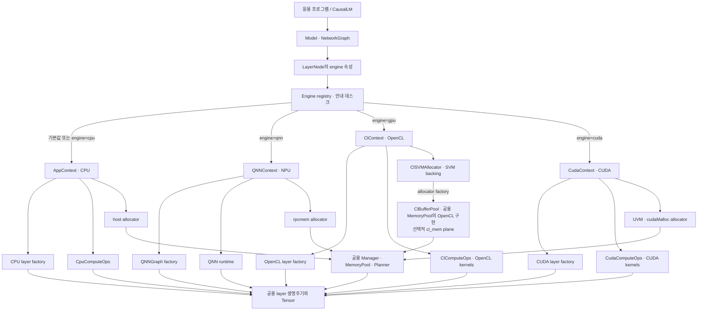

이 도표에서 위쪽의 모델, graph, layer 생명주기, tensor와 planner는 공용
골격이다. 아래쪽의 실제 kernel, queue/stream, allocator와 장치별 cache가
backend마다 달라진다.

### 무엇이 그대로 남는가

- 모델을 만들고 compile한 뒤 inference하는 상위 흐름
- layer의 `finalize()`, `forwarding()`, `incremental_forwarding()` 계약
- tensor의 shape, dtype, stride, view
- tensor 생존 시간을 계산하고 메모리 자리를 재사용하는 planner
- CPU를 기본 engine으로 사용하는 기존 모델
- QNN binary와 `QNNGraph`를 사용하는 NPU 실행 방식

### 무엇이 새로 중요해지는가

- layer에 붙은 engine 이름과 실제 graph allocator가 일치해야 함
- GPU가 지원하는 연산과 지원하지 않는 연산의 경계를 알아야 함
- host와 device 중 어느 복사본이 최신인지 추적해야 함
- 비동기 kernel 완료 전에 CPU가 값을 읽지 않도록 event를 연결해야 함
- 장치가 “GPU”라는 사실만이 아니라 DPAS, integer-dot, subgroup, SVM,
  CUDA 버전 같은 세부 능력을 확인해야 함

## 4. CPU와 QNN NPU에서 이미 쓰던 부분

### 4.1 같은 `Engine → Context` 선택 구조

기존 CPU는 `AppContext`, QNN은 plugin으로 불러온 `QNNContext`를 사용한다.
새 OpenCL/CUDA도 이 registry에 context를 추가하는 방식이다.

```text
engine 속성 없음  → cpu
engine=cpu        → AppContext
engine=qnn        → QNNContext
engine=gpu        → ClContext
engine=cuda       → CudaContext
```

따라서 GPU 지원은 NNTrainer 옆에 별도 실행기를 붙이는 방식이 아니다.
기존 안내 데스크에 새 작업장 이름을 등록하는 방식이다.

다만 현재 PR에서는 process 환경 변수 `NNTR_ENGINE`, layer의 `engine=`,
graph allocator 선택이 아직 하나의 권위 있는 값으로 모이지 않았다.
#4116처럼 환경 변수만 보고 GPU라고 추정했는데 실제 layer는 CPU인 경우,
CPU용 weight repack을 생략해 첫 FC부터 실패할 수 있다.

### 4.2 같은 layer 생명주기

CPU, QNN, OpenCL, CUDA layer는 모두 아래 계약을 따라야 한다.

```text
속성 설정
  → finalize와 tensor/weight 요청
  → RunLayerContext 구성
  → forwarding 또는 incremental_forwarding
  → backend와 실행 모드가 지원하는 경우 backward
```

QNN model-format 경로는 현재 inference-only다. 여기서 공통 생명주기를
공유한다는 말은 모든 accelerator가 학습 backward까지 지원한다는 뜻이
아니다. 이 PR 묶음의 OpenCL/CUDA 변경도 대부분 CausalLM 추론을 겨냥한다.

GPU 구현도 CPU와 같은 의미를 내야 한다.

- 일반 forward에서 activation을 적용했다면 incremental forward도 적용해야 함
- CPU가 nonzero 위치의 여러 prompt token을 처리하면 GPU도 같은 resumed
  prefill을 처리해야 함
- forward에 fused activation을 넣었다면 학습 backward의 미분도 맞아야 함
- batch, view offset, dtype 해석이 CPU 기준과 같아야 함

즉 “GPU가 더 빠르다”보다 먼저 “CPU와 같은 계산을 한다”가 만족되어야 한다.

### 4.3 같은 planner, 다른 allocator

기존 QNN 통합에서 중요한 패턴은 NNTrainer의 planner를 버리지 않고,
activation pool의 allocator만 `QNNRpcManager`로 바꾸는 것이다.

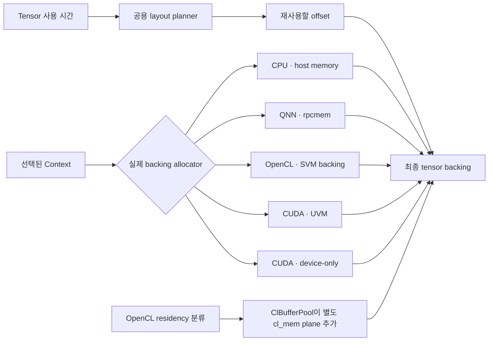

QNN은 DSP에 등록할 activation 주소가 안정적으로 유지되어야 하므로,
activation pool을 `rpcmem`에 두고 token 사이에 재사용한다. NNTrainer
weight pool은 CPU에 둘 수 있다. 실제 NPU weight는 QNN binary와 runtime이
따로 관리하기 때문이다.

GPU도 같은 allocator 교체 패턴을 사용하지만 요구 조건은 다르다.

- OpenCL FC는 NNTrainer weight를 직접 pack/upload한다.
- CUDA FC도 NNTrainer의 QS4CX weight를 직접 읽고 파생 cache를 만든다.
- GPU에서는 layer 사이에 경계가 많아 중간 tensor의 최신 plane을 계속
  추적해야 한다.
- device-only memory를 쓰면 CPU fallback 전에 명시적인 복사가 필요하다.

### 4.4 같은 주소를 재사용해도 같은 tensor는 아니다

planner는 계산이 끝난 tensor의 자리를 다른 tensor에 주는 것이 정상이다.
이 점은 CPU, NPU, GPU 모두 같다. 하지만 GPU cache가 주소를 tensor의
신분증처럼 사용하면 문제가 된다.

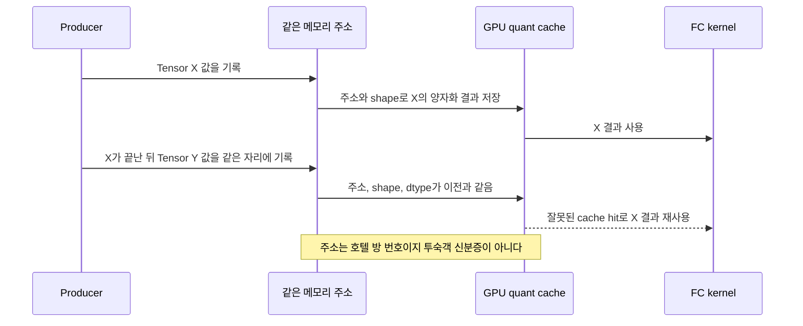

QNN에서 안정된 주소는 DSP에 등록한 **장소**를 찾는 데 유용하다. 반면
activation cache는 그 장소의 **현재 내용**이 같은지를 판단해야 한다.
따라서 GPU cache에는 주소뿐 아니라 logical tensor identity, storage
generation, model/forward 수명 같은 정보가 필요하다.

### 4.5 `ComputeOps`는 공유 방향이지만 NPU 실행은 아직 다르다

#4105는 CPU 구현을 기준으로 공통 `ComputeOps` 주문서를 만든다.
OpenCL과 CUDA는 지원하는 Tensor 연산을 override한다.

- CPU tensor → `CpuComputeOps`
- OpenCL tensor → `ClComputeOps`
- CUDA tensor → `CudaComputeOps`

QNN은 현재 모든 Tensor 연산을 `ComputeOps`로 하나씩 처리하기보다,
사전 컴파일된 `QNNGraph`를 큰 단위로 QNN runtime에 넘기는 방식이 중심이다.
따라서 “CPU·GPU·NPU가 완전히 같은 연산표로 실행된다”는 설명은 과장이다.

비유하면 CPU와 GPU는 같은 주문서의 요리 항목을 각 주방에서 하나씩 만들고,
QNN은 완성된 도시락 한 상자를 외부 업체에 맡기는 방식에 더 가깝다.

| 항목 | CPU | QNN NPU | OpenCL/CUDA GPU |
|---|---|---|---|
| 주 실행 단위 | layer/Tensor 연산 | 주로 사전 컴파일된 QNN graph | layer, whole-op, 개별 kernel |
| Weight 소유 | NNTrainer host pool | QNN binary/runtime가 별도 관리 가능 | NNTrainer weight와 GPU pack/cache |
| Activation | host pool | `rpcmem` pool | SVM, `cl_mem`, UVM, `cudaMalloc` |
| host↔device 전송 경계 | 없음 | 주로 큰 graph 입출력 | layer 사이마다 생길 수 있음 |
| 동기화 | 함수 반환 시 완료인 경우가 많음 | 큰 execute 경계 | upload/kernel/read마다 event 가능 |
| 미지원 연산 | CPU 기준 구현 | 별도 CPU layer/graph 경계로 명시적으로 구성 | 메모리가 host-readable할 때만 CPU fallback 가능 |

## 5. 메모리 종류가 늘어나는 것이 가장 큰 구조 변화다

| 메모리 | 주 backend | CPU가 일반 포인터로 읽을 수 있나? | 필요한 계약 |
|---|---|---:|---|
| 일반 host heap | CPU | 예 | 보통 함수 호출만으로 충분 |
| QNN `rpcmem`/ION | QNN I/O | host mapping 가능 | memHandle 등록·해제, 안정된 주소 |
| OpenCL SVM | OpenCL | SVM 종류에 따라 가능 | 실제 지원 확인, SVM 종류에 따른 map/unmap·queue 완료 |
| OpenCL `cl_mem` | OpenCL | 아니오 | enqueue copy와 event, view offset |
| CUDA UVM | CUDA | 주소 접근 가능 | stream 완료와 page migration 고려 |
| CUDA `cudaMalloc` | CUDA | 아니오 | D2H/H2D staging과 stream 동기화 |

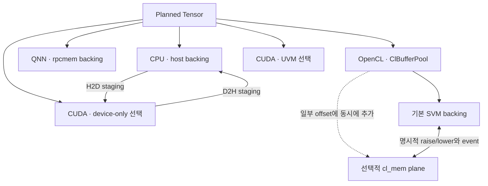

OpenCL의 SVM과 `cl_mem`은 상호 배타적인 상태가 아니다. 한 tensor가 SVM
backing과 두 번째 `cl_mem` plane을 동시에 가질 수 있고, 어느 쪽을 최신으로
만들지는 명시적인 copy와 event가 보장해야 한다. CUDA UVM과 device-only는
실행 중 자동으로 오가는 상태가 아니라 allocator 설정에서 고르는 대안이다.

### CPU fallback의 정확한 뜻

CPU fallback은 함수 이름만 CPU 구현으로 바꾸는 것이 아니다.

1. 값이 CPU가 읽을 수 있는 메모리에 있어야 한다.
2. 앞선 GPU 작업이 완료되었는지 기다려야 한다.
3. CPU가 계산한 결과를 다음 GPU consumer가 볼 수 있게 다시 올려야 한다.

`cl_mem`이나 `cudaMalloc` pointer를 CPU 함수에 그대로 넘기는 것은
fallback이 아니라 잘못된 메모리 접근이다. 안전한 staging이 없다면 오류를
상위로 반환해야 한다.

### OpenCL의 두 plane

OpenCL residency PR은 같은 tensor에 host/SVM plane과 `cl_mem` plane이
생길 수 있게 한다. 의도된 결정은 다음과 같아야 한다.

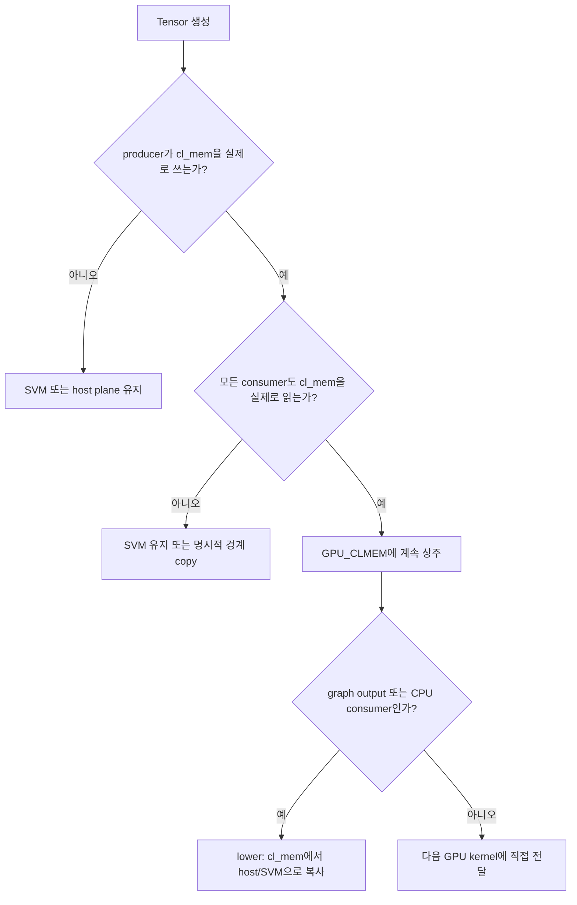

단순히 “producer와 consumer의 engine이 GPU인가?”만 묻는 것으로는 부족하다.
각 layer가 실제로 어느 plane을 읽고 쓰는지 확인해야 한다.

## 6. 모델 실행 단계별로 달라지는 점

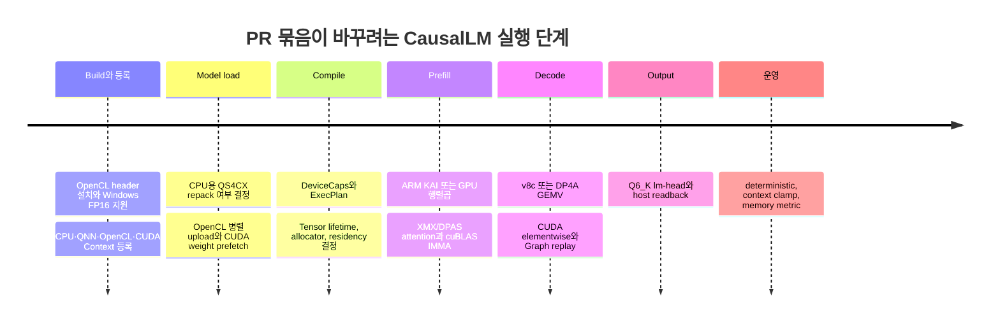

### 6.1 Build와 배포

- OpenCL 소비자용 header를 설치하고 내부 생성 kernel header는 숨긴다.
- `_Float16`이 없는 MSVC에서 16비트 wrapper `Half`를 선택할 수 있게 한다.
- Windows에서 OpenCL+CUDA+FP16 조합을 CI로 검증하려 한다.
- `ThreadManager::Global()`을 DLL 사이에 하나로 만들려 한다.

현재는 Tizen devel RPM 목록, Android prebuilt macro/header export, Windows
PR trigger, CUDA 12/13 API 차이, static DLL singleton 같은 공백이 남아 있다.

### 6.2 Model load

- CPU ARM은 QS4CX를 KAI kernel에 맞게 repack한다.
- OpenCL/CUDA는 원본 quantized weight를 직접 사용하거나 장치별 pack/cache를
  만들 수 있어, 실제 GPU graph라면 CPU용 repack을 생략할 수 있다.
- OpenCL은 큰 weight의 pack/upload를 여러 worker로 나누려 한다.
- CUDA는 load 중 원본 managed QS4CX page를 prefetch할 수 있고, 이와 별개로
  cuBLAS용 파생 INT8 weight를 persistent cache에 둘지 JIT scratch에서
  풀지 선택한다. prefetch와 JIT unpack은 동시에 사용할 수도 있다.

같은 QS4CX라도 장치별 진열 순서는 다를 수 있다. 전체 byte 수가 같아도
`nr=8`로 포장한 CPU weight를 `nr=4` kernel이 읽으면 weight와 scale 위치가
뒤섞인다. buffer에는 layout/variant 정보가 필요하다.

### 6.3 Compile과 메모리 계획

- `DeviceCaps × ModelFeatures → ExecPlan`으로 kernel을 고르는 기반이 생긴다.
- graph의 engine에 맞는 allocator를 pool에 연결하려 한다.
- OpenCL tensor를 SVM에 둘지 `cl_mem`에 둘지 producer/consumer로 판단한다.
- `NNTR_MEM_PLANNER=basic|v1|v2|v3`로 layout planner를 비교할 수 있다.

다만 #4108의 `ExecPlan`은 현재 log-only라 실제 dispatch의 단일 권위가
아니다. #4141의 기본값은 기존 V1이라 기본 동작은 유지되지만, V2는 학습
gradient의 겹치는 수명을 놓칠 수 있다.

### 6.4 Prefill

prefill은 prompt token 여러 개를 한꺼번에 처리하므로 큰 행렬곱에 유리하다.

- ARM CPU: KAI FP16 activation × QS4CX INT4 weight
- Intel OpenCL: XMX/DPAS FC와 flash-attention
- CUDA: FP16 activation/QS4CX/FP16 output 조건에서 INT8로 준비해
  cuBLAS IMMA 사용
- OpenCL attention: 여러 subgroup의 부분합을 XRED로 합침

### 6.5 Decode

decode는 새 token 하나를 처리하므로 보통 `M=1`이다.

- OpenCL v8c INT8×INT4 FC
- CUDA DP4A GEMV
- SwiGLU, scalar, softcap, RMSNorm 같은 작은 CUDA kernel
- CUDA activation 양자화와 GEMV를 한 kernel로 합치는 opt-in 경로
- 첫 decode의 GPU 작업을 capture해 다음 token에 재생하는 CUDA Graph

### 6.6 Output과 운영

- Q6_K lm-head를 CUDA에서 실행해 vocabulary logits까지 GPU에 두려 한다.
- model 설정, 실제 RoPE table, KV-cache 범위에 맞춰 context 길이를 줄이려 한다.
- Windows에서 working set과 private commit 최고값을 함께 보여 주려 한다.
- 같은 입력의 재현성을 높이기 위해 deterministic 실행을 기본으로 하려 한다.

## 7. OpenCL 쪽에서 구체적으로 늘어나는 것

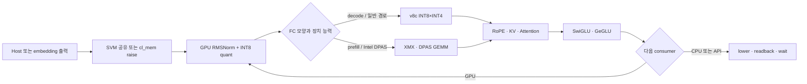

### 목표 효과

- INT4 FC를 GPU에서 계산한다.
- 긴 prompt의 FC와 attention을 Intel 행렬 연산기로 보낸다.
- weight upload를 병렬화해 model load와 전송을 겹친다.
- RoPE, KV update, attention, GLU, RMSNorm 사이의 CPU 왕복을 줄인다.
- RMSNorm과 INT8 양자화를 합쳐 다음 FC에 바로 넘긴다.
- SVM만 쓰는 tensor에는 불필요한 `cl_mem` 복제본을 만들지 않는다.

### 현재 핵심 공백

- SVM 실패 후 일반 host pointer를 SVM으로 표시할 수 있다.
- activation cache가 주소·shape 관련 값·dtype를 보지만 storage generation을
  보지 않아 이전 token 결과를 재사용할 수 있다.
- out-of-order queue에서 upload와 첫 consumer의 event 연결이 빠져 있다.
- `GPU_CLMEM` 분류가 layer의 실제 plane 지원을 확인하지 않는다.
- graph output을 host로 lower하지 않는 경로가 있다.
- DPAS 존재만 보고 SG16 kernel을 선택한다.
- fused RMSNorm/slice의 `cl_mem` view 시작 offset이 빠져 batch 2부터
  batch 0 영역을 다시 쓸 수 있다.
- #4109에서는 서로 다른 raw planner offset이 정렬 뒤 같은 `cl_mem`
  identity로 합쳐질 수 있고, reinitialize가 전용 pool factory를 우회한다.
- #4110에서 v8c 거부 뒤의 “CPU fallback”은 실제 CPU ops로 가지 않을 수
  있으며, Windows weight page discard와 fallback, host epilogue 동기화도
  서로 맞지 않는다.
- #4111의 `K=64`는 XMX gate를 통과하지만 2D block surface 최소 폭을
  만족하지 않는다.
- #4112는 cached/chunked causal query의 절대 위치를 잃을 수 있고, GLU
  kernel 미등록 상태에서 빈 vector를 읽으며, scratch 교체 뒤 cached image
  view를 무효화하지 않는다.
- #4115의 GPU scalar 일반 forward는 no-op일 수 있고 nonzero 위치의
  multi-token resumed prefill을 정상 처리하지 못한다.
- #4149 단독 head의 부품은 caller가 없지만 #4150이 실제 layer에 연결한다.
  반면 #4148 flash-attention wrapper는 #4151까지 포함해도 in-tree caller가
  없어 “추가됨”과 “기본 실행됨”을 구분해야 한다.
- #4149/#4150 연결 경로에는 kernel 성공 전 fused alias 공개, model별 gamma
  cache 수명, FP32 gamma 해석과 coarse-SVM ownership 공백도 남아 있다.

### OpenCL build와 tuning knob

OpenCL은 build에서 명시적으로 켜야 한다.

```text
meson setup build -Denable-opencl=true
```

빌드했다고 모든 layer가 자동으로 GPU로 바뀌는 것은 아니다. 속성이 없으면
CPU가 기본이고, 목표 구조에서는 관련 node에 `engine=gpu`가 일관되게
전달되어야 한다. 현재 head에서는 `NNTR_ENGINE=gpu`만 설정해도 CausalLM의
모든 layer에 이 속성이 전파되지는 않는다.

| 영역 | 대표 환경변수 | 현재 해석 |
|---|---|---|
| memory | `NNTR_GPU_SVM_POOL`, `NNTR_GPU_CLMEM_POOL`, `NNTR_CLMEM_SVM_SKIP` | SVM backing과 선택적 `cl_mem` plane 실험 |
| XMX FC | `NNTR_XMX_NT`, `NNTR_XMX_SGM` | tile/shape tuning, 0·비숫자 검증 필요 |
| attention | `NNTR_FLASH_XMX`, `NNTR_FLASH_XMX_XRED`, `NNTR_FLASH_FP16_SCORE` | 실험 kernel과 reduction 선택 |
| 재현성 | `NNTR_DETERMINISTIC` | kernel ring·reduction 정책, 현재 backend 간 계약 불일치 |
| fusion/진단 | `NNTR_FUSED_RMSQ`, `NNTR_FUSED_RMSQ_CHECK` | fused RMSNorm+quant와 비교 진단 |

이 값들은 안정된 사용자 API라기보다 검증이 덜 된 tuning/debug knob에
가깝다. `NNTR_XMX_NT/SGM`의 0 또는 비숫자 값은 0 나눗셈에 이를 수 있고,
일부 boolean은 문자열 `"0"`도 “변수가 존재한다”는 이유로 기능을 켠다.

## 8. CUDA 쪽에서 구체적으로 늘어나는 것

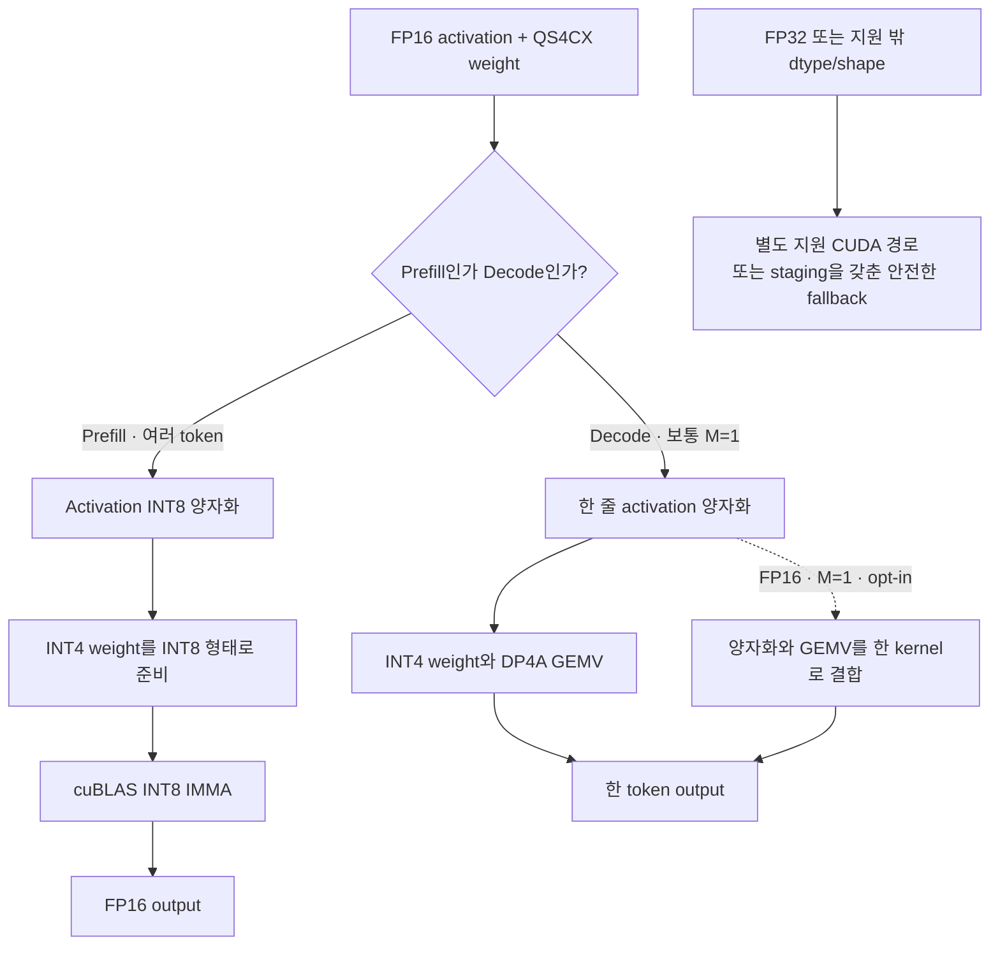

현재 #4117에는 이 도표보다 앞선 연결 문제가 있다.
`NeuralNetwork::compile()`의 graph allocator 선택은 OpenCL GPU node만
확인하고 CUDA node를 `engine_name="cuda"`로 연결하지 않는다. 그래서
`engine=cuda` layer가 있어도 weight/activation pool은 CPU allocator를 받을
수 있다. 이 문제 때문에 일부 CUDA fast path가 실제로 켜지지 않을 수 있고,
allocator를 올바르게 고친 뒤에는 지금 가려진 device-only/CPU fallback
문제가 바로 드러날 수 있다.

### 목표 효과

- `cuda` context, device, stream, allocator와 NVRTC kernel cache가 생긴다.
- SwiGLU, scalar, logit softcap, RMSNorm을 CUDA에서 처리한다.
- QS4CX FC를 dequant-GEMM, DP4A decode, cuBLAS prefill로 나눈다.
- weight를 미리 GPU로 옮기거나 하나의 JIT scratch를 재사용할 수 있다.
- Q6_K lm-head와 tied embedding을 CUDA에 연결한다.
- 반복 decode의 C++ layer walk를 CUDA Graph 한 번의 launch로 줄이려 한다.

`CudaComputeOps`는 CPU 구현과 완전히 단절된 표가 아니라 `CpuComputeOps`를
상속해 FC와 copy 등 일부만 override한다. UVM처럼 CPU가 읽을 수 있는
activation이라면 미구현 연산을 기존 CPU 코드가 처리할 수 있어 점진적
이식에 유리하다. 반대로 #4127처럼 activation을 `cudaMalloc` device-only에
두면 residual addition 등 상속받은 CPU 연산은 같은 pointer를 읽을 수 없다.
기존 CPU 코드 재사용이 장점이 되려면 memory 종류도 함께 맞아야 한다.

### Weight cache와 JIT scratch의 차이

| 방식 | 쉬운 비유 | 장점 | 비용 |
|---|---|---|---|
| persistent cache | 모든 상품을 미리 뜯어 선반에 진열 | 실행 때 빠름 | weight마다 파생 VRAM 사용 |
| JIT scratch | 하나의 작업대에서 지금 필요한 상품만 개봉 | VRAM 절약 | 매번 unpack 비용 |

현재 persistent cache는 raw pointer 주소와 긴 수명 때문에 model reload를
오인할 수 있고, JIT scratch는 wide tail read를 위한 padding이 빠져 있다.

### CUDA Graph가 하려는 일

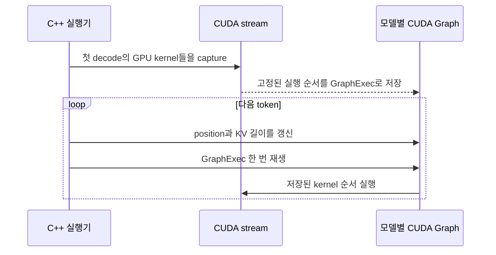

비유하면 token마다 수백 줄의 작업 지시를 다시 읽어 주는 대신, 첫 작업을
녹화해 두고 다음부터 재생 버튼만 누르는 것이다.

현재 #4126은 position buffer를 쓰지만 이를 읽는 kernel이 없고, CPU 연산은
graph에 기록되지 않으며, graph cache가 모델별이 아니다. #4127은 이 미완성
M2-B 경로와 device-only activation을 일부 GPU에서 기본으로 켜려 한다.
따라서 현재 합집합에서 가장 위험한 기본값 변경 중 하나다.

### 현재 CUDA 경로에서 추가로 조심할 점

- #4124는 Q6_K CUDA lm-head가 성공하면 함수 전체를 일찍 `return`해 bias와
  batch 1 이후 계산을 건너뛴다.
- #4143은 모델 파일에 FP32로 저장된 RMSNorm gamma를 FP16 weight처럼
  요청해 byte 해석과 다음 weight 위치를 어긋나게 한다. 32행 초과 등의
  CPU fallback도 device-only pointer를 직접 읽을 수 있다.
- #4120과 #4152의 GEMV는 `K % 4 != 0`일 때 마지막 1~3개 곱을 누락한다.
- `NNTR_CUDA_DEVICE=N`으로 고른 device context를 loader/inference worker
  thread에서 다시 current로 만들지 않아 GPU 0을 쓰거나 invalid handle이
  날 수 있다.
- #4121에서는 concat/split이 만드는 mapped Tensor가 `ContextData`를 잃어
  device-aware copy를 우회할 수 있다.
- #4122는 CUDA 13의 5인자 `cudaMemPrefetchAsync()`를 무조건 호출하므로
  CUDA 12.x header에서는 컴파일되지 않는다.

### 자동 기본값과 deterministic은 아직 하나의 계약이 아니다

#4127은 약 15개의 CUDA 환경변수 기본값을 넣지만, 리뷰한 head에서 실제
reader가 확인된 것은 `NNTR_CUDA_ELTWISE`, `NNTR_CUDA_DEV_ACT`,
`NNTR_CUDA_M2B`, `NNTR_CUDA_ASYNC` 네 개뿐이다. RoPE, attention,
QKNorm 등 여러 값은 아직 실제 실행 경로를 바꾸지 않는다. M2-B와
device-only 설정은 integrated GPU를 제외한 discrete 분기에서 기본으로
들어간다.

#4125는 `NNTR_DETERMINISTIC`이 없으면 on으로 보지만, #4127은 명시적인
문자 `"1"`만 deterministic으로 인식해 일부 discrete GPU에서 async를 켠다.
CUDA pedantic math 설정도 현재 호출되지 않는 `sgemmRowMajor()` 안에만 있어
실제 CUDA FC 경로를 바꾸지 않는다. 따라서 현재 합집합에서는 “deterministic
기본 on”을 일관된 보장으로 설명할 수 없다.

## 9. CPU·Windows·공통 동작도 함께 바뀐다

### CPU

- `CpuComputeOps`가 새 backend-neutral 연산표의 기준 구현이 된다.
- FC/Conv에 fused activation 속성이 추가된다.
- ARM i8mm에서 FP16 activation × QS4CX INT4 KAI 경로가 추가된다.
- GPU가 아닌 실제 CPU graph에서는 QS4CX CPU repack을 계속 해야 한다.
- GPU 결과 검증의 기준값은 여전히 CPU 경로다.

현재 #4105는 incremental FC의 fused activation과 학습 derivative가
완결되지 않았고, #4128은 `nr=8` pack을 `nr=4` kernel에 넘길 수 있다.

### NPU/QNN

- QNN graph와 QNN binary 실행 방식 자체를 GPU kernel로 바꾸지는 않는다.
- 공용 registry, factory, `ContextData`, allocator와 planner 정리가
  QNN plugin에도 영향을 준다.
- `refinalize()`가 engine tag를 CPU로 되돌리거나 non-CPU factory facade가
  기본 구현으로 빠지는 문제는 QNN에도 관련된다.
- QNN activation 주소 안정성과 GPU cache content identity를 혼동하면 안 된다.
- GPU로 이동하려면 QNN binary 하나를 바꾸는 것이 아니라 layer coverage,
  weight layout, residency, copy, wait를 다시 확인해야 한다.

### FP16과 Windows

- `-Dfp16-impl=wrapper`는 `_Float16`이 없는 MSVC에서 16비트 `Half`를
  사용하려는 선택지다.
- `numeric_limits<Half>`가 올바른 binary16 값을 제공해야 음수만 있는
  max-pooling에서 0을 잘못 고르지 않는다.
- 설치 SDK도 library와 application이 같은 `Half` 정의를 보도록 header와
  설정을 함께 내보내야 한다.
- `ThreadManager::Global()`을 cpp로 옮겨도 static nntrainer가 DLL마다
  복사되면 singleton도 DLL마다 생긴다.
- Windows GPU CI에는 일반 PR trigger와 실제 CausalLM/FP16 구성 검증이 필요하다.

### Planner

`NNTR_MEM_PLANNER`를 지정하지 않으면 기존 V1을 써 기본 동작은 바뀌지 않는다.
V2/V3는 실험 선택지로 보아야 한다. 특히 V2는 다음처럼 감싸는 gradient
수명을 겹치지 않는다고 판단할 수 있다.

```text
Gradient A:       [7시 -------- 10시)
Gradient B: [1시 ---------------- 10시)
                         겹침
```

두 사람에게 같은 사물함을 주면 한 gradient가 다른 gradient를 조용히
덮어쓸 수 있다. 이 문제는 GPU 전용이 아니라 CPU 학습에도 직접 영향을 준다.

### Context 길이

안전한 길이는 설정 파일 숫자 하나가 아니다.

```text
한계
  = min(모델 설정 한계,
        실제 생성된 RoPE table 길이,
        KV-cache 용량)

system prompt + 이전 token + 현재 prompt + generation <= 한계
```

#4144의 방향은 모든 backend에 유용하지만, 현재는 실제 RoPE table 길이와
이미 사용한 token을 충분히 반영하지 않는다.

### 메모리 지표

- working set: 실제 RAM에 가장 많이 올라온 양
- private commit: OS가 이 process 전용으로 책임지기로 한 최대 공간

책상 위에 펼친 책과 내 이름으로 예약한 책장의 차이로 볼 수 있다.
큰 OpenCL SVM을 예약했지만 일부만 RAM에 올라온 경우 두 값의 차이가 유용하다.
다만 private commit은 이번 `run()`만의 값도, GPU VRAM 전체 사용량도 아니다.

## 10. 사용 시나리오별 실제 차이

| 기존 사용자 | 목표 상태에서 보이는 변화 | 현재 head에서 특히 조심할 점 |
|---|---|---|
| 기본 CPU 모델 | 별도 engine 속성이 없으면 CPU 유지, 새 ComputeOps와 ARM path 사용 가능 | fused activation, KAI pack/layout, planner V2 |
| QNN NPU 모델 | QNN graph/plugin과 rpcmem 흐름 유지, 공용 registry 정리의 이점 | non-CPU factory와 refinalize engine tag |
| OpenCL CausalLM | `engine=gpu` layer에서 FC/attention/RMSNorm resident path | `NNTR_ENGINE=gpu`만으로 전체 graph가 바뀌지 않음 |
| CUDA CausalLM | `engine=cuda`에서 stream, FC, elementwise, graph replay 사용 | allocator, device-only fallback, M2-B 기본값 |
| CPU+GPU 혼합 graph | 미지원 layer만 CPU에 남길 수 있음 | 매 경계의 copy·wait·최신 plane이 명시되어야 함 |
| 여러 모델 동시 실행 | Context는 process-wide로 공유할 수 있지만 weight/graph cache는 모델·수명별로 분리 | process-global raw-pointer cache와 graph cache |
| Windows 사용자 | wrapper FP16, OpenCL+CUDA build 검증, private commit 지표 | SDK export, static DLL singleton, CI trigger |

### CPU/NPU 사용자가 GPU로 옮길 때

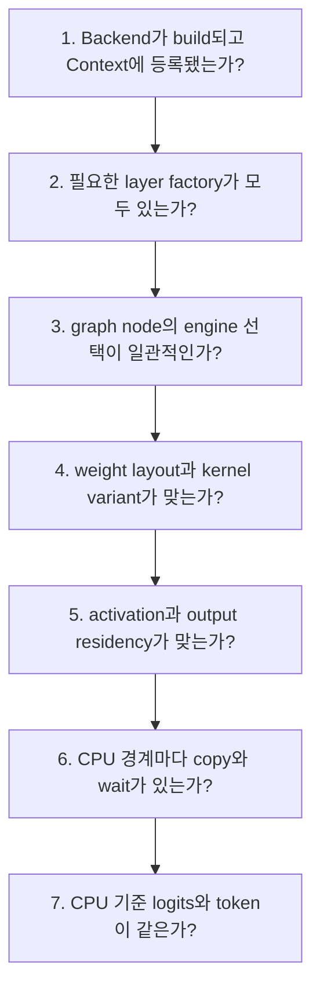

단순히 `engine=qnn`을 `engine=gpu`로 바꾸거나 `NNTR_ENGINE=cuda`를
설정하는 것만으로 끝나지 않는다.

1. 환경 변수로 추측하지 말고 실제 등록된 context를 확인한다.
2. factory가 없는 layer를 CPU로 안전하게 보낼지 오류로 막을지 정한다.
3. weight pool과 activation pool을 따로 검토한다.
4. tensor view의 시작 offset과 batch offset을 kernel에 전달한다.
5. graph output은 암묵적인 host consumer로 보고 반환 전에 readback한다.
6. CPU bias, activation, fallback 전에 GPU 완료를 기다린다.
7. device-only memory는 staging 없이 CPU에 넘기지 않는다.
8. prefill, decode, batch, K tail, model reload를 CPU 기준과 비교한다.

## 11. 성능과 메모리의 교환 관계

| 선택 | 얻으려는 것 | 지불하는 비용 | 현재 주의점 |
|---|---|---|---|
| OpenCL `cl_mem` residency | layer 사이 upload/readback 감소 | 두 plane의 최신 상태 관리 | boundary copy와 output lower 공백 |
| SVM-only `cl_mem` 생략 | 긴 KV-cache의 중복 메모리 감소 | 정확한 offset 분류 필요 | #4145 직접 변경은 타당 |
| OpenCL 병렬 upload | load 시간 단축 | event와 staging 수명 관리 | 첫 GEMM dependency 누락 |
| CUDA device-only activation | page migration과 host 간섭 감소 | CPU가 직접 접근 불가 | CPU fallback이 남은 상태에서 위험 |
| CUDA weight prefetch | 실행 전 migration | load bandwidth와 version 차이 | CUDA 12 build와 완료 보장 |
| CUDA JIT INT8 unpack | persistent VRAM 절약 | prefill마다 unpack | tail padding 누락 |
| CUDA Graph | token당 launch overhead 감소 | 주소·shape·동적 값이 안정적이어야 함 | position consumer와 host op 누락 |
| deterministic 기본값 | 재현성 향상 | 일부 reduction 성능 저하 | Intel 경로에서 코드 주석 기준 약 3.6배 가능 |
| fused decode GEMV | kernel launch와 임시 buffer 감소 | output block마다 양자화 반복 | RTX 5060 측정에서는 약 31% 느려 default off |
| planner V2/V3 선택 | 메모리 배치 실험 | 검증해야 할 조합 증가 | V2 training overlap 오류 |

성능 수치는 해당 PR과 리뷰에 기록된 특정 환경의 관찰값일 뿐, 모든 장치의
일반적인 성능을 뜻하지 않는다.

## 12. 현재 reviewed head들을 그대로 합치면 생기는 위험

### 대표 리뷰 댓글 분포

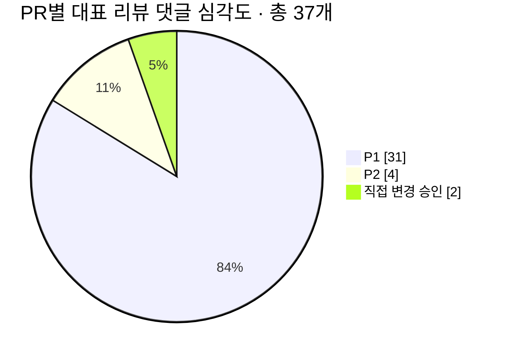

### 위험 지도

| 위험 묶음 | 쉬운 설명 | 대표 PR | 영향 |
|---|---|---|---|
| backend 선택 불일치 | 안내 데스크와 실제 작업장이 다름 | #4106, #4116, #4117, #4150 | 잘못된 factory·allocator·repack |
| capability 과신 | GPU라는 이유만으로 맞지 않는 kernel 선택 | #4108, #4111, #4148 | compile 실패, device fault, 오출력 |
| 주소 기반 cache | 같은 방 주소를 같은 손님으로 착각 | #4110, #4119, #4120 | 이전 token/model 값 재사용 |
| memory plane 불일치 | GPU가 쓴 창고와 CPU가 읽는 창고가 다름 | #4109, #4114, #4149 | stale output, 잘못된 batch |
| 비동기 순서 누락 | 2번 공정이 1번 완료 전에 시작 | #4112, #4113, #4118, #4121 | 부분 upload·stale read |
| device-only CPU fallback | CPU가 열 수 없는 GPU 창고 주소를 받음 | #4119, #4124, #4127, #4143 | crash/access violation |
| shape와 tail | 마지막 1~3개 또는 특정 폭을 빼먹음 | #4111, #4120, #4123, #4128, #4152 | 조용한 수치 오류 |
| CUDA Graph 미완성 | 첫 token 녹화본에 새 위치를 넣지 못함 | #4126, #4127 | 두 번째 token부터 오출력 |
| 공용 CPU 의미 변경 | fast path와 기준 path의 의미가 다름 | #4105, #4115 | incremental·backward 오류 |
| build/배포 공백 | 소스는 있지만 실제 패키지/CI에 없음 | #4103, #4122, #4129, #4131, #4150 | build 실패 또는 기능 미포함 |
| DLL 전역 상태 중복 | 관리자를 한 곳으로 옮겨도 정적 library가 DLL마다 복사됨 | #4130 | thread pool이 DLL마다 따로 생김 |
| planner 수명 오류 | 동시에 쓰는 gradient에 같은 사물함 배정 | #4141 | CPU 학습값 덮어쓰기 |
| runtime 범위 계산 | 설정 한계와 실제 RoPE/KV 길이가 다름 | #4144 | 범위 밖 접근 |

### 현재 합집합을 한 문장으로 평가하면

> GPU backend의 공용 뼈대와 많은 부품은 마련됐지만, **engine 선택,
> memory residency, fallback, cache generation, queue dependency, CUDA Graph**
> 계약을 고치기 전에는 “환경 변수 하나로 안전한 full-GPU CausalLM”이라고
> 볼 수 없다.

## 13. 통합할 때 권장하는 순서

1. **공용 의미부터 고정한다.**

   CPU 기준으로 normal/incremental forward, resumed prefill, batch, bias,
   activation, backward 의미를 테스트한다.

2. **engine 선택의 단일 권위를 만든다.**

   `NNTR_ENGINE`, layer `engine=`, context registry, graph allocator가 같은
   최종 plan을 보게 한다.

3. **factory와 allocator 연결을 먼저 완성한다.**

   non-CPU factory override와 CUDA/OpenCL graph pool 연결을 확인한다.

4. **메모리 접근 계약을 정한다.**

   UVM/SVM 기반 점진적 fallback인지, device-only full-GPU인지 구분한다.

5. **모든 CPU↔GPU 경계에 copy와 wait를 넣는다.**

   graph output, bias/activation, failure fallback까지 포함한다.

6. **cache를 모델과 storage generation에 묶는다.**

   raw pointer 단독 key와 process-global cache를 제거한다.

7. **수치 경계부터 수정한다.**

   K tail, batch/view offset, gamma dtype, context/RoPE 범위를 테스트한다.

8. **CUDA Graph는 다시 opt-in으로 제한한다.**

   모든 node가 capture-safe하고 token별 값이 실제 consumer에 연결된 뒤
   자동 기본값을 검토한다.

9. **플랫폼별 build와 runtime matrix를 채운다.**

   Tizen, Android, Windows, CUDA 12/13, integrated/discrete GPU를 포함한다.

10. **CPU 결과를 수치 기준으로 삼고, QNN도 기존 동작과 회귀 비교한다.**

    model load/reload, 긴 prefill, 여러 token decode, multi-batch,
    multi-model을 반복한다.

## 14. 37개 PR 전체 목록과 역할

아래 분류는 설명을 쉽게 하기 위한 것이며, 실제 git dependency graph와
완전히 같지는 않다.

### 공용 구조·CPU·응용·빌드: 13개

| PR | 의도한 변화 | CPU/NPU와의 관계 |
|---|---|---|
| [#4105](https://github.com/nntrainer/nntrainer/pull/4105) · [상세 리뷰](./pr-4105.md) | whole-op `ComputeOps`, CPU 기준 구현, fused activation | OpenCL/CUDA Tensor 연산의 의미를 맞추는 기준이며 QNN은 graph 단위 계약을 비교 |
| [#4106](https://github.com/nntrainer/nntrainer/pull/4106) · [상세 리뷰](./pr-4106.md) | engine registry, `DeviceCaps`, factory facade, engine tag | 기존 CPU/QNN context 구조를 GPU까지 일반화 |
| [#4108](https://github.com/nntrainer/nntrainer/pull/4108) · [상세 리뷰](./pr-4108.md) | `DeviceCaps × ModelFeatures → ExecPlan` | 공용 선택기 기반, 현재는 log-only |
| [#4115](https://github.com/nntrainer/nntrainer/pull/4115) · [상세 리뷰](./pr-4115.md) | CausalLM layer를 core로 이동, model registry | CPU/GPU가 같은 LLM layer 계약을 재사용 |
| [#4116](https://github.com/nntrainer/nntrainer/pull/4116) · [상세 리뷰](./pr-4116.md) | non-CPU engine에서 ARM용 QS4CX repack 생략 | 실제 CPU인지 GPU인지 정확히 알아야 함 |
| [#4125](https://github.com/nntrainer/nntrainer/pull/4125) · [상세 리뷰](./pr-4125.md) | deterministic 기본값과 OpenCL kernel ring | backend 공통 재현성 정책을 만들려는 시도 |
| [#4128](https://github.com/nntrainer/nntrainer/pull/4128) · [상세 리뷰](./pr-4128.md) | ARM KAI FP16×QS4CX INT4 matmul | GPU 외에도 CPU fast path를 계속 강화 |
| [#4129](https://github.com/nntrainer/nntrainer/pull/4129) · [상세 리뷰](./pr-4129.md) | MSVC용 `Half` wrapper | Windows CPU/GPU build의 공통 FP16 표현 |
| [#4130](https://github.com/nntrainer/nntrainer/pull/4130) · [상세 리뷰](./pr-4130.md) | `ThreadManager::Global()` out-of-line | CPU worker와 여러 layer DLL의 공용 thread pool 목표 |
| [#4131](https://github.com/nntrainer/nntrainer/pull/4131) · [상세 리뷰](./pr-4131.md) | Windows OpenCL+CUDA+FP16 CI | 통합 build를 자동 검증하려는 기반 |
| [#4141](https://github.com/nntrainer/nntrainer/pull/4141) · [상세 리뷰](./pr-4141.md) | `NNTR_MEM_PLANNER=basic|v1|v2|v3` | CPU 학습과 모든 backend pool에 영향을 줄 수 있음 |
| [#4142](https://github.com/nntrainer/nntrainer/pull/4142) · [상세 리뷰](./pr-4142.md) | Windows peak private commit 출력 | Windows CausalLM의 process-level 지표이며 의미는 backend-neutral |
| [#4144](https://github.com/nntrainer/nntrainer/pull/4144) · [상세 리뷰](./pr-4144.md) | runtime context 길이 clamp | 모든 backend의 RoPE/KV 범위 안전성 |

### OpenCL과 GPU-resident CausalLM: 12개

| PR | 의도한 변화 | 이전과 달라지는 점 |
|---|---|---|
| [#4103](https://github.com/nntrainer/nntrainer/pull/4103) · [상세 리뷰](./pr-4103.md) | 필요한 OpenCL header 설치 | 외부 소비자가 GPU API를 실제로 build 가능 |
| [#4109](https://github.com/nntrainer/nntrainer/pull/4109) · [상세 리뷰](./pr-4109.md) | SVM pool, device probe, queue/cache 기반 | GPU graph가 backend allocator를 사용 |
| [#4110](https://github.com/nntrainer/nntrainer/pull/4110) · [상세 리뷰](./pr-4110.md) | v8c INT8×INT4 FC와 cache | decode FC를 OpenCL whole-op로 처리 |
| [#4111](https://github.com/nntrainer/nntrainer/pull/4111) · [상세 리뷰](./pr-4111.md) | Intel XMX/DPAS prefill GEMM | 큰 prompt FC에 행렬 전용 장치 사용 |
| [#4112](https://github.com/nntrainer/nntrainer/pull/4112) · [상세 리뷰](./pr-4112.md) | attention, RoPE, KV, GLU, RMSNorm kernel | LLM 중간 연산을 GPU에 연결 |
| [#4113](https://github.com/nntrainer/nntrainer/pull/4113) · [상세 리뷰](./pr-4113.md) | v8c weight 병렬 pack/upload | model load와 GPU upload를 겹침 |
| [#4114](https://github.com/nntrainer/nntrainer/pull/4114) · [상세 리뷰](./pr-4114.md) | planner 기반 `cl_mem` residency | 중간 tensor를 GPU plane에 계속 보관 |
| [#4145](https://github.com/nntrainer/nntrainer/pull/4145) · [상세 리뷰](./pr-4145.md) | SVM-only offset의 `cl_mem` 생략 | 불필요한 두 번째 GPU buffer 절약 |
| [#4148](https://github.com/nntrainer/nntrainer/pull/4148) · [상세 리뷰](./pr-4148.md) | XMX/DPAS flash-attention prefill | 긴 prompt attention용 고속 kernel |
| [#4149](https://github.com/nntrainer/nntrainer/pull/4149) · [상세 리뷰](./pr-4149.md) | RMSNorm+quant, layer slice, probe 부품 | resident layer를 위한 fused 부품 추가 |
| [#4150](https://github.com/nntrainer/nntrainer/pull/4150) · [상세 리뷰](./pr-4150.md) | GPU RMSNorm과 per-layer-slice layer 등록 | #4149 부품을 CausalLM graph에 연결 |
| [#4151](https://github.com/nntrainer/nntrainer/pull/4151) · [상세 리뷰](./pr-4151.md) | attention XRED 부분합 교환 | subgroup의 중복 합산을 줄임 |

### CUDA: 12개

| PR | 의도한 변화 | 이전과 달라지는 점 |
|---|---|---|
| [#4117](https://github.com/nntrainer/nntrainer/pull/4117) · [상세 리뷰](./pr-4117.md) | CUDA context, allocator, stream, NVRTC cache | NVIDIA GPU를 이름 있는 backend로 추가 |
| [#4118](https://github.com/nntrainer/nntrainer/pull/4118) · [상세 리뷰](./pr-4118.md) | SwiGLU, scalar, softcap CUDA kernel | 작은 decode 연산의 CPU 왕복 감소 |
| [#4119](https://github.com/nntrainer/nntrainer/pull/4119) · [상세 리뷰](./pr-4119.md) | QS4CX dequant-GEMM과 `CudaComputeOps` | INT4 FC를 CUDA에서 직접 계산 |
| [#4120](https://github.com/nntrainer/nntrainer/pull/4120) · [상세 리뷰](./pr-4120.md) | DP4A decode와 cuBLAS IMMA prefill | `M=1`과 큰 `M`에 다른 FC 경로 |
| [#4121](https://github.com/nntrainer/nntrainer/pull/4121) · [상세 리뷰](./pr-4121.md) | device-only copy와 dtype 변환 | CUDA memory를 위한 copy 계약 추가 |
| [#4122](https://github.com/nntrainer/nntrainer/pull/4122) · [상세 리뷰](./pr-4122.md) | model load 중 QS4CX weight prefetch | 실행 전에 GPU page migration 시도 |
| [#4123](https://github.com/nntrainer/nntrainer/pull/4123) · [상세 리뷰](./pr-4123.md) | transient JIT INT8 weight scratch | persistent cache 대신 VRAM 절약 선택 |
| [#4124](https://github.com/nntrainer/nntrainer/pull/4124) · [상세 리뷰](./pr-4124.md) | Q6_K CUDA lm-head와 tied embedding | 마지막 logits 계산까지 CUDA 연결 |
| [#4126](https://github.com/nntrainer/nntrainer/pull/4126) · [상세 리뷰](./pr-4126.md) | M2-B CUDA Graph decode | token당 C++ launch overhead 감소 |
| [#4127](https://github.com/nntrainer/nntrainer/pull/4127) · [상세 리뷰](./pr-4127.md) | GPU 종류별 CUDA 환경변수 기본값 | 수동 설정 없이 fast path 선택 목표 |
| [#4143](https://github.com/nntrainer/nntrainer/pull/4143) · [상세 리뷰](./pr-4143.md) | FP32 누적 CUDA RMSNorm | FP16 overflow를 피하며 norm을 GPU로 이동 |
| [#4152](https://github.com/nntrainer/nntrainer/pull/4152) · [상세 리뷰](./pr-4152.md) | activation quant와 GEMV fusion | decode의 두 kernel을 하나로 합치는 opt-in |

총합은 `13 + 12 + 12 = 37`개다.

## 15. 최종 결론

문제를 모두 고친 목표 상태에서 NNTrainer는 다음과 같이 달라진다.

- CPU, QNN, OpenCL, CUDA를 같은 `Engine → Context` 구조에서 선택한다.
- CPU는 기본값과 정확성 기준으로 남고 ARM INT4/FP16 fast path가 추가된다.
- QNN NPU는 기존 graph/plugin과 `rpcmem` 모델을 유지한다.
- OpenCL과 CUDA는 CausalLM layer를 더 잘게 가속하면서 중간 tensor를
  장치 메모리에 계속 둔다.
- prefill은 큰 행렬 연산기를 활용하고, 조건이 충족된 CUDA decode는 한 줄
  GEMV와 graph replay를 사용할 수 있다.
- 공용 planner와 allocator 교체 구조 덕분에 기존 CPU/NPU 메모리 관리 경험을
  재사용한다.
- Windows FP16, build CI, context 길이, 메모리 관측 같은 운영 기능도 넓어진다.

그러나 현재 reviewed head들의 합집합은 아직 이 목표 상태가 아니다.
CPU/NPU 공용 골격을 재사용한다는 것은 장점인 동시에, engine tag나 allocator를
잘못 연결하면 한 backend의 문제가 전체 graph로 퍼진다는 뜻이기도 하다.

따라서 이 PR 묶음의 정확한 평가는 다음 두 문장으로 나뉜다.

> **의도된 최종 모습:** 기존 CPU/NPU 골격 위에서 기존 OpenCL backend를
> GPU-resident CausalLM 경로까지 확장하고, CUDA를 새 정식 backend로
> 추가해 load·prefill·decode·output을 장치별 fast path로 연결한다.

> **현재 리뷰 head의 모습:** 공용 기반과 주요 kernel은 상당히 갖춰졌지만,
> memory residency·CPU fallback·cache identity·비동기 dependency·CUDA Graph
> correctness를 고치기 전에는 전체 stack을 기본 활성화하면 안 된다.

개별 문제의 정확한 위치와 재현 근거는 각 PR의 [상세 리뷰](./pr-4103.md)와
[PR별 한 개의 영어 리뷰 댓글 초안](./pr-comment-drafts.md)에서 확인할 수 있다.
